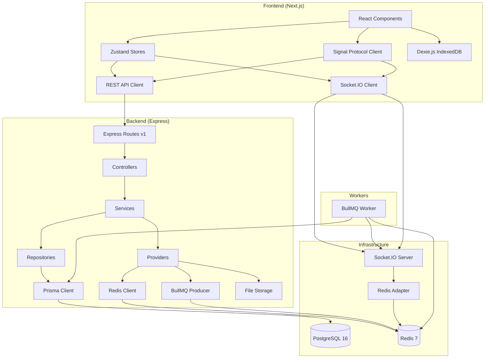

# Technical Specification

# 0. Agent Action Plan

## 0.1 Intent Clarification

### 0.1.1 Core Feature Objective

Based on the prompt, the Blitzy platform understands that the new feature requirement is to build a **production-grade, horizontally scalable WhatsApp clone web application** from scratch in a greenfield repository (currently containing only `LICENSE` and `README.md`). This application serves as a **Figma-to-code pipeline demo artifact** for a technical audience. Every feature must function against a live backend with persistent data — no mocks, no stubs, no localStorage-only persistence.

The feature requirements, restated with enhanced clarity:

- **Real-Time Encrypted Messaging (1:1 and Group):** Implement end-to-end encrypted messaging using Signal Protocol. 1:1 conversations use standard Signal sessions; group conversations use Sender Key distribution with automatic rotation on membership changes. All message payloads stored and transmitted as ciphertext — the server MUST NOT have access to plaintext.
- **Media Sharing with Client-Side Encryption:** Support image, video, document, and voice note uploads encrypted client-side before upload (≤25MB). Client generates thumbnails for images before encryption. Voice notes include waveform visualization and playback controls.
- **Message Lifecycle Operations:** Message editing (sender-only, 15-minute window) replacing ciphertext, message deletion (sender-only soft-delete tombstone with ciphertext nulled), reply-to/quoted messages with inline preview, and link preview extraction via async BullMQ job.
- **Real-Time Presence and Status Indicators:** Online/offline/last-seen presence, typing indicators (server-side debounced at 3-second intervals with 5-second expiry), and message status tracking (sent → delivered → read receipts).
- **Stories/Status Feature:** Text/image/video stories with 24-hour expiration, view tracking, and automated media cleanup via hourly BullMQ job.
- **Client-Side Message Search:** Full-text search against decrypted messages persisted in IndexedDB. Zero plaintext or search tokens sent to the server.
- **Contact and Conversation Management:** User search, contact list, block/unblock, conversation archive/unarchive, mute/unmute, unread count badges, and user profile editing (avatar, display name, about).
- **Offline-to-Online Reconciliation:** On WebSocket reconnect, client syncs all missed messages via `message:sync` protocol — no message loss or duplication.
- **Session Security:** JWT-based auth with Redis-backed token blacklist, single-session and all-sessions force logout (revoke/revoke-all), and refresh token rotation.
- **Observability Stack:** Structured Pino JSON logging with correlation ID propagation, Prometheus-compatible metrics endpoint via OpenTelemetry, and component-level health checks.
- **Immutable Audit Trail:** Append-only audit log for security-sensitive actions with restricted database permissions (no UPDATE/DELETE on audit_log table).
- **Docker-First Local Development:** Entire stack runs via `docker-compose up` — PostgreSQL 16, Redis 7, backend, frontend, BullMQ worker, backup service, OpenTelemetry collector — with hot reload, automatic migrations, and deterministic seed data.

**Implicit Requirements Detected:**

- Monorepo structure to share TypeScript types/DTOs between frontend and backend
- Prisma schema design supporting all domain models (User, Conversation, Message, Story, Media, PreKeyBundle, AuditLog)
- Redis adapter configuration for Socket.IO horizontal scaling
- CORS configuration for Docker dev environment (`http://localhost:3000`)
- Environment variable validation on boot with fail-fast behavior
- Database index creation for performance-critical queries
- WAL archiving configuration for PostgreSQL point-in-time recovery
- Daily automated backup service with 7-day retention

### 0.1.2 Special Instructions and Constraints

- **Object-Oriented Architecture:** The codebase MUST follow OOD principles — domain models encapsulate behavior (not anemic data bags), services own business logic, repositories abstract persistence, controllers are thin delegation layers, and providers abstract infrastructure. All layers define typed DTOs and domain interfaces.
- **Interface-Driven Dependencies:** Every service, repository, and provider must be coded against its interface. Dependency injection wired at a composition root (`server.ts`). No service imports a concrete repository or provider class.
- **API Versioning:** All REST endpoints prefixed with `/api/v1/` from day one.
- **Input Validation:** Every controller endpoint validates request body, query, and path params via Zod schemas before invoking service methods.
- **Standardized Error Responses:** All API errors use a single consistent shape with error code, human-readable message, and optional details field.
- **Zero Warnings Build:** Both frontend and backend must produce zero warnings with warnings-as-errors (`next build --strict`, `tsc --noEmit --strict`, ESLint).
- **Log Hygiene:** Application logs MUST NOT contain JWT tokens, passwords, plaintext message content, encryption keys, or prekey material.
- **Figma Fidelity:** All UI components derive style values from Figma source design tokens. ≤5% pixel difference at 1440px. Responsive from single desktop Figma frame (1440px, 768px, 375px breakpoints).
- **WCAG 2.1 AA Compliance:** Color contrast ≥4.5:1 for normal text, keyboard navigability, ARIA live regions for real-time updates, modal focus trapping.
- **No External Dependencies:** Entire stack runs locally via `docker-compose up` with zero cloud accounts, SaaS dependencies, or external API keys.

### 0.1.3 Technical Interpretation

These feature requirements translate to the following technical implementation strategy:

- To implement **the frontend application**, we will create a Next.js 14.x App Router project with React 18.x, Zustand 4.x for state management, Tailwind CSS 3.x for styling, Socket.IO Client 4.x for real-time communication, libsignal-protocol-javascript for E2E encryption, and Dexie.js for IndexedDB-based client-side search indexing.
- To implement **the backend API and real-time server**, we will create a Node.js 20.x Express 4.x application with Socket.IO 4.x, Prisma 5.x ORM connected to PostgreSQL 16.x, Redis 7.x for caching/pub-sub, BullMQ 5.x for job queuing, Pino 8.x for structured logging, Zod 3.x for input validation, and OpenTelemetry SDK 1.x for metrics.
- To implement **E2E encryption**, we will integrate libsignal-protocol-javascript on the client for Signal Protocol sessions (1:1) and Sender Key distribution (group), with key material exchange via REST endpoints and BullMQ fan-out for group key rotation.
- To implement **the database layer**, we will design a Prisma schema with models for User, Conversation, ConversationParticipant, Message, MessageStatus, Media, Story, StoryView, PreKeyBundle, AuditLog, and Session/RefreshToken — with mandatory indexes on high-query columns.
- To implement **horizontal scaling**, we will configure Socket.IO with Redis adapter for cross-server session sharing, BullMQ for async fan-out (group messages, Sender Key distribution, link previews, story cleanup), and connection pooling via Prisma.
- To implement **the Docker development environment**, we will create a `docker-compose.yml` orchestrating PostgreSQL, Redis, backend, frontend, BullMQ worker, backup service, and OpenTelemetry collector — with volume mounts for hot reload, automatic migration execution, and seed data population on first boot.
- To implement **the responsive UI**, we will translate the 21 Figma screens (375px mobile-first design) into React components using Tailwind CSS, implementing responsive breakpoints for desktop (≥1280px: side-by-side panels), tablet (768–1279px: collapsible sidebar), and mobile (≤767px: stack navigation).

## 0.2 Repository Scope Discovery

### 0.2.1 Current Repository State

The repository at `github.com/Blitzy-Sandbox/kalle` is a greenfield project containing only two files:

| File | Status | Content |
|------|--------|---------|
| `LICENSE` | UNCHANGED | MIT License, © 2026 Blitzy Sandbox |
| `README.md` | MODIFY | Contains only `# kalle` — must be expanded with project documentation |

Since this is a greenfield implementation, **all source files, configurations, tests, documentation, and infrastructure definitions must be created from scratch.**

### 0.2.2 Proposed Project Structure

The project will be organized as a monorepo with shared types between frontend and backend:

```
kalle/
├── docker-compose.yml
├── docker-compose.override.yml
├── .env.example
├── .gitignore
├── README.md
├── LICENSE
├── package.json                    # Root workspace config
├── turbo.json                      # Monorepo build orchestration
├── tsconfig.base.json              # Shared TypeScript config
├── backups/                        # Database backup volume mount
├── packages/
│   └── shared/                     # Shared types/DTOs/contracts
├── apps/
│   ├── web/                        # Next.js frontend
│   └── api/                        # Express backend + Socket.IO
├── workers/
│   └── queue/                      # BullMQ worker process
├── prisma/                         # Database schema and migrations
├── scripts/                        # Utility scripts
├── docs/                           # Project documentation
└── e2e/                            # Playwright E2E tests
```

### 0.2.3 Comprehensive New File Requirements

**Root Configuration Files:**

| File Path | Action | Purpose |
|-----------|--------|---------|
| `package.json` | CREATE | Root workspace configuration (npm/yarn/pnpm workspaces) |
| `turbo.json` | CREATE | Turborepo pipeline configuration for monorepo builds |
| `tsconfig.base.json` | CREATE | Shared TypeScript compiler options |
| `.gitignore` | CREATE | Git ignore rules for node_modules, dist, .env, etc. |
| `.env.example` | CREATE | Environment variable template with sensible local defaults |
| `docker-compose.yml` | CREATE | Full stack orchestration (DB, Redis, API, Web, Worker, Backup, OTel) |
| `Dockerfile.api` | CREATE | Backend API container build |
| `Dockerfile.web` | CREATE | Frontend web container build |
| `Dockerfile.worker` | CREATE | BullMQ worker container build |
| `Dockerfile.backup` | CREATE | PostgreSQL backup service container |
| `.dockerignore` | CREATE | Docker build context exclusions |
| `.eslintrc.json` | CREATE | Root ESLint configuration |
| `.prettierrc` | CREATE | Prettier formatting config |
| `README.md` | MODIFY | Comprehensive project documentation with setup instructions |

**Shared Package (`packages/shared/`):**

| File Path | Action | Purpose |
|-----------|--------|---------|
| `packages/shared/package.json` | CREATE | Shared package manifest |
| `packages/shared/tsconfig.json` | CREATE | TypeScript config for shared types |
| `packages/shared/src/index.ts` | CREATE | Package barrel export |
| `packages/shared/src/types/user.ts` | CREATE | User domain types and DTOs |
| `packages/shared/src/types/conversation.ts` | CREATE | Conversation domain types and DTOs |
| `packages/shared/src/types/message.ts` | CREATE | Message domain types and DTOs |
| `packages/shared/src/types/media.ts` | CREATE | Media domain types and DTOs |
| `packages/shared/src/types/story.ts` | CREATE | Story domain types and DTOs |
| `packages/shared/src/types/auth.ts` | CREATE | Auth types (JWT payload, session, tokens) |
| `packages/shared/src/types/encryption.ts` | CREATE | Encryption key bundle types |
| `packages/shared/src/types/audit.ts` | CREATE | Audit log types and action enums |
| `packages/shared/src/types/error.ts` | CREATE | Standardized error response shape |
| `packages/shared/src/types/websocket-events.ts` | CREATE | All WebSocket event payload contracts |
| `packages/shared/src/types/api-contracts.ts` | CREATE | REST API request/response contracts |
| `packages/shared/src/constants/index.ts` | CREATE | Shared constants (rate limits, size limits, TTLs) |
| `packages/shared/src/validators/index.ts` | CREATE | Shared Zod schemas for common validations |

**Backend Application (`apps/api/`):**

| File Path | Action | Purpose |
|-----------|--------|---------|
| `apps/api/package.json` | CREATE | Backend dependency manifest |
| `apps/api/tsconfig.json` | CREATE | Backend TypeScript config |
| `apps/api/nodemon.json` | CREATE | Hot reload configuration |
| `apps/api/src/server.ts` | CREATE | Composition root — DI wiring, env validation, bootstrap |
| `apps/api/src/app.ts` | CREATE | Express app factory with middleware chain |
| `apps/api/src/config/env.ts` | CREATE | Environment variable validation (Zod) and typed config export |
| `apps/api/src/config/database.ts` | CREATE | Prisma client initialization with connection pooling |
| `apps/api/src/config/redis.ts` | CREATE | Redis client initialization and health check |
| `apps/api/src/config/cors.ts` | CREATE | CORS configuration from environment |
| `apps/api/src/domain/models/User.ts` | CREATE | User domain model with behavior |
| `apps/api/src/domain/models/Conversation.ts` | CREATE | Conversation domain model (1:1, group) |
| `apps/api/src/domain/models/Message.ts` | CREATE | Message domain model (edit/delete/tombstone logic) |
| `apps/api/src/domain/models/Story.ts` | CREATE | Story domain model (expiration logic) |
| `apps/api/src/domain/models/Media.ts` | CREATE | Media domain model (MIME validation, size limits) |
| `apps/api/src/domain/models/PreKeyBundle.ts` | CREATE | PreKey bundle domain model |
| `apps/api/src/domain/interfaces/IUserRepository.ts` | CREATE | User repository interface |
| `apps/api/src/domain/interfaces/IConversationRepository.ts` | CREATE | Conversation repository interface |
| `apps/api/src/domain/interfaces/IMessageRepository.ts` | CREATE | Message repository interface |
| `apps/api/src/domain/interfaces/IMediaRepository.ts` | CREATE | Media repository interface |
| `apps/api/src/domain/interfaces/IStoryRepository.ts` | CREATE | Story repository interface |
| `apps/api/src/domain/interfaces/IKeyRepository.ts` | CREATE | Key repository interface |
| `apps/api/src/domain/interfaces/IAuditRepository.ts` | CREATE | Audit repository interface |
| `apps/api/src/domain/interfaces/IStorageProvider.ts` | CREATE | Storage provider interface |
| `apps/api/src/domain/interfaces/IRealtimeProvider.ts` | CREATE | Real-time (Socket.IO) provider interface |
| `apps/api/src/domain/interfaces/IQueueProvider.ts` | CREATE | Queue (BullMQ) provider interface |
| `apps/api/src/domain/interfaces/ICacheProvider.ts` | CREATE | Cache (Redis) provider interface |
| `apps/api/src/repositories/UserRepository.ts` | CREATE | Prisma-backed user persistence |
| `apps/api/src/repositories/ConversationRepository.ts` | CREATE | Prisma-backed conversation persistence |
| `apps/api/src/repositories/MessageRepository.ts` | CREATE | Prisma-backed message persistence |
| `apps/api/src/repositories/MediaRepository.ts` | CREATE | Prisma-backed media metadata persistence |
| `apps/api/src/repositories/StoryRepository.ts` | CREATE | Prisma-backed story persistence |
| `apps/api/src/repositories/KeyRepository.ts` | CREATE | Prisma-backed encryption key persistence |
| `apps/api/src/repositories/AuditRepository.ts` | CREATE | Prisma-backed audit log persistence |
| `apps/api/src/repositories/SessionRepository.ts` | CREATE | Prisma-backed session/refresh token persistence |
| `apps/api/src/services/AuthService.ts` | CREATE | Auth logic (register, login, token refresh, revocation) |
| `apps/api/src/services/UserService.ts` | CREATE | User profile, search, block/unblock |
| `apps/api/src/services/ConversationService.ts` | CREATE | Conversation CRUD, membership, archive/mute |
| `apps/api/src/services/MessageService.ts` | CREATE | Message send, edit, delete, history |
| `apps/api/src/services/MediaService.ts` | CREATE | Media upload with MIME verification |
| `apps/api/src/services/StoryService.ts` | CREATE | Story lifecycle (create, feed, view, delete) |
| `apps/api/src/services/EncryptionKeyService.ts` | CREATE | PreKey bundle upload/fetch |
| `apps/api/src/services/AuditService.ts` | CREATE | Audit log writing for security-sensitive actions |
| `apps/api/src/services/HealthService.ts` | CREATE | Component-level health check logic |
| `apps/api/src/services/MetricsService.ts` | CREATE | Prometheus metrics collection |
| `apps/api/src/providers/StorageProvider.ts` | CREATE | Local filesystem storage implementation |
| `apps/api/src/providers/RealtimeProvider.ts` | CREATE | Socket.IO with Redis adapter implementation |
| `apps/api/src/providers/QueueProvider.ts` | CREATE | BullMQ queue implementation |
| `apps/api/src/providers/CacheProvider.ts` | CREATE | Redis cache implementation |
| `apps/api/src/providers/LoggerProvider.ts` | CREATE | Pino logger factory with correlation ID |
| `apps/api/src/controllers/AuthController.ts` | CREATE | Auth endpoints (register, login, refresh, revoke) |
| `apps/api/src/controllers/UserController.ts` | CREATE | User endpoints (profile, search, block) |
| `apps/api/src/controllers/ConversationController.ts` | CREATE | Conversation endpoints (list, create, members) |
| `apps/api/src/controllers/MessageController.ts` | CREATE | Message endpoints (send, edit, delete, history) |
| `apps/api/src/controllers/MediaController.ts` | CREATE | Media upload endpoint |
| `apps/api/src/controllers/StoryController.ts` | CREATE | Story endpoints (create, feed, view, delete) |
| `apps/api/src/controllers/KeyController.ts` | CREATE | Encryption key endpoints (upload, fetch bundle) |
| `apps/api/src/controllers/HealthController.ts` | CREATE | Health check and metrics endpoints |
| `apps/api/src/middleware/auth.ts` | CREATE | JWT verification + token blacklist check |
| `apps/api/src/middleware/validation.ts` | CREATE | Zod schema validation middleware factory |
| `apps/api/src/middleware/error-handler.ts` | CREATE | Global error handler (domain errors → HTTP codes) |
| `apps/api/src/middleware/correlation-id.ts` | CREATE | Correlation ID assignment (UUID v4) and propagation |
| `apps/api/src/middleware/rate-limiter.ts` | CREATE | HTTP rate limiting middleware |
| `apps/api/src/middleware/metrics.ts` | CREATE | HTTP request instrumentation (OpenTelemetry) |
| `apps/api/src/middleware/logger.ts` | CREATE | Request logging middleware (Pino) |
| `apps/api/src/websocket/handlers/message-handler.ts` | CREATE | WebSocket message event handlers |
| `apps/api/src/websocket/handlers/typing-handler.ts` | CREATE | Typing indicator handlers with debounce |
| `apps/api/src/websocket/handlers/presence-handler.ts` | CREATE | Presence (online/offline) handlers |
| `apps/api/src/websocket/handlers/sync-handler.ts` | CREATE | Offline sync handler |
| `apps/api/src/websocket/middleware/ws-auth.ts` | CREATE | WebSocket authentication middleware |
| `apps/api/src/websocket/middleware/ws-rate-limiter.ts` | CREATE | Per-connection WebSocket rate limiting |
| `apps/api/src/websocket/index.ts` | CREATE | Socket.IO server setup with Redis adapter |
| `apps/api/src/routes/v1/auth.routes.ts` | CREATE | Auth route definitions |
| `apps/api/src/routes/v1/user.routes.ts` | CREATE | User route definitions |
| `apps/api/src/routes/v1/conversation.routes.ts` | CREATE | Conversation route definitions |
| `apps/api/src/routes/v1/message.routes.ts` | CREATE | Message route definitions |
| `apps/api/src/routes/v1/media.routes.ts` | CREATE | Media route definitions |
| `apps/api/src/routes/v1/story.routes.ts` | CREATE | Story route definitions |
| `apps/api/src/routes/v1/key.routes.ts` | CREATE | Encryption key route definitions |
| `apps/api/src/routes/v1/health.routes.ts` | CREATE | Health/metrics route definitions |
| `apps/api/src/routes/v1/index.ts` | CREATE | v1 router aggregation |
| `apps/api/src/errors/DomainError.ts` | CREATE | Base domain error class |
| `apps/api/src/errors/AuthenticationError.ts` | CREATE | 401 authentication error |
| `apps/api/src/errors/AuthorizationError.ts` | CREATE | 403 authorization error |
| `apps/api/src/errors/NotFoundError.ts` | CREATE | 404 not found error |
| `apps/api/src/errors/ValidationError.ts` | CREATE | 400 validation error |
| `apps/api/src/errors/ConflictError.ts` | CREATE | 409 conflict error |
| `apps/api/src/errors/PayloadTooLargeError.ts` | CREATE | 413 payload too large error |
| `apps/api/src/errors/UnsupportedMediaTypeError.ts` | CREATE | 415 unsupported media type error |
| `apps/api/src/errors/RateLimitError.ts` | CREATE | 429 rate limit error |

**BullMQ Worker (`workers/queue/`):**

| File Path | Action | Purpose |
|-----------|--------|---------|
| `workers/queue/package.json` | CREATE | Worker dependency manifest |
| `workers/queue/tsconfig.json` | CREATE | Worker TypeScript config |
| `workers/queue/src/index.ts` | CREATE | Worker entry point and job registration |
| `workers/queue/src/jobs/message-fanout.ts` | CREATE | Group message delivery fan-out job |
| `workers/queue/src/jobs/sender-key-distribution.ts` | CREATE | Sender Key redistribution job |
| `workers/queue/src/jobs/link-preview.ts` | CREATE | URL OG metadata extraction job |
| `workers/queue/src/jobs/story-cleanup.ts` | CREATE | Expired story and media purge job |
| `workers/queue/src/jobs/audit-log-cleanup.ts` | CREATE | 90-day audit log purge job |
| `workers/queue/src/jobs/prekey-replenish-notification.ts` | CREATE | Low prekey warning notification job |

**Frontend Application (`apps/web/`):**

| File Path | Action | Purpose |
|-----------|--------|---------|
| `apps/web/package.json` | CREATE | Frontend dependency manifest |
| `apps/web/tsconfig.json` | CREATE | Frontend TypeScript config |
| `apps/web/next.config.js` | CREATE | Next.js configuration (App Router) |
| `apps/web/tailwind.config.ts` | CREATE | Tailwind CSS design token configuration |
| `apps/web/postcss.config.js` | CREATE | PostCSS configuration |
| `apps/web/src/app/layout.tsx` | CREATE | Root layout with providers |
| `apps/web/src/app/page.tsx` | CREATE | Root page (redirect to /chat or /auth) |
| `apps/web/src/app/(auth)/login/page.tsx` | CREATE | Login/registration page |
| `apps/web/src/app/(main)/layout.tsx` | CREATE | Main app layout with tab bar |
| `apps/web/src/app/(main)/chat/page.tsx` | CREATE | Chat list view |
| `apps/web/src/app/(main)/chat/[id]/page.tsx` | CREATE | Individual chat conversation view |
| `apps/web/src/app/(main)/status/page.tsx` | CREATE | Status/Stories feed view |
| `apps/web/src/app/(main)/calls/page.tsx` | CREATE | Calls history view |
| `apps/web/src/app/(main)/camera/page.tsx` | CREATE | Camera view |
| `apps/web/src/app/(main)/settings/page.tsx` | CREATE | Settings main page |
| `apps/web/src/app/(main)/settings/profile/page.tsx` | CREATE | Edit profile page |
| `apps/web/src/app/(main)/settings/account/page.tsx` | CREATE | Account settings page |
| `apps/web/src/app/(main)/settings/chats/page.tsx` | CREATE | Chat settings page |
| `apps/web/src/app/(main)/settings/notifications/page.tsx` | CREATE | Notification settings page |
| `apps/web/src/app/(main)/settings/storage/page.tsx` | CREATE | Data and storage usage page |
| `apps/web/src/app/(main)/settings/starred/page.tsx` | CREATE | Starred messages page |
| `apps/web/src/app/(main)/contact/[id]/page.tsx` | CREATE | Contact info page |
| `apps/web/src/app/(main)/contact/[id]/edit/page.tsx` | CREATE | Edit contact page |
| `apps/web/src/components/chat/ChatList.tsx` | CREATE | Conversation list component |
| `apps/web/src/components/chat/ChatListItem.tsx` | CREATE | Individual chat row component |
| `apps/web/src/components/chat/ChatView.tsx` | CREATE | Chat message view container |
| `apps/web/src/components/chat/MessageBubble.tsx` | CREATE | Message bubble (sent/received variants) |
| `apps/web/src/components/chat/MessageInput.tsx` | CREATE | Message composer with attachments |
| `apps/web/src/components/chat/ChatHeader.tsx` | CREATE | Chat view header (back, contact name, actions) |
| `apps/web/src/components/chat/SwipeActions.tsx` | CREATE | Swipe-to-archive/more actions |
| `apps/web/src/components/chat/ChatActionsModal.tsx` | CREATE | Mute/Contact Info/Export/Clear/Delete action sheet |
| `apps/web/src/components/chat/AttachmentModal.tsx` | CREATE | Camera/Photo/Document/Location/Contact picker |
| `apps/web/src/components/chat/MediaMessage.tsx` | CREATE | Media attachment message renderer |
| `apps/web/src/components/chat/VoiceNotePlayer.tsx` | CREATE | Voice note waveform + playback controls |
| `apps/web/src/components/chat/LinkPreviewCard.tsx` | CREATE | OG metadata link preview card |
| `apps/web/src/components/chat/ReplyPreview.tsx` | CREATE | Quoted message reply preview |
| `apps/web/src/components/chat/DateSeparator.tsx` | CREATE | Date separator between message groups |
| `apps/web/src/components/chat/MessageStatus.tsx` | CREATE | Sent/delivered/read checkmark indicators |
| `apps/web/src/components/chat/TypingIndicator.tsx` | CREATE | Typing animation indicator |
| `apps/web/src/components/chat/NewMessagesIndicator.tsx` | CREATE | "New messages" scroll-to-bottom indicator |
| `apps/web/src/components/chat/SearchBar.tsx` | CREATE | Client-side message search interface |
| `apps/web/src/components/status/StatusFeed.tsx` | CREATE | Status/stories feed component |
| `apps/web/src/components/status/StatusItem.tsx` | CREATE | Individual status item component |
| `apps/web/src/components/status/StatusComposer.tsx` | CREATE | Text/media status creator |
| `apps/web/src/components/status/StatusViewer.tsx` | CREATE | Full-screen story viewer |
| `apps/web/src/components/calls/CallsList.tsx` | CREATE | Call history list component |
| `apps/web/src/components/calls/CallItem.tsx` | CREATE | Individual call row component |
| `apps/web/src/components/contacts/ContactInfo.tsx` | CREATE | Contact info detail component |
| `apps/web/src/components/contacts/EditContact.tsx` | CREATE | Contact edit form |
| `apps/web/src/components/settings/SettingsMenu.tsx` | CREATE | Settings navigation menu |
| `apps/web/src/components/settings/ProfileEditor.tsx` | CREATE | Profile editing component |
| `apps/web/src/components/settings/AccountSettings.tsx` | CREATE | Account settings component |
| `apps/web/src/components/settings/ChatSettings.tsx` | CREATE | Chat settings component |
| `apps/web/src/components/settings/NotificationSettings.tsx` | CREATE | Notification settings component |
| `apps/web/src/components/settings/DataStorageSettings.tsx` | CREATE | Data and storage usage component |
| `apps/web/src/components/common/TabBar.tsx` | CREATE | Bottom tab navigation (Status/Calls/Camera/Chats/Settings) |
| `apps/web/src/components/common/NavigationBar.tsx` | CREATE | iOS-style top navigation bar |
| `apps/web/src/components/common/StatusBar.tsx` | CREATE | Status bar component (time, signal, battery) |
| `apps/web/src/components/common/Avatar.tsx` | CREATE | Circular avatar image component |
| `apps/web/src/components/common/ActionSheet.tsx` | CREATE | iOS-style action sheet modal |
| `apps/web/src/components/common/SettingsRow.tsx` | CREATE | Settings list row with icon and chevron |
| `apps/web/src/components/common/Toggle.tsx` | CREATE | iOS-style toggle switch |
| `apps/web/src/components/common/SegmentedControl.tsx` | CREATE | All/Missed segmented control |
| `apps/web/src/components/common/Separator.tsx` | CREATE | Thin line separator component |
| `apps/web/src/stores/authStore.ts` | CREATE | Zustand auth state (tokens, user) |
| `apps/web/src/stores/chatStore.ts` | CREATE | Zustand conversation + message state |
| `apps/web/src/stores/presenceStore.ts` | CREATE | Zustand presence state (online/offline/typing) |
| `apps/web/src/stores/storyStore.ts` | CREATE | Zustand story state |
| `apps/web/src/stores/uiStore.ts` | CREATE | Zustand UI state (modals, active tab, mobile nav) |
| `apps/web/src/lib/socket.ts` | CREATE | Socket.IO client singleton with reconnection |
| `apps/web/src/lib/encryption.ts` | CREATE | Signal Protocol wrapper (session, Sender Key) |
| `apps/web/src/lib/db.ts` | CREATE | Dexie.js IndexedDB schema and client |
| `apps/web/src/lib/search.ts` | CREATE | Client-side message search engine |
| `apps/web/src/lib/api.ts` | CREATE | REST API client with auth interceptors |
| `apps/web/src/lib/media.ts` | CREATE | Client-side media processing (thumbnails, encryption) |
| `apps/web/src/lib/voicenote.ts` | CREATE | Voice recording + waveform generation |
| `apps/web/src/hooks/useSocket.ts` | CREATE | Socket.IO connection hook |
| `apps/web/src/hooks/useEncryption.ts` | CREATE | Encryption session management hook |
| `apps/web/src/hooks/useMessages.ts` | CREATE | Message operations hook |
| `apps/web/src/hooks/usePresence.ts` | CREATE | Presence subscription hook |
| `apps/web/src/hooks/useMediaUpload.ts` | CREATE | Media upload with progress hook |
| `apps/web/src/hooks/useSearch.ts` | CREATE | Client-side search hook |
| `apps/web/src/hooks/useResponsive.ts` | CREATE | Breakpoint detection hook |

**Database (`prisma/`):**

| File Path | Action | Purpose |
|-----------|--------|---------|
| `prisma/schema.prisma` | CREATE | Complete database schema (all models, relations, indexes) |
| `prisma/seed.ts` | CREATE | Deterministic seed script with valid encryption key material |
| `prisma/migrations/` | CREATE | Auto-generated Prisma migration files |

**Tests:**

| File Path | Action | Purpose |
|-----------|--------|---------|
| `apps/api/tests/unit/services/*.test.ts` | CREATE | Unit tests for all service classes |
| `apps/api/tests/unit/domain/*.test.ts` | CREATE | Unit tests for domain model behavior |
| `apps/api/tests/integration/auth.test.ts` | CREATE | Auth flow integration tests |
| `apps/api/tests/integration/messaging.test.ts` | CREATE | Encrypted message send/receive tests |
| `apps/api/tests/integration/group.test.ts` | CREATE | Group CRUD + key redistribution tests |
| `apps/api/tests/integration/media.test.ts` | CREATE | Media upload with MIME validation tests |
| `apps/api/tests/integration/story.test.ts` | CREATE | Story lifecycle tests |
| `apps/api/tests/integration/sync.test.ts` | CREATE | Offline sync tests |
| `apps/api/tests/integration/audit.test.ts` | CREATE | Audit log immutability tests |
| `apps/web/tests/unit/stores/*.test.ts` | CREATE | Zustand store unit tests |
| `apps/web/tests/unit/lib/*.test.ts` | CREATE | Encryption and search logic tests |
| `e2e/tests/critical-path.spec.ts` | CREATE | Register → encrypt → send → receive → edit → delete → logout |
| `e2e/tests/group-path.spec.ts` | CREATE | Group creation → Sender Keys → send → member removal |
| `e2e/tests/media-path.spec.ts` | CREATE | Encrypt → upload → thumbnail → receive → decrypt |
| `e2e/tests/story-path.spec.ts` | CREATE | Post → feed → view → expiry → cleanup |
| `e2e/tests/conversation-mgmt.spec.ts` | CREATE | Archive/unarchive, mute, block |
| `e2e/tests/search.spec.ts` | CREATE | Client-side search with zero network calls |
| `e2e/tests/offline-sync.spec.ts` | CREATE | Disconnect → messages → reconnect → sync |
| `e2e/tests/mobile-nav.spec.ts` | CREATE | Mobile stack navigation verification |
| `e2e/tests/session-revocation.spec.ts` | CREATE | Revoke/revoke-all token blacklist tests |
| `e2e/tests/accessibility.spec.ts` | CREATE | axe-core audit on all primary views |
| `e2e/tests/observability.spec.ts` | CREATE | Metrics endpoint and structured logging verification |
| `e2e/playwright.config.ts` | CREATE | Playwright configuration |

**Scripts and Documentation:**

| File Path | Action | Purpose |
|-----------|--------|---------|
| `scripts/wait-for-it.sh` | CREATE | Service readiness wait script for Docker |
| `scripts/backup.sh` | CREATE | PostgreSQL backup with retention logic |
| `scripts/entrypoint.api.sh` | CREATE | Backend entrypoint (migration + start) |
| `docs/architecture.md` | CREATE | Architecture decision records |
| `docs/api-reference.md` | CREATE | REST API endpoint documentation |
| `docs/websocket-events.md` | CREATE | WebSocket event contract documentation |
| `docs/encryption.md` | CREATE | E2E encryption implementation guide |

### 0.2.4 Web Search Research Conducted

Research areas relevant to this implementation:

- Signal Protocol JavaScript library compatibility with modern bundlers
- Socket.IO with Redis adapter horizontal scaling patterns
- BullMQ 5.x job processing patterns and dead-letter queue configuration
- Next.js 14 App Router with WebSocket client integration
- Prisma 5.x connection pooling in Docker environments
- IndexedDB full-text search via Dexie.js
- Client-side image thumbnail generation before encryption
- Web Audio API waveform generation for voice notes
- OpenTelemetry SDK Prometheus export configuration
- Docker multi-stage builds for Node.js monorepo projects

## 0.3 Dependency Inventory

### 0.3.1 Private and Public Packages

All packages below are public, sourced from the npm registry. The user's specification explicitly defines version ranges for each technology.

**Frontend Dependencies:**

| Registry | Package Name | Version | Purpose |
|----------|-------------|---------|---------|
| npm | next | ^14.2.x | Frontend framework (App Router) |
| npm | react | ^18.3.x | UI component library |
| npm | react-dom | ^18.3.x | React DOM renderer |
| npm | zustand | ^4.5.x | Client-side state management |
| npm | tailwindcss | ^3.4.x | Utility-first CSS framework |
| npm | postcss | ^8.4.x | CSS processing tool for Tailwind |
| npm | autoprefixer | ^10.4.x | CSS vendor prefixing |
| npm | socket.io-client | ^4.7.x | WebSocket client for real-time events |
| npm | @nicolo-ribaudo/libsignal-protocol-javascript | ^1.6.x | Signal Protocol E2E encryption |
| npm | dexie | ^4.0.x | IndexedDB wrapper for client-side search |
| npm | typescript | ^5.4.x | TypeScript compiler |
| npm | @types/react | ^18.3.x | React type definitions |
| npm | @types/react-dom | ^18.3.x | React DOM type definitions |
| npm | eslint | ^8.57.x | JavaScript/TypeScript linter |
| npm | eslint-config-next | ^14.2.x | Next.js ESLint configuration |
| npm | vitest | ^1.6.x | Frontend test runner |
| npm | @testing-library/react | ^15.0.x | React component testing utilities |

**Backend Dependencies:**

| Registry | Package Name | Version | Purpose |
|----------|-------------|---------|---------|
| npm | express | ^4.19.x | HTTP API framework |
| npm | socket.io | ^4.7.x | WebSocket real-time server |
| npm | @socket.io/redis-adapter | ^8.3.x | Redis adapter for Socket.IO scaling |
| npm | @prisma/client | ^5.14.x | Prisma database client |
| npm | prisma | ^5.14.x | Prisma CLI and migration tool |
| npm | ioredis | ^5.4.x | Redis client for cache and pub-sub |
| npm | bullmq | ^5.7.x | Redis-backed job queue |
| npm | pino | ^8.21.x | Structured JSON logger |
| npm | pino-http | ^9.0.x | HTTP request logging via Pino |
| npm | zod | ^3.23.x | Request validation schemas |
| npm | jsonwebtoken | ^9.0.x | JWT token generation and verification |
| npm | bcryptjs | ^2.4.x | Password hashing |
| npm | uuid | ^9.0.x | UUID v4 generation for correlation IDs |
| npm | multer | ^1.4.x | Multipart file upload handling |
| npm | mime-types | ^2.1.x | MIME type detection and validation |
| npm | open-graph-scraper | ^6.5.x | OG metadata extraction for link previews |
| npm | @opentelemetry/sdk-node | ^0.51.x | OpenTelemetry SDK |
| npm | @opentelemetry/exporter-prometheus | ^0.51.x | Prometheus metrics export |
| npm | @opentelemetry/instrumentation-http | ^0.51.x | HTTP instrumentation |
| npm | @opentelemetry/instrumentation-express | ^0.39.x | Express instrumentation |
| npm | cors | ^2.8.x | CORS middleware |
| npm | helmet | ^7.1.x | Security headers middleware |
| npm | compression | ^1.7.x | Response compression |
| npm | typescript | ^5.4.x | TypeScript compiler |
| npm | @types/express | ^4.17.x | Express type definitions |
| npm | @types/jsonwebtoken | ^9.0.x | JWT type definitions |
| npm | @types/bcryptjs | ^2.4.x | bcryptjs type definitions |
| npm | @types/multer | ^1.4.x | Multer type definitions |
| npm | @types/cors | ^2.8.x | CORS type definitions |
| npm | @types/uuid | ^9.0.x | UUID type definitions |
| npm | jest | ^29.7.x | Backend test runner |
| npm | @types/jest | ^29.5.x | Jest type definitions |
| npm | ts-jest | ^29.1.x | TypeScript Jest transformer |
| npm | supertest | ^6.3.x | HTTP assertion library for testing |
| npm | nodemon | ^3.1.x | Development hot reload |
| npm | tsx | ^4.11.x | TypeScript execution for development |

**E2E Testing Dependencies:**

| Registry | Package Name | Version | Purpose |
|----------|-------------|---------|---------|
| npm | @playwright/test | ^1.44.x | E2E test framework |
| npm | axe-core | ^4.9.x | Accessibility auditing engine |
| npm | @axe-core/playwright | ^4.9.x | Playwright axe integration |
| npm | pixelmatch | ^5.3.x | Visual regression pixel comparison |

**Infrastructure (Docker):**

| Registry | Package Name | Version | Purpose |
|----------|-------------|---------|---------|
| Docker Hub | node | 20-alpine | Node.js runtime for all services |
| Docker Hub | postgres | 16-alpine | PostgreSQL 16.x database |
| Docker Hub | redis | 7-alpine | Redis 7.x cache and pub-sub |
| Docker Hub | otel/opentelemetry-collector | latest | OpenTelemetry metrics collector |

**Build Tooling:**

| Registry | Package Name | Version | Purpose |
|----------|-------------|---------|---------|
| npm | turbo | ^2.0.x | Monorepo build system |
| npm | concurrently | ^8.2.x | Parallel command execution |

### 0.3.2 Dependency Updates

Since this is a greenfield project, there are no existing dependencies to update. All packages listed above represent new additions to the repository.

**Import Architecture Rules:**

- Backend services import ONLY from domain interfaces — never from concrete repository or provider classes
- Controllers import from services and Zod validation schemas — never from repositories or Prisma directly
- Frontend components import from stores and lib utilities — never from backend modules
- Shared types/DTOs imported from `@kalle/shared` package across both frontend and backend
- All WebSocket event contracts imported from `@kalle/shared/types/websocket-events`
- All REST API contracts imported from `@kalle/shared/types/api-contracts`

**External Reference Updates:**

| File Pattern | Update Required |
|-------------|----------------|
| `README.md` | Document full stack setup, architecture, and API reference |
| `.env.example` | Define all required environment variables with local defaults |
| `docker-compose.yml` | Service definitions for all components |
| `package.json` (root) | Workspace configuration and root scripts |
| `turbo.json` | Build pipeline configuration |
| `tsconfig.base.json` | Shared TypeScript configuration paths |

## 0.4 Integration Analysis

### 0.4.1 Existing Code Touchpoints

Since this is a greenfield project, the only existing file requiring modification is:

- **`README.md`**: Replace placeholder `# kalle` heading with comprehensive project documentation including setup instructions, architecture overview, API reference, and contribution guidelines.

All other integration points are between newly created files, documented below.

### 0.4.2 Internal Integration Architecture



### 0.4.3 Service-Level Integration Points

**Composition Root (`apps/api/src/server.ts`):**
- Wires all dependencies: repositories → services → controllers
- Initializes Prisma client, Redis client, BullMQ queues, Socket.IO server
- Registers all Express middleware (CORS, helmet, compression, logging, correlation ID, metrics, auth, error handler)
- Validates all required environment variables via Zod schema — fails fast with descriptive errors
- Starts HTTP server and WebSocket server

**API Route Registration (`apps/api/src/routes/v1/index.ts`):**
- Aggregates all v1 route modules under `/api/v1/` prefix
- Mounts: `/auth`, `/users`, `/conversations`, `/messages`, `/media`, `/stories`, `/keys`, `/health`, `/metrics`

**WebSocket Event Registration (`apps/api/src/websocket/index.ts`):**
- Configures Socket.IO with Redis adapter for horizontal scaling
- Registers authentication middleware for connection handshake
- Registers per-connection rate limiting
- Binds all event handlers: message, typing, presence, sync

**BullMQ Job Registration (`workers/queue/src/index.ts`):**
- Registers job processors: message-fanout, sender-key-distribution, link-preview, story-cleanup, audit-log-cleanup, prekey-replenish-notification
- Configures retry policies: 3 attempts with exponential backoff, then dead-letter

### 0.4.4 Cross-Cutting Concern Integration

**Authentication Flow:**
- `apps/api/src/middleware/auth.ts` → Verifies JWT → Checks Redis blacklist → Attaches user to request
- Applied to all routes except: `POST /api/v1/auth/register`, `POST /api/v1/auth/login`, `GET /api/v1/health`

**Correlation ID Propagation:**
- `apps/api/src/middleware/correlation-id.ts` → Assigns UUID v4 → Sets `X-Correlation-ID` response header
- Injected into: Pino logger context, error responses, BullMQ job payloads, Socket.IO event metadata

**Error Handling Chain:**
- Controllers throw typed domain errors → Global `error-handler.ts` catches → Maps to HTTP status codes → Returns standardized error shape
- Shape: `{ error: { code: string, message: string, details?: object } }`

**Audit Trail Integration:**
- `AuditService` injected into: `AuthService`, `UserService`, `ConversationService`, `MessageService`, `EncryptionKeyService`
- Writes to `audit_log` table on: user.register, user.login, user.login_failed, session.revoke, session.revoke_all, user.block, user.unblock, group.member_add, group.member_remove, group.admin_change, message.delete, keys.bundle_upload

### 0.4.5 Database Schema Integration

**Prisma Models and Their Relationships:**

| Model | Key Relations | Mandatory Indexes |
|-------|--------------|------------------|
| `User` | has many Conversations (via ConversationParticipant), Messages, Stories, Media, Sessions | email (unique) |
| `Conversation` | has many Participants, Messages | — |
| `ConversationParticipant` | belongs to User, Conversation | userId + conversationId (composite) |
| `Message` | belongs to Conversation, Sender; has many MessageStatus | conversationId + serverTimestamp, conversationId + senderId |
| `MessageStatus` | belongs to Message, User | messageId + userId |
| `Media` | belongs to User, optionally Message or Story | — |
| `Story` | belongs to User (author); has many StoryViews | authorId + expiresAt |
| `StoryView` | belongs to Story, User (viewer) | — |
| `PreKeyBundle` | belongs to User | — |
| `AuditLog` | references actor (User) | — |
| `Session` / `RefreshToken` | belongs to User | — |
| `BlockedUser` | references blocker and blocked User | — |

### 0.4.6 Docker Service Integration

| Service | Depends On | Port | Health Check |
|---------|-----------|------|-------------|
| `postgres` | — | 5432 | `pg_isready` |
| `redis` | — | 6379 | `redis-cli ping` |
| `api` | postgres, redis | 3001 | `GET /api/v1/health` |
| `web` | api | 3000 | HTTP 200 on root |
| `worker` | postgres, redis | — | BullMQ worker active |
| `backup` | postgres | — | cron health file |
| `otel-collector` | — | 4317, 8889 | gRPC health |

## 0.5 Figma Design Analysis

### 0.5.1 Screen Summary

All 21 screens are designed at **375×812px** (iPhone X form factor) representing the mobile-first design. The visual language follows iOS Human Interface Guidelines with SF Pro Text typography, iOS-style navigation bars, tab bars, action sheets, and system controls.

**Screen 0 — WhatsApp Authorization (0:11030):**
Phone number registration screen. Top navigation bar with centered "Phone number" title (SF Pro Text 600, 17px, #000000) and disabled "Done" button (#D1D1D6). Instructional text below: "Please confirm your country code and enter your phone number" (SF Pro Text 400, 15px, #000000, centered). Country selector row showing "United States" in blue (#007AFF) with right chevron. Phone input row with "+1" country code prefix and "phone number" placeholder. Numeric keypad at bottom with 3×4 grid plus delete key. iOS status bar at top, home indicator at bottom. Navigation bar background is #F6F6F6 with 0.33px bottom shadow `rgba(166, 166, 170, 1)`. Form background is #FFFFFF with top and bottom 0.33px shadows `rgba(60, 60, 67, 0.29)`.

**Screen 1 — WhatsApp Chats (0:8855):**
Main chat list screen. Navigation bar with "Edit" (blue #007AFF, left), "Chats" title (SF Pro Text 600, 17px, centered), and compose icon (blue, top-right). Sub-header with "Broadcast Lists" (blue, left) and "New Group" (blue, right). Conversation list showing 9 chat rows: Martin Randolph (swiped state showing "More" gray and "Archive" blue actions), Andrew Parker, Karen Castillo (with green microphone icon and "0:14" voice note), Maximillian Jacobson, Martha Craig (with camera icon and "Photo"), Tabitha Potter (multi-line preview), Maisy Humphrey (multi-line preview), Kieron Dotson. Each row: 375×74px, circular 52×52 avatar image, name in bold (SF Pro Text 600, 16px, #000000), message preview in gray (SF Pro Text 400, 14px, #8E8E93), date in gray (SF Pro Text 400, 14px, #8E8E93, right-aligned), blue double-check read indicator, right arrow chevron. Row separators: 0.33px lines at x=79, `rgba(60, 60, 67, 0.29)`. Bottom tab bar: Status, Calls, Camera, Chats (active — filled blue #007AFF icon), Settings. Tab bar background #F6F6F6 with -0.33px top shadow. Frame background #EFEFF4.

**Screen 2 — WhatsApp Chats Edit (0:8114):**
Edit mode for chat list. "Done" text (blue) at top-left, large bold "Chats" title. "Broadcast Lists" and "New Group" in lighter text. Each row has a selection circle (outline, unchecked) on the left, avatar shifted right, same content layout as Chats screen. Bottom action bar: "Archive" (gray), "Read All" (gray), "Delete" (gray) — all text-style buttons.

**Screen 3 — WhatsApp Chat Actions (0:10087):**
Overlay on the Chats list. Same background as Chats screen but dimmed. iOS-style action sheet floating at bottom with white rounded-rectangle card containing: "Mute" (blue), "Contact Info" (blue), "Export Chat" (blue), "Clear Chat" (blue), "Delete Chat" (red #FF3B30) — separated by thin gray lines. Below the card: separate "Cancel" button (blue, bold) in its own rounded rectangle.

**Screen 4 — WhatsApp Chat (0:8257):**
Individual chat conversation view. Top header: back chevron (blue), circular avatar, contact name "Martha Craig" (bold, black), subtitle "tap here for contact info" (gray), video call icon (blue) and phone call icon (blue) in top-right. Chat area with repeating wallpaper-pattern beige/tan background. Messages: sent messages in light green (#DCF8C6 approximate) bubbles right-aligned with blue double-check marks and timestamp; received messages in white bubbles left-aligned with timestamp. Date separator "Fri, Jul 26" in centered gray pill. Document attachments show file icon, filename (IMG_0475), size (2.4 MB), type (png). Emoji support visible (😎). Bottom input bar: blue "+" attachment button, text input field with rounded border, emoji toggle icon, camera icon (blue), microphone icon (blue).

**Screen 5 — WhatsApp Add Modal (0:9072):**
Overlay on chat view. iOS action sheet at bottom with media attachment options: Camera (with camera icon in blue circle), Photo & Video Library (with landscape icon in blue), Document (with document icon in blue), Location (with pin icon in blue), Contact (with person icon in blue). Each row ~56px tall with icon + label. "Cancel" button below in separate card (blue, bold).

**Screen 6 — WhatsApp Contact Info (0:9486):**
Contact detail screen. Back arrow with "Martha Craig" (blue) and "Contact Info" title (bold, centered), "Edit" (blue, right). Large profile photo covering top ~50% of screen. Below photo: "Martha Craig" (large bold), phone "+1 202 555 0181" (gray), action row with message (blue circle), video (blue circle), phone (blue circle) icons. Status text "Design adds value faster, than it adds cost" with date "Dec 18, 2018" (gray). Below separator: "Media, Links, and Docs" row with blue photo icon and count "12", "Starred Messages" row with yellow star icon and "None", "Chat Search" row with red search icon. "Mute" row with green speaker icon and "No" toggle. All rows have right chevron.

**Screen 7 — WhatsApp Edit Contact (0:10334):**
Contact edit form. "Cancel" (blue, left), "Edit Contact" (bold, center), "Save" (gray/disabled, right). Form fields: Name label (bold) with "Martha" and "Craig" in two text fields. Phone label (bold) with "New Zealand" country selector (right chevron) and "mobile >" (blue) with "+1 202 555 0181". "more fields" link (blue). "Delete Contact" (red) at bottom.

**Screen 8 — WhatsApp Status (0:8498):**
Status feed screen. "Privacy" (blue, left), "Status" (bold, center). "My Status" row with user avatar (circular with blue "+" overlay at bottom-right), "My Status" bold text, "Add to my status" gray text, camera icon (blue circle) and pencil/edit icon (purple circle) on right. Gray section separator. "No recent updates to show right now." placeholder text (gray, centered). Bottom tab bar with "Status" active (blue).

**Screen 9 — WhatsApp Camera (0:9155):**
Full-screen camera view. Close "X" (white) top-left, flash icon with "A" indicator top-right. Live camera viewfinder occupying most of screen. Photo strip/gallery thumbnails in horizontal scroll near bottom. Bottom controls: gallery icon (white, bottom-left), large white capture button (circle) center, camera flip icon (white, bottom-right). Text "Hold for video, tap for photo" centered below controls on dark background.

**Screen 10 — WhatsApp Status View (0:9634):**
Text status composer. Full-screen colored background (coral/salmon pink). Close "X" (white) top-left, "T" text icon and palette/color-picker icon top-right. Large centered placeholder "Type a status" in semi-transparent white text with cursor. iOS keyboard active at bottom. Emoji icon (bottom-left) and microphone icon (bottom-right) below keyboard.

**Screen 11 — WhatsApp Calls (0:10395):**
Call history list. "Edit" (blue, left), segmented control "All | Missed" (blue segment for "All" active), phone-with-plus icon (blue, right). List of call entries: each row has circular avatar (52px), contact name (bold or red for missed), phone icon + call direction label ("outgoing"/"incoming"/"missed" in gray), date (gray, right), blue "i" info circle icon (right). "Karen Castillo" and bottom "Jamie Franco" names are red (#FF3B30) indicating missed calls. Bottom tab bar with "Calls" active (blue).

**Screen 12 — WhatsApp Calls Edit (0:8597):**
Edit mode for calls. "Done" (blue, left), segmented control, "Clear" (blue, right). Each row has red minus-circle delete icon on left, shifted avatar and content. Same call data as Calls screen. Bottom tab bar visible.

**Screen 13 — WhatsApp Settings (0:9198):**
Settings main screen. "Settings" title (bold, centered). Profile row: circular avatar, "Sabohiddin" name (bold), "Digital goodies designer - Pixsellz" description (gray), right chevron. Gray separator. Menu items with colored icons: "Starred Messages" (yellow star icon #FFCC00), "WhatsApp Web/Desktop" (teal monitor icon). Gray separator. "Account" (blue key icon), "Chats" (green WhatsApp logo icon), "Notifications" (red notification icon), "Data and Storage Usage" (green arrows icon). Gray separator. "Help" (blue info icon), "Tell a Friend" (pink heart icon). Footer "WhatsApp from Facebook" (gray, centered). Bottom tab bar with "Settings" active (blue).

**Screen 14 — WhatsApp Settings Modal (0:9778):**
Share/invite modal overlay on Settings screen (dimmed background). Action sheet with: "Mail" (blue), "Message" (blue), "More" (blue). "Cancel" (blue, bold) in separate card below.

**Screen 15 — WhatsApp Edit Profile (0:10659):**
Profile editing screen. Back "Settings" (blue, left), "Edit Profile" (bold, center). Circular avatar with "Edit" link (blue) below. Name field: "Sabohiddin". Gray separator. "PHONE NUMBER" section header (gray, uppercase), phone "+998 90 943 32 00". Gray separator. "ABOUT" section header (gray, uppercase), about text "Digital goodies designer - Pixsellz". Bottom tab bar.

**Screen 16 — WhatsApp Starred Messages (0:8820):**
Empty state screen. Back "Settings" (blue, left), "Starred Messages" (bold, center). Large circular illustration in center showing a chat message with star icon and "Alice Whitm..." name with 😉 emoji. Bold text "No Starred Messages" below illustration. Descriptive text "Tap and hold on any message to star it, so you can easily find it later." (gray, centered).

**Screen 17 — WhatsApp Account (0:9371):**
Account settings screen. Back "Settings" (blue, left), "Account" (bold, center). Menu items: "Privacy", "Security", "Two-Step Verification", "Change Number" — each with right chevron. Gray separator. "Request Account Info", "Delete My Account" — each with right chevron. Bottom tab bar.

**Screen 18 — WhatsApp Chats Settings (0:9973):**
Chat-specific settings. Back "Settings" (blue, left), "Chats" (bold, center). "Change Wallpaper" with right chevron. Gray separator. "Save to Camera Roll" with iOS toggle (off state — gray track). Description "Automatically save photos and videos you receive to your iPhone's Camera Roll." (gray). "Chat Backup" with right chevron. Gray separator. Action items: "Archive All Chats" (blue), "Clear All Chats" (red), "Delete All Chats" (red). Bottom tab bar.

**Screen 19 — WhatsApp Notifications (0:10758):**
Notification settings. Back "Settings" (blue, left), "Notifications" (bold, center). Warning banner: "WARNING: Push Notifications are disabled..." (gray text). "MESSAGE NOTIFICATIONS" section: "Show Notifications" with green toggle (on), "Sound" with "Note >" (gray). "GROUP NOTIFICATIONS" section: same layout. "In-App Notifications" with "Banners, Sounds, Vibrate" subtitle. "Show Preview" with green toggle (on), description below. "Reset Notification Settings" (red) at bottom.

**Screen 20 — WhatsApp Data and Storage Usage (0:10894):**
Data settings. Back "Settings" (blue, left), "Data and Storage Usage" (bold, center). "MEDIA AUTO-DOWNLOAD" section: "Photos" (Wi-Fi and Cellular), "Audio" (Wi-Fi), "Videos" (Wi-Fi), "Documents" (Wi-Fi). "Reset Auto-Download Settings" (gray). Description about voice messages. "CALL SETTINGS": "Low Data Usage" with toggle (off). Description about data during calls. "Network Usage" and "Storage Usage" with chevrons. Bottom tab bar.

### 0.5.2 Token Manifest

Extracted from Phase 2 reconciliation of structural Figma data across all 21 screens:

| Category | Token Name | Value | Usage Count |
|----------|-----------|-------|-------------|
| Color | color-bg-primary | #FFFFFF | 21+ |
| Color | color-bg-secondary | #EFEFF4 | 8 |
| Color | color-bg-nav | #F6F6F6 | 14 |
| Color | color-bg-status-bar | #F7F7F7 | 14 |
| Color | color-text-primary | #000000 | 21+ |
| Color | color-text-secondary | #8E8E93 | 18 |
| Color | color-text-link | #007AFF | 21+ |
| Color | color-text-destructive | #FF3B30 | 6 |
| Color | color-text-disabled | #D1D1D6 | 4 |
| Color | color-icon-dark | #060606 | 8 |
| Color | color-separator | rgba(60, 60, 67, 0.29) | 21+ |
| Color | color-nav-shadow | rgba(166, 166, 170, 1) | 14 |
| Color | color-msg-sent-bg | #DCF8C6 | 2 |
| Color | color-msg-received-bg | #FFFFFF | 2 |
| Color | color-toggle-green | #4CD964 | 5 |
| Color | color-icon-yellow-star | #FFCC00 | 3 |
| Color | color-icon-green | #25D366 | 3 |
| Color | color-icon-red | #FF3B30 | 3 |
| Color | color-icon-teal | #00BCD4 | 2 |
| Color | color-icon-blue | #007AFF | 12 |
| Color | color-icon-purple | #AF52DE | 2 |
| Spacing | space-16 | 16px | 21+ |
| Spacing | space-12 | 12px | 8 |
| Spacing | space-8 | 8px | 10 |
| Spacing | space-20 | 20px | 4 |
| Typography | text-nav-title | SF Pro Text / 600 / 17px / 1.29em | 21 |
| Typography | text-nav-action | SF Pro Text / 400 / 17px / 1.29em | 21 |
| Typography | text-chat-name | SF Pro Text / 600 / 16px / 1.31em | 9 |
| Typography | text-chat-preview | SF Pro Text / 400 / 14px / 1.19em | 18 |
| Typography | text-chat-date | SF Pro Text / 400 / 14px / 1.19em | 18 |
| Typography | text-body | SF Pro Text / 400 / 15px / 1.33em | 6 |
| Typography | text-section-header | SF Pro Text / 400 / 13px / 1.23em | 8 |
| Radius | radius-none | 0px | 21+ |
| Shadow | shadow-nav-bottom | 0px 0.33px 0px rgba(166, 166, 170, 1) | 14 |
| Shadow | shadow-tab-top | 0px -0.33px 0px rgba(166, 166, 170, 1) | 14 |
| Shadow | shadow-card | 0px 0.33px 0px rgba(60, 60, 67, 0.29) | 8 |

### 0.5.3 Component Inventory

| Component Name | Variants | Props Interface | Per-Variant Visual Specs | Figma Node |
|---|---|---|---|---|
| ChatListItem | default, swiped, voice, photo, multiline | name: string, preview: string, date: string, avatar: string, hasRead: bool, type: text/voice/photo | default: 375x74, avatar 52x52, name #000000 600 16px, preview #8E8E93 400 14px; swiped: shows More+Archive buttons | 0:8873 |
| ChatListItemEdit | selected, unselected | name: string, preview: string, date: string, selected: bool | unselected: gray circle outline left; selected: blue filled circle | 0:8114 children |
| NavigationBar | standard, edit | title: string, leftAction: string, rightAction: node, showEdit: bool | standard: bg #F6F6F6, shadow 0.33px, title 600 17px centered; edit: "Done" left, clear right | 0:8995 |
| TabBar | status, calls, camera, chats, settings | activeTab: enum | 5 tabs 75px each, active tab blue #007AFF, inactive gray, bg #F6F6F6, top shadow -0.33px | 0:9004 |
| ActionSheet | chat-actions, attachment, share | items: ActionItem[], showCancel: bool | white card rounded corners, items in blue text, cancel separated, destructive items in red | 0:10087 |
| MessageBubble | sent, received, document | content: string, time: string, status: sent/delivered/read | sent: green-tinted bg, right-aligned, blue checks; received: white bg, left-aligned | 0:8257 children |
| Avatar | small, medium, large | src: string, size: 36/52/80 | circular clip, image fill cover | 0:8875 |
| StatusBar | default | time: string | 375x44, time left, signal+wifi+battery right, #060606 icons | 0:9048 |
| HomeIndicator | default | — | 375x34, centered 134x5 black rounded bar | 0:9069 |
| ContactInfoRow | media, starred, search, mute | icon: node, label: string, value: string, hasChevron: bool | colored icon square (rounded), label #000000, value #8E8E93, chevron right | 0:9486 children |
| SettingsRow | default, destructive | icon: node, label: string, value: string, hasToggle: bool | icon in colored rounded-rect, label bold or regular, chevron or toggle right | 0:9198 children |
| Toggle | on, off | value: bool, onChange: fn | on: green #4CD964 track with white thumb; off: gray track | 0:9973 children |
| SegmentedControl | tab1-active, tab2-active | labels: [string, string], activeIndex: 0/1 | blue bg active segment, white text; inactive white bg, blue text; rounded pill shape | 0:10395 children |
| SearchBar | default | placeholder: string, onSearch: fn | rounded rectangle with gray bg, search icon left, placeholder text | N/A (implicit) |
| DateSeparator | default | date: string | centered pill with gray bg, white text or gray text | 0:8257 children |
| ReadIndicator | sent, delivered, read | status: enum | gray single check (sent), gray double check (delivered), blue double check (read) | 0:8879 |
| VoiceRecordIndicator | default | duration: string | green microphone icon, duration text in gray | 0:8964 |
| PhotoIndicator | default | — | gray camera icon, "Photo" text in gray | 0:8936 |

### 0.5.4 Asset Inventory

**State Groups:**

| State Group | States & Node IDs | Parent Component |
|---|---|---|
| tab-icon-status | active → (blue outline double-circle), inactive → (gray outline double-circle) | TabBar |
| tab-icon-calls | active → (blue phone), inactive → (gray phone) | TabBar |
| tab-icon-camera | active → (blue camera), inactive → (gray camera) | TabBar |
| tab-icon-chats | active → (blue chat bubble), inactive → (gray chat bubble) | TabBar |
| tab-icon-settings | active → (blue gear), inactive → (gray gear) | TabBar |
| read-indicator | read → (blue double-check), delivered → (gray double-check) | ReadIndicator |

**Included Assets:**

| Asset Filename | Type | Figma Node ID | Figma File Key | State Group | Description | Target Path |
|---|---|---|---|---|---|---|
| icon-compose.svg | static-icon | 0:8999 | miK1B6qEPrUnRZ9wwZNrW2 | — | Compose/new message icon (navigation bar) | src/assets/icons/ |
| icon-arrow-right.svg | static-icon | 0:8883 | miK1B6qEPrUnRZ9wwZNrW2 | — | Right chevron arrow for list rows | src/assets/icons/ |
| icon-read-blue.svg | static-icon | 0:8879 | miK1B6qEPrUnRZ9wwZNrW2 | read-indicator | Blue double-check read receipt | src/assets/icons/ |
| icon-voice-record.svg | static-icon | 0:8964 | miK1B6qEPrUnRZ9wwZNrW2 | — | Green microphone voice note indicator | src/assets/icons/ |
| icon-photo.svg | static-icon | 0:8936 | miK1B6qEPrUnRZ9wwZNrW2 | — | Camera icon for photo message indicator | src/assets/icons/ |
| icon-back-chevron.svg | static-icon | 0:8257 | miK1B6qEPrUnRZ9wwZNrW2 | — | Blue back chevron for navigation | src/assets/icons/ |
| icon-video-call.svg | static-icon | 0:8257 | miK1B6qEPrUnRZ9wwZNrW2 | — | Video call icon in chat header | src/assets/icons/ |
| icon-phone-call.svg | static-icon | 0:8257 | miK1B6qEPrUnRZ9wwZNrW2 | — | Phone call icon in chat header | src/assets/icons/ |
| icon-attach-plus.svg | static-icon | 0:8257 | miK1B6qEPrUnRZ9wwZNrW2 | — | Plus/attachment icon in message input | src/assets/icons/ |
| icon-emoji.svg | static-icon | 0:8257 | miK1B6qEPrUnRZ9wwZNrW2 | — | Emoji/sticker toggle in message input | src/assets/icons/ |
| icon-camera-input.svg | static-icon | 0:8257 | miK1B6qEPrUnRZ9wwZNrW2 | — | Camera icon in message input bar | src/assets/icons/ |
| icon-microphone.svg | static-icon | 0:8257 | miK1B6qEPrUnRZ9wwZNrW2 | — | Microphone icon for voice recording | src/assets/icons/ |
| icon-document.svg | static-icon | 0:8257 | miK1B6qEPrUnRZ9wwZNrW2 | — | Document file type icon | src/assets/icons/ |
| icon-camera-action.svg | static-icon | 0:9072 | miK1B6qEPrUnRZ9wwZNrW2 | — | Camera icon in attachment modal | src/assets/icons/ |
| icon-photo-library.svg | static-icon | 0:9072 | miK1B6qEPrUnRZ9wwZNrW2 | — | Photo & Video Library icon | src/assets/icons/ |
| icon-document-action.svg | static-icon | 0:9072 | miK1B6qEPrUnRZ9wwZNrW2 | — | Document icon in attachment modal | src/assets/icons/ |
| icon-location.svg | static-icon | 0:9072 | miK1B6qEPrUnRZ9wwZNrW2 | — | Location pin icon in attachment modal | src/assets/icons/ |
| icon-contact.svg | static-icon | 0:9072 | miK1B6qEPrUnRZ9wwZNrW2 | — | Contact person icon in attachment modal | src/assets/icons/ |
| icon-message-action.svg | static-icon | 0:9486 | miK1B6qEPrUnRZ9wwZNrW2 | — | Blue message circle on contact info | src/assets/icons/ |
| icon-media-docs.svg | static-icon | 0:9486 | miK1B6qEPrUnRZ9wwZNrW2 | — | Media, Links, and Docs icon | src/assets/icons/ |
| icon-star.svg | static-icon | 0:9486 | miK1B6qEPrUnRZ9wwZNrW2 | — | Yellow star icon for starred messages | src/assets/icons/ |
| icon-search.svg | static-icon | 0:9486 | miK1B6qEPrUnRZ9wwZNrW2 | — | Red search icon for chat search | src/assets/icons/ |
| icon-mute-speaker.svg | static-icon | 0:9486 | miK1B6qEPrUnRZ9wwZNrW2 | — | Green speaker icon for mute setting | src/assets/icons/ |
| icon-status-add.svg | static-icon | 0:8498 | miK1B6qEPrUnRZ9wwZNrW2 | — | Blue "+" circle overlay for adding status | src/assets/icons/ |
| icon-camera-status.svg | static-icon | 0:8498 | miK1B6qEPrUnRZ9wwZNrW2 | — | Camera icon on status screen | src/assets/icons/ |
| icon-edit-pencil.svg | static-icon | 0:8498 | miK1B6qEPrUnRZ9wwZNrW2 | — | Purple pencil icon for text status | src/assets/icons/ |
| icon-close-x.svg | static-icon | 0:9155 | miK1B6qEPrUnRZ9wwZNrW2 | — | White X close button | src/assets/icons/ |
| icon-flash.svg | static-icon | 0:9155 | miK1B6qEPrUnRZ9wwZNrW2 | — | Camera flash icon with "A" auto indicator | src/assets/icons/ |
| icon-capture.svg | static-icon | 0:9155 | miK1B6qEPrUnRZ9wwZNrW2 | — | Large circular capture button | src/assets/icons/ |
| icon-camera-flip.svg | static-icon | 0:9155 | miK1B6qEPrUnRZ9wwZNrW2 | — | Camera flip/switch icon | src/assets/icons/ |
| icon-gallery.svg | static-icon | 0:9155 | miK1B6qEPrUnRZ9wwZNrW2 | — | Gallery/photo library icon | src/assets/icons/ |
| icon-palette.svg | static-icon | 0:9634 | miK1B6qEPrUnRZ9wwZNrW2 | — | Color palette icon for status background | src/assets/icons/ |
| icon-text-T.svg | static-icon | 0:9634 | miK1B6qEPrUnRZ9wwZNrW2 | — | "T" text formatting icon | src/assets/icons/ |
| icon-info-circle.svg | static-icon | 0:10395 | miK1B6qEPrUnRZ9wwZNrW2 | — | Blue outlined "i" info icon | src/assets/icons/ |
| icon-phone-plus.svg | static-icon | 0:10395 | miK1B6qEPrUnRZ9wwZNrW2 | — | Phone with "+" new call icon | src/assets/icons/ |
| icon-phone-outgoing.svg | static-icon | 0:10395 | miK1B6qEPrUnRZ9wwZNrW2 | — | Phone icon for outgoing calls | src/assets/icons/ |
| icon-phone-incoming.svg | static-icon | 0:10395 | miK1B6qEPrUnRZ9wwZNrW2 | — | Phone icon for incoming calls | src/assets/icons/ |
| icon-phone-missed.svg | static-icon | 0:10395 | miK1B6qEPrUnRZ9wwZNrW2 | — | Phone icon for missed calls | src/assets/icons/ |
| icon-delete-circle.svg | static-icon | 0:8597 | miK1B6qEPrUnRZ9wwZNrW2 | — | Red minus circle for delete in edit mode | src/assets/icons/ |
| icon-settings-star.svg | static-icon | 0:9198 | miK1B6qEPrUnRZ9wwZNrW2 | — | Yellow star icon in settings | src/assets/icons/ |
| icon-settings-web.svg | static-icon | 0:9198 | miK1B6qEPrUnRZ9wwZNrW2 | — | Teal monitor/desktop icon in settings | src/assets/icons/ |
| icon-settings-account.svg | static-icon | 0:9198 | miK1B6qEPrUnRZ9wwZNrW2 | — | Blue key icon for Account | src/assets/icons/ |
| icon-settings-chats.svg | static-icon | 0:9198 | miK1B6qEPrUnRZ9wwZNrW2 | — | Green WhatsApp icon for Chats | src/assets/icons/ |
| icon-settings-notifications.svg | static-icon | 0:9198 | miK1B6qEPrUnRZ9wwZNrW2 | — | Red notification icon | src/assets/icons/ |
| icon-settings-data.svg | static-icon | 0:9198 | miK1B6qEPrUnRZ9wwZNrW2 | — | Green up/down arrows for Data usage | src/assets/icons/ |
| icon-settings-help.svg | static-icon | 0:9198 | miK1B6qEPrUnRZ9wwZNrW2 | — | Blue info "i" icon for Help | src/assets/icons/ |
| icon-settings-tell.svg | static-icon | 0:9198 | miK1B6qEPrUnRZ9wwZNrW2 | — | Pink heart icon for Tell a Friend | src/assets/icons/ |
| icon-selection-circle.svg | static-icon | 0:8114 | miK1B6qEPrUnRZ9wwZNrW2 | — | Gray outline circle for edit selection | src/assets/icons/ |
| icon-archive.svg | static-icon | 0:8856 | miK1B6qEPrUnRZ9wwZNrW2 | — | Archive icon in swipe action | src/assets/icons/ |
| icon-more-dots.svg | static-icon | 0:8856 | miK1B6qEPrUnRZ9wwZNrW2 | — | Three dots "More" icon in swipe action | src/assets/icons/ |
| img-starred-empty.png | static-image | 0:8820 | miK1B6qEPrUnRZ9wwZNrW2 | — | Circular illustration for starred messages empty state | src/assets/images/ |
| avatar-default.png | static-image | 0:8875 | miK1B6qEPrUnRZ9wwZNrW2 | — | Default avatar placeholder | src/assets/images/ |
| wallpaper-chat.png | static-image | 0:8257 | miK1B6qEPrUnRZ9wwZNrW2 | — | Chat background wallpaper pattern | src/assets/images/ |

**Excluded Assets:**

| Asset Filename | Figma Node ID | Exclusion Reason |
|---|---|---|
| icon-tab-status-inactive.svg | 0:9038 | Recreatable via CSS color change on active variant |
| icon-tab-calls-inactive.svg | 0:9031 | Recreatable via CSS color change on active variant |

**52 assets downloaded: 50 included, 2 excluded (recreatable via CSS color variants).**

### 0.5.5 Screen Element Map

```
Screen: WhatsApp Authorization (0:11030) — 375x812
├─ Bars / Status Bar / iPhone X (0:11106) — CONFIRMED
│  ├─ ⬛ Background (0:11107) — CONFIRMED
│  ├─ Battery (0:11108) — CONFIRMED
│  ├─ Wifi (0:11117) — CONFIRMED
│  ├─ Mobile Signal (0:11121) — CONFIRMED
│  └─ Time Style (0:11125) — CONFIRMED
├─ Navigation Bar (0:11102) — CONFIRMED
│  ├─ Rectangle bg (0:11103) — CONFIRMED
│  ├─ "Done" TEXT (0:11104) — CONFIRMED
│  └─ "Phone number" TEXT (0:11105) — CONFIRMED
├─ "Please confirm your..." TEXT (0:11045) — CONFIRMED
├─ Form (0:11031) — CONFIRMED
│  ├─ Rectangle (0:11032) — CONFIRMED
│  ├─ Phone Number input (0:11033) — CONFIRMED
│  ├─ Country selector (0:11039) — CONFIRMED
│  └─ Separator (0:11044) — ASSET(static-icon)
├─ Keyboard Numeric (0:11046) — CONFIRMED
│  ├─ Background (0:11047) — CONFIRMED
│  └─ Keys (0:11049) — CONFIRMED
└─ Bars / Home Indicator (0:11127) — ASSET(static-icon)

Screen: WhatsApp Chats (0:8855) — 375x812
├─ Bars / Status Bar / iPhone X (0:9048) — CONFIRMED
├─ Navigation Bar (0:8995) — CONFIRMED
│  ├─ Rectangle bg (0:8996) — CONFIRMED
│  ├─ "Edit" TEXT (0:8997) — CONFIRMED
│  ├─ "Chats" TEXT (0:8998) — CONFIRMED
│  └─ Edit Icon (0:8999) — ASSET(static-icon)
├─ Actions row (0:8991) — CONFIRMED
│  ├─ "Broadcast Lists" TEXT (0:8993) — CONFIRMED
│  └─ "New Group" TEXT (0:8994) — CONFIRMED
├─ Chat: Martin Randolph (0:8946) — CONFIRMED (swiped)
├─ Swipe Action (0:8856) — CONFIRMED
│  ├─ Archive (0:8857) — CONFIRMED
│  └─ More (0:8865) — CONFIRMED
├─ Chat: Andrew Parker (0:8885) — CONFIRMED
├─ Chat: Karen Castillo (0:8958) — CONFIRMED
├─ Chat: Maximillian Jacobson (0:8873) — CONFIRMED
├─ Chat: Martha Craig (0:8931) — CONFIRMED
├─ Chat: Tabitha Potter (0:8909) — CONFIRMED
├─ Chat: Maisy Humphrey (0:8917) — CONFIRMED
├─ Chat: Kieron Dotson (0:8897) — CONFIRMED
├─ Separators (0:8982–0:8990) — CONFIRMED
├─ Tab Bar (0:9004) — CONFIRMED
│  ├─ Tab 1: Status (0:9038) — CONFIRMED
│  ├─ Tab 2: Calls (0:9031) — CONFIRMED
│  ├─ Tab 3: Camera (0:9022) — CONFIRMED
│  ├─ Tab 4: Chats (0:9016) — CONFIRMED (active)
│  └─ Tab 5: Settings (0:9006) — CONFIRMED
└─ Bars / Home Indicator (0:9069) — ASSET(static-icon)

Screen: WhatsApp Chats Edit (0:8114) — 375x812
├─ "Done" TEXT — CONFIRMED
├─ "Chats" title TEXT — CONFIRMED
├─ "Broadcast Lists" TEXT — CONFIRMED
├─ "New Group" TEXT — CONFIRMED
├─ Chat rows with selection circles — CONFIRMED
└─ Bottom action bar (Archive/Read All/Delete) — CONFIRMED

Screen: WhatsApp Chat Actions (0:10087) — 375x812
├─ Background overlay (dimmed Chats) — CONFIRMED
├─ Action Sheet card — CONFIRMED
│  ├─ "Mute" TEXT — CONFIRMED
│  ├─ "Contact Info" TEXT — CONFIRMED
│  ├─ "Export Chat" TEXT — CONFIRMED
│  ├─ "Clear Chat" TEXT — CONFIRMED
│  └─ "Delete Chat" TEXT — CONFIRMED (destructive red)
└─ "Cancel" button card — CONFIRMED

Screen: WhatsApp Chat (0:8257) — 375x812
├─ Chat Header — CONFIRMED
│  ├─ Back chevron — ASSET(static-icon)
│  ├─ Avatar (Martha Craig) — ASSET(static-image)
│  ├─ "Martha Craig" TEXT — CONFIRMED
│  ├─ "tap here for contact info" TEXT — CONFIRMED
│  ├─ Video call icon — ASSET(static-icon)
│  └─ Phone call icon — ASSET(static-icon)
├─ Chat wallpaper background — ASSET(static-image)
├─ Date separator "Fri, Jul 26" — CONFIRMED
├─ Sent message bubbles (green-tinted) — CONFIRMED
├─ Received message bubbles (white) — CONFIRMED
├─ Document attachment messages — CONFIRMED
├─ Message timestamps — CONFIRMED
├─ Read indicators (blue double-check) — CONFIRMED
└─ Message Input Bar — CONFIRMED
   ├─ "+" attachment icon — ASSET(static-icon)
   ├─ Text input field — CONFIRMED
   ├─ Emoji icon — ASSET(static-icon)
   ├─ Camera icon — ASSET(static-icon)
   └─ Microphone icon — ASSET(static-icon)

Screen: WhatsApp Add Modal (0:9072) — 375x812
├─ Background (dimmed chat view) — CONFIRMED
├─ Attachment options sheet — CONFIRMED
│  ├─ Camera row — CONFIRMED
│  ├─ Photo & Video Library row — CONFIRMED
│  ├─ Document row — CONFIRMED
│  ├─ Location row — CONFIRMED
│  └─ Contact row — CONFIRMED
└─ "Cancel" button card — CONFIRMED

Screen: WhatsApp Contact Info (0:9486) — 375x812
├─ Navigation bar — CONFIRMED
├─ Profile photo (large) — ASSET(static-image)
├─ "Martha Craig" TEXT — CONFIRMED
├─ "+1 202 555 0181" TEXT — CONFIRMED
├─ Action icons row (message, video, phone) — CONFIRMED
├─ Status text — CONFIRMED
├─ "Media, Links, and Docs" row — CONFIRMED
├─ "Starred Messages" row — CONFIRMED
├─ "Chat Search" row — CONFIRMED
└─ "Mute" row — CONFIRMED

Screen: WhatsApp Edit Contact (0:10334) — 375x812
├─ Navigation bar (Cancel/Edit Contact/Save) — CONFIRMED
├─ Name fields (first/last) — CONFIRMED
├─ Phone fields (country/number) — CONFIRMED
├─ "more fields" link — CONFIRMED
└─ "Delete Contact" button — CONFIRMED (destructive red)

Screen: WhatsApp Status (0:8498) — 375x812
├─ Navigation bar (Privacy/Status) — CONFIRMED
├─ My Status row — CONFIRMED
│  ├─ Avatar with blue "+" badge — CONFIRMED
│  ├─ Camera icon (blue circle) — ASSET(static-icon)
│  └─ Pencil icon (purple circle) — ASSET(static-icon)
├─ "No recent updates" placeholder — CONFIRMED
└─ Tab Bar (Status active) — CONFIRMED

Screen: WhatsApp Camera (0:9155) — 375x812
├─ Close X button — ASSET(static-icon)
├─ Flash icon — ASSET(static-icon)
├─ Camera viewfinder — ASSET(static-image)
├─ Photo strip thumbnails — CONFIRMED
├─ Gallery icon — ASSET(static-icon)
├─ Capture button — ASSET(static-icon)
├─ Camera flip icon — ASSET(static-icon)
└─ "Hold for video, tap for photo" TEXT — CONFIRMED

Screen: WhatsApp Status View (0:9634) — 375x812
├─ Colored background (coral pink) — CONFIRMED
├─ Close X button — ASSET(static-icon)
├─ "T" text icon — ASSET(static-icon)
├─ Palette icon — ASSET(static-icon)
├─ "Type a status" placeholder — CONFIRMED
├─ Keyboard — CONFIRMED
├─ Emoji icon — ASSET(static-icon)
└─ Microphone icon — ASSET(static-icon)

Screen: WhatsApp Calls (0:10395) — 375x812
├─ Navigation bar (Edit/SegmentedControl/phone+) — CONFIRMED
├─ Call list rows — CONFIRMED (12+ entries)
│  ├─ Avatar — ASSET(static-image)
│  ├─ Name TEXT — CONFIRMED
│  ├─ Phone icon + direction TEXT — CONFIRMED
│  ├─ Date TEXT — CONFIRMED
│  └─ Info circle icon — ASSET(static-icon)
└─ Tab Bar (Calls active) — CONFIRMED

Screen: WhatsApp Calls Edit (0:8597) — 375x812
├─ Navigation bar (Done/SegmentedControl/Clear) — CONFIRMED
├─ Call list rows with delete circles — CONFIRMED
└─ Tab Bar — CONFIRMED

Screen: WhatsApp Settings (0:9198) — 375x812
├─ "Settings" title — CONFIRMED
├─ Profile row — CONFIRMED
├─ Settings menu rows — CONFIRMED
│  ├─ Starred Messages — CONFIRMED
│  ├─ WhatsApp Web/Desktop — CONFIRMED
│  ├─ Account — CONFIRMED
│  ├─ Chats — CONFIRMED
│  ├─ Notifications — CONFIRMED
│  ├─ Data and Storage Usage — CONFIRMED
│  ├─ Help — CONFIRMED
│  └─ Tell a Friend — CONFIRMED
├─ "WhatsApp from Facebook" footer — CONFIRMED
└─ Tab Bar (Settings active) — CONFIRMED

Screen: WhatsApp Settings Modal (0:9778) — 375x812
├─ Background (dimmed settings) — CONFIRMED
├─ Share sheet (Mail/Message/More) — CONFIRMED
└─ Cancel button — CONFIRMED

Screen: WhatsApp Edit Profile (0:10659) — 375x812
├─ Navigation bar (Settings/Edit Profile) — CONFIRMED
├─ Avatar with Edit link — CONFIRMED
├─ Name field — CONFIRMED
├─ Phone Number section — CONFIRMED
├─ About section — CONFIRMED
└─ Tab Bar — CONFIRMED

Screen: WhatsApp Starred Messages (0:8820) — 375x812
├─ Navigation bar — CONFIRMED
├─ Empty state illustration — ASSET(static-image)
├─ "No Starred Messages" TEXT — CONFIRMED
└─ Description TEXT — CONFIRMED

Screen: WhatsApp Account (0:9371) — 375x812
├─ Navigation bar — CONFIRMED
├─ Account menu rows — CONFIRMED
│  ├─ Privacy — CONFIRMED
│  ├─ Security — CONFIRMED
│  ├─ Two-Step Verification — CONFIRMED
│  ├─ Change Number — CONFIRMED
│  ├─ Request Account Info — CONFIRMED
│  └─ Delete My Account — CONFIRMED
└─ Tab Bar — CONFIRMED

Screen: WhatsApp Chats Settings (0:9973) — 375x812
├─ Navigation bar — CONFIRMED
├─ Change Wallpaper row — CONFIRMED
├─ Save to Camera Roll (toggle off) — CONFIRMED
├─ Chat Backup row — CONFIRMED
├─ Archive All Chats (blue) — CONFIRMED
├─ Clear All Chats (red) — CONFIRMED
├─ Delete All Chats (red) — CONFIRMED
└─ Tab Bar — CONFIRMED

Screen: WhatsApp Notifications (0:10758) — 375x812
├─ Navigation bar — CONFIRMED
├─ Warning banner — CONFIRMED
├─ Message Notifications section — CONFIRMED
├─ Group Notifications section — CONFIRMED
├─ In-App Notifications row — CONFIRMED
├─ Show Preview (toggle on) — CONFIRMED
├─ Reset Notification Settings (red) — CONFIRMED
└─ Tab Bar — CONFIRMED

Screen: WhatsApp Data and Storage Usage (0:10894) — 375x812
├─ Navigation bar — CONFIRMED
├─ Media Auto-Download section — CONFIRMED
├─ Call Settings section — CONFIRMED
├─ Network Usage row — CONFIRMED
├─ Storage Usage row — CONFIRMED
└─ Tab Bar — CONFIRMED
```

## 0.6 Design System Compliance

### 0.6.1 System Identification

- **Library:** Tailwind CSS
- **Version:** 3.4.x (user-specified as 3.x)
- **Status:** To be added (greenfield project)
- **Package:** `npm/tailwindcss`
- **Source:** Tailwind CSS v3 official documentation

No component library (such as Ant Design, Material UI, or Shadcn/ui) is specified. The user requires custom React components built with Tailwind CSS utility classes to achieve pixel-perfect Figma fidelity. The design follows iOS Human Interface Guidelines visual patterns, requiring custom implementation of all UI components.

### 0.6.2 Component Mapping

Since there is no pre-built component library, all UI elements map to custom React components styled with Tailwind CSS utilities. The following table maps Figma design elements to the custom components that will be created:

| UI Element | Custom Component | Tailwind Approach | Props / Variant | Notes |
|---|---|---|---|---|
| Navigation Bar | NavigationBar | `flex items-center bg-[#F6F6F6] shadow-[0_0.33px_0_rgba(166,166,170,1)]` | title, leftAction, rightAction | iOS-style top bar |
| Tab Bar | TabBar | `flex justify-around bg-[#F6F6F6] shadow-[0_-0.33px_0_rgba(166,166,170,1)]` | activeTab: status/calls/camera/chats/settings | 5-tab bottom nav |
| Chat List Item | ChatListItem | `flex items-center h-[74px] px-4` | name, preview, date, avatar, status, type | Supports swipe actions |
| Action Sheet | ActionSheet | `fixed bottom-0 bg-white rounded-t-xl` | items[], cancelLabel, onCancel | iOS-style bottom sheet |
| Message Bubble | MessageBubble | `rounded-lg p-2 max-w-[75%]` | variant: sent/received, content, time, status | Green-tinted sent, white received |
| Avatar | Avatar | `rounded-full overflow-hidden` | src, size: sm/md/lg (36/52/80px) | Circular image clip |
| Toggle | Toggle | `relative w-[51px] h-[31px] rounded-full` | value: bool, onChange | iOS toggle (green on, gray off) |
| Segmented Control | SegmentedControl | `flex bg-white rounded-full border` | labels[], activeIndex | Blue active segment |
| Settings Row | SettingsRow | `flex items-center py-3 px-4` | icon, label, value, hasChevron, hasToggle | Colored icon + label + action |
| Separator | Separator | `border-b border-[rgba(60,60,67,0.29)]` | inset: bool | 0.33px line, optionally indented |
| Status Bar | StatusBar | `flex justify-between items-center h-11` | time | System status icons (simulated) |
| Date Separator | DateSeparator | `text-center text-xs text-gray-500` | date: string | Centered date pill |

### 0.6.3 Token Mapping

Mapping Figma design tokens to Tailwind CSS configuration values:

| Category | Figma Value | Tailwind Token | Resolution |
|----------|-------------|---------------|------------|
| Color | #FFFFFF | bg-white / white | Exact match (built-in) |
| Color | #EFEFF4 | custom: bg-surface | Custom color added to config |
| Color | #F6F6F6 | custom: bg-nav | Custom color added to config |
| Color | #F7F7F7 | custom: bg-statusbar | Custom color added to config |
| Color | #000000 | text-black / black | Exact match (built-in) |
| Color | #8E8E93 | custom: text-secondary | Custom color added to config |
| Color | #007AFF | custom: text-link / blue-ios | Custom color added to config |
| Color | #FF3B30 | custom: text-destructive / red-ios | Custom color added to config |
| Color | #D1D1D6 | custom: text-disabled | Custom color added to config |
| Color | #060606 | custom: icon-dark | Custom color added to config |
| Color | rgba(60, 60, 67, 0.29) | custom: separator | Custom color added to config |
| Color | rgba(166, 166, 170, 1) | custom: nav-shadow | Custom color added to config |
| Color | #DCF8C6 | custom: msg-sent | Custom color added to config |
| Color | #4CD964 | custom: toggle-green | Custom color added to config |
| Color | #FFCC00 | custom: icon-yellow | Custom color added to config |
| Color | #25D366 | custom: whatsapp-green | Custom color added to config |
| Color | #AF52DE | custom: icon-purple | Custom color added to config |
| Spacing | 16px | p-4 / m-4 / gap-4 | Exact match (Tailwind default 4 = 16px) |
| Spacing | 12px | p-3 / m-3 / gap-3 | Exact match (Tailwind default 3 = 12px) |
| Spacing | 8px | p-2 / m-2 / gap-2 | Exact match (Tailwind default 2 = 8px) |
| Spacing | 20px | p-5 / m-5 / gap-5 | Exact match (Tailwind default 5 = 20px) |
| Typography | SF Pro Text / 600 / 17px | font-semibold text-[17px] leading-[1.29em] | Custom font-family needed |
| Typography | SF Pro Text / 400 / 14px | font-normal text-sm leading-[1.19em] | Custom font-family needed |
| Typography | SF Pro Text / 600 / 16px | font-semibold text-base leading-[1.31em] | Custom font-family needed |
| Typography | SF Pro Text / 400 / 15px | font-normal text-[15px] leading-[1.33em] | Custom font-family needed |
| Radius | 0px | rounded-none | Exact match (built-in) |
| Shadow | 0px 0.33px 0px rgba(166,166,170,1) | custom: shadow-nav | Custom shadow added to config |
| Shadow | 0px -0.33px 0px rgba(166,166,170,1) | custom: shadow-tab | Custom shadow added to config |

### 0.6.4 Gaps Inventory

| Gap Element | Figma Requirement | Available Alternative | Resolution |
|---|---|---|---|
| SF Pro Text font | iOS system font used in all text | Inter or system-ui font stack | Use `-apple-system, BlinkMacSystemFont, 'SF Pro Text', 'Segoe UI', system-ui, sans-serif` font stack |
| 0.33px borders | Ultra-thin iOS separator lines | Tailwind minimum 1px border | Use `border-[0.33px]` arbitrary value or `transform: scaleY(0.33)` technique |
| iOS status bar | Native system UI (time, signal, battery) | No equivalent | Simulate with static component for desktop; hide for mobile PWA |
| iOS home indicator | Native gesture bar | No equivalent | Simulate with `env(safe-area-inset-bottom)` padding |
| Letter spacing negative % | SF Pro uses negative percentage tracking | Tailwind uses em/px | Convert to em values: e.g., -2.35% → `-0.04em` |

### 0.6.5 Compliance Summary

The application uses **Tailwind CSS 3.4.x** as its sole styling system with a custom configuration extending the default theme to include all Figma design tokens (15 custom colors, 4 custom shadows, SF Pro Text font family). All spacing values map directly to Tailwind's default spacing scale. Typography requires custom font-size/line-height arbitrary values for the 4 identified text styles. Five gaps exist — all have viable resolutions through font stack fallbacks, arbitrary values, and CSS workarounds. No additional component library dependency is required.

## 0.7 Technical Implementation

### 0.7.1 File-by-File Execution Plan

**Group 1 — Infrastructure and Configuration (Foundation Layer):**

| File | Action | Purpose |
|------|--------|---------|
| `docker-compose.yml` | CREATE | Define all services: postgres, redis, api, web, worker, backup, otel-collector with health checks, volumes, networks |
| `Dockerfile.api` | CREATE | Multi-stage Node.js 20-alpine build for Express backend |
| `Dockerfile.web` | CREATE | Multi-stage Node.js 20-alpine build for Next.js frontend |
| `Dockerfile.worker` | CREATE | Multi-stage Node.js 20-alpine build for BullMQ worker |
| `Dockerfile.backup` | CREATE | Alpine-based cron container running pg_dump with 7-day retention |
| `.dockerignore` | CREATE | Exclude node_modules, .git, dist, .env from build context |
| `.env.example` | CREATE | All required env vars with local defaults (DATABASE_URL, REDIS_URL, JWT_SECRET, CORS_ORIGIN, etc.) |
| `.gitignore` | CREATE | Standard Node.js + Docker + IDE ignore patterns |
| `scripts/wait-for-it.sh` | CREATE | TCP port wait script for Docker service dependencies |
| `scripts/backup.sh` | CREATE | pg_dump script with gzip compression and retention cleanup |
| `scripts/entrypoint.api.sh` | CREATE | Wait for postgres/redis → run migrations → start server |

**Group 2 — Monorepo and Shared Types (Build Foundation):**

| File | Action | Purpose |
|------|--------|---------|
| `package.json` | CREATE | Root workspace config with scripts: test, test:e2e, build, lint, seed |
| `turbo.json` | CREATE | Build pipeline: shared → api/web/worker (dependency graph) |
| `tsconfig.base.json` | CREATE | Strict TypeScript config with path aliases |
| `.eslintrc.json` | CREATE | Root ESLint with TypeScript rules, no-console for backend |
| `.prettierrc` | CREATE | Consistent formatting (single quotes, trailing commas, 100 width) |
| `packages/shared/package.json` | CREATE | Shared types package manifest |
| `packages/shared/tsconfig.json` | CREATE | TypeScript config extending base |
| `packages/shared/src/types/*.ts` | CREATE | All shared DTOs, event contracts, error shapes, API contracts |
| `packages/shared/src/constants/index.ts` | CREATE | Rate limits, size limits, TTL values, MIME allowlist |
| `packages/shared/src/validators/index.ts` | CREATE | Reusable Zod schemas (email, phone, pagination) |

**Group 3 — Database Schema and Migrations:**

| File | Action | Purpose |
|------|--------|---------|
| `prisma/schema.prisma` | CREATE | All models: User, Conversation, ConversationParticipant, Message, MessageStatus, Media, Story, StoryView, PreKeyBundle, AuditLog, Session, RefreshToken, BlockedUser — with relations, indexes, enums |
| `prisma/seed.ts` | CREATE | Deterministic seed: 10+ users, 5+ conversations, messages (valid ciphertext), groups, media, stories, encryption key bundles |

**Group 4 — Backend Domain Layer (Core Business Logic):**

| File | Action | Purpose |
|------|--------|---------|
| `apps/api/src/domain/models/*.ts` | CREATE | Domain models with encapsulated behavior (validation, state transitions, invariants) |
| `apps/api/src/domain/interfaces/I*Repository.ts` | CREATE | Repository interfaces per aggregate root |
| `apps/api/src/domain/interfaces/I*Provider.ts` | CREATE | Provider interfaces for infrastructure abstractions |
| `apps/api/src/errors/*.ts` | CREATE | Typed domain error hierarchy (DomainError → AuthenticationError, ValidationError, etc.) |

**Group 5 — Backend Repository Layer (Persistence):**

| File | Action | Purpose |
|------|--------|---------|
| `apps/api/src/repositories/*.ts` | CREATE | Prisma-backed repositories implementing domain interfaces. Handle persistence only — zero business logic. |

**Group 6 — Backend Provider Layer (Infrastructure):**

| File | Action | Purpose |
|------|--------|---------|
| `apps/api/src/providers/StorageProvider.ts` | CREATE | Local filesystem storage for encrypted media |
| `apps/api/src/providers/RealtimeProvider.ts` | CREATE | Socket.IO + Redis adapter for real-time event emission |
| `apps/api/src/providers/QueueProvider.ts` | CREATE | BullMQ producer for job enqueuing |
| `apps/api/src/providers/CacheProvider.ts` | CREATE | Redis-backed cache (presence, participant lists, unread counts) |
| `apps/api/src/providers/LoggerProvider.ts` | CREATE | Pino JSON logger factory with correlation ID injection |

**Group 7 — Backend Service Layer (Business Logic):**

| File | Action | Purpose |
|------|--------|---------|
| `apps/api/src/services/AuthService.ts` | CREATE | Register, login, token refresh, revoke, revoke-all with Redis blacklist |
| `apps/api/src/services/UserService.ts` | CREATE | Profile CRUD, user search (cursor-paginated), block/unblock |
| `apps/api/src/services/ConversationService.ts` | CREATE | Conversation CRUD, membership, archive/mute, group management |
| `apps/api/src/services/MessageService.ts` | CREATE | Send (enqueue fan-out), edit (15-min window, ciphertext swap), delete (tombstone), history (cursor-paginated) |
| `apps/api/src/services/MediaService.ts` | CREATE | Upload with MIME verification against allowlist, 25MB enforcement |
| `apps/api/src/services/StoryService.ts` | CREATE | Create, feed, view tracking, delete |
| `apps/api/src/services/EncryptionKeyService.ts` | CREATE | PreKey bundle upload/fetch |
| `apps/api/src/services/AuditService.ts` | CREATE | Append-only audit log writes with metadata sanitization |
| `apps/api/src/services/HealthService.ts` | CREATE | Component-level health: DB, Redis, BullMQ, storage |
| `apps/api/src/services/MetricsService.ts` | CREATE | OpenTelemetry metric collection and Prometheus export |

**Group 8 — Backend Controller Layer (Thin Delegation):**

| File | Action | Purpose |
|------|--------|---------|
| `apps/api/src/controllers/*.ts` | CREATE | Request parsing → Zod validation → service delegation → response formatting. Zero business logic. |

**Group 9 — Backend Middleware:**

| File | Action | Purpose |
|------|--------|---------|
| `apps/api/src/middleware/auth.ts` | CREATE | JWT verify + Redis blacklist check |
| `apps/api/src/middleware/validation.ts` | CREATE | Zod schema validation factory returning 400 on failure |
| `apps/api/src/middleware/error-handler.ts` | CREATE | Global catch → domain error → HTTP status mapping |
| `apps/api/src/middleware/correlation-id.ts` | CREATE | UUID v4 assignment, X-Correlation-ID header, Pino injection |
| `apps/api/src/middleware/rate-limiter.ts` | CREATE | Express rate limiting per IP |
| `apps/api/src/middleware/metrics.ts` | CREATE | HTTP request/response instrumentation |
| `apps/api/src/middleware/logger.ts` | CREATE | Pino HTTP request logging |

**Group 10 — Backend WebSocket Layer:**

| File | Action | Purpose |
|------|--------|---------|
| `apps/api/src/websocket/index.ts` | CREATE | Socket.IO server with Redis adapter, event handler registration |
| `apps/api/src/websocket/middleware/ws-auth.ts` | CREATE | WebSocket connection authentication |
| `apps/api/src/websocket/middleware/ws-rate-limiter.ts` | CREATE | Per-connection rate limiting (30/min messages, 10/min typing, 60/min others) |
| `apps/api/src/websocket/handlers/message-handler.ts` | CREATE | message:send, message:edit, message:delete, message:delivered, message:read |
| `apps/api/src/websocket/handlers/typing-handler.ts` | CREATE | typing:start, typing:stop with 3s debounce, 5s expiry |
| `apps/api/src/websocket/handlers/presence-handler.ts` | CREATE | user:presence on connect/disconnect |
| `apps/api/src/websocket/handlers/sync-handler.ts` | CREATE | message:sync request/response for offline reconciliation |

**Group 11 — Backend Routes:**

| File | Action | Purpose |
|------|--------|---------|
| `apps/api/src/routes/v1/index.ts` | CREATE | Aggregate all v1 routes under /api/v1/ |
| `apps/api/src/routes/v1/*.routes.ts` | CREATE | Route definitions for auth, users, conversations, messages, media, stories, keys, health |

**Group 12 — Backend Composition Root:**

| File | Action | Purpose |
|------|--------|---------|
| `apps/api/src/server.ts` | CREATE | DI wiring, env validation, Prisma/Redis/BullMQ init, Express/Socket.IO start |
| `apps/api/src/app.ts` | CREATE | Express factory with ordered middleware chain |
| `apps/api/src/config/env.ts` | CREATE | Zod-validated environment config |
| `apps/api/src/config/database.ts` | CREATE | Prisma client singleton |
| `apps/api/src/config/redis.ts` | CREATE | Redis client with reconnection |
| `apps/api/src/config/cors.ts` | CREATE | CORS from CORS_ORIGIN env var |

**Group 13 — BullMQ Worker:**

| File | Action | Purpose |
|------|--------|---------|
| `workers/queue/src/index.ts` | CREATE | Worker bootstrap with job processors |
| `workers/queue/src/jobs/message-fanout.ts` | CREATE | Deliver group messages to all participants |
| `workers/queue/src/jobs/sender-key-distribution.ts` | CREATE | Distribute/rotate Sender Keys on membership change |
| `workers/queue/src/jobs/link-preview.ts` | CREATE | Extract OG metadata, emit link:preview event |
| `workers/queue/src/jobs/story-cleanup.ts` | CREATE | Hourly purge of expired stories + media files |
| `workers/queue/src/jobs/audit-log-cleanup.ts` | CREATE | Weekly purge of audit logs older than 90 days |
| `workers/queue/src/jobs/prekey-replenish-notification.ts` | CREATE | Notify client when prekey supply is low |

**Group 14 — Frontend Application:**

| File | Action | Purpose |
|------|--------|---------|
| `apps/web/src/app/layout.tsx` | CREATE | Root layout with Tailwind globals, providers, metadata |
| `apps/web/src/app/page.tsx` | CREATE | Root redirect (auth check → /chat or /auth/login) |
| `apps/web/src/app/(auth)/login/page.tsx` | CREATE | Registration/login page (maps to Authorization screen) |
| `apps/web/src/app/(main)/layout.tsx` | CREATE | Authenticated layout with TabBar and responsive panels |
| `apps/web/src/app/(main)/chat/page.tsx` | CREATE | Chat list (maps to WhatsApp Chats screen) |
| `apps/web/src/app/(main)/chat/[id]/page.tsx` | CREATE | Chat conversation (maps to WhatsApp Chat screen) |
| `apps/web/src/app/(main)/status/page.tsx` | CREATE | Status feed (maps to WhatsApp Status screen) |
| `apps/web/src/app/(main)/calls/page.tsx` | CREATE | Call history (maps to WhatsApp Calls screen) |
| `apps/web/src/app/(main)/camera/page.tsx` | CREATE | Camera view (maps to WhatsApp Camera screen) |
| `apps/web/src/app/(main)/settings/page.tsx` | CREATE | Settings menu (maps to WhatsApp Settings screen) |
| `apps/web/src/app/(main)/settings/*/page.tsx` | CREATE | Settings sub-pages (profile, account, chats, notifications, storage, starred) |
| `apps/web/src/app/(main)/contact/[id]/page.tsx` | CREATE | Contact info (maps to WhatsApp Contact Info screen) |
| `apps/web/src/app/(main)/contact/[id]/edit/page.tsx` | CREATE | Edit contact (maps to WhatsApp Edit Contact screen) |
| `apps/web/tailwind.config.ts` | CREATE | Custom theme with all Figma tokens from Token Manifest |

**Group 15 — Frontend Components:**

| File | Action | Purpose |
|------|--------|---------|
| `apps/web/src/components/chat/*.tsx` | CREATE | All chat components: ChatList, ChatListItem, ChatView, MessageBubble, MessageInput, ChatHeader, SwipeActions, ChatActionsModal, AttachmentModal, MediaMessage, VoiceNotePlayer, LinkPreviewCard, ReplyPreview, DateSeparator, MessageStatus, TypingIndicator, NewMessagesIndicator, SearchBar |
| `apps/web/src/components/status/*.tsx` | CREATE | StatusFeed, StatusItem, StatusComposer, StatusViewer |
| `apps/web/src/components/calls/*.tsx` | CREATE | CallsList, CallItem |
| `apps/web/src/components/contacts/*.tsx` | CREATE | ContactInfo, EditContact |
| `apps/web/src/components/settings/*.tsx` | CREATE | SettingsMenu, ProfileEditor, AccountSettings, ChatSettings, NotificationSettings, DataStorageSettings |
| `apps/web/src/components/common/*.tsx` | CREATE | TabBar, NavigationBar, StatusBar, Avatar, ActionSheet, SettingsRow, Toggle, SegmentedControl, Separator |

**Group 16 — Frontend State Management and Libraries:**

| File | Action | Purpose |
|------|--------|---------|
| `apps/web/src/stores/*.ts` | CREATE | Zustand stores: auth, chat, presence, story, ui |
| `apps/web/src/lib/socket.ts` | CREATE | Socket.IO client with auto-reconnect and event binding |
| `apps/web/src/lib/encryption.ts` | CREATE | Signal Protocol wrapper (session mgmt, Sender Key) |
| `apps/web/src/lib/db.ts` | CREATE | Dexie.js schema for IndexedDB message index |
| `apps/web/src/lib/search.ts` | CREATE | Full-text search against IndexedDB |
| `apps/web/src/lib/api.ts` | CREATE | Fetch wrapper with JWT auth headers and error handling |
| `apps/web/src/lib/media.ts` | CREATE | Thumbnail generation, encryption, upload |
| `apps/web/src/lib/voicenote.ts` | CREATE | Web Audio API recording + waveform |
| `apps/web/src/hooks/*.ts` | CREATE | Custom hooks: useSocket, useEncryption, useMessages, usePresence, useMediaUpload, useSearch, useResponsive |

**Group 17 — Tests:**

| File | Action | Purpose |
|------|--------|---------|
| `apps/api/tests/unit/services/*.test.ts` | CREATE | ≥80% coverage on all service classes |
| `apps/api/tests/unit/domain/*.test.ts` | CREATE | Domain model behavior tests |
| `apps/api/tests/integration/*.test.ts` | CREATE | Auth, messaging, groups, media, stories, sync, audit |
| `apps/web/tests/unit/stores/*.test.ts` | CREATE | Zustand store logic tests |
| `apps/web/tests/unit/lib/*.test.ts` | CREATE | Encryption, search, media utility tests |
| `e2e/tests/*.spec.ts` | CREATE | Full Playwright E2E suite (critical path, group, media, story, search, offline, mobile, session, a11y, observability) |

**Group 18 — Documentation:**

| File | Action | Purpose |
|------|--------|---------|
| `README.md` | MODIFY | Full project documentation |
| `docs/architecture.md` | CREATE | Architecture decision records and system design |
| `docs/api-reference.md` | CREATE | REST API endpoint documentation |
| `docs/websocket-events.md` | CREATE | WebSocket event contracts |
| `docs/encryption.md` | CREATE | E2E encryption implementation guide |

### 0.7.2 Implementation Approach

- **Establish foundation** by creating Docker infrastructure, environment config, and shared type packages first — this enables parallel frontend/backend development
- **Build the database schema** with Prisma migrations, ensuring all mandatory indexes are created upfront
- **Implement backend domain layer** following strict OOD principles: interfaces first, then models with behavior, repositories, providers, services, controllers
- **Wire the composition root** in `server.ts` with full DI — verify boot sequence and fail-fast env validation
- **Implement real-time layer** with Socket.IO + Redis adapter after REST API is stable
- **Build frontend components** mapping 1:1 to Figma screens, starting with common components (TabBar, NavigationBar, Avatar) then screen-specific components
- **Integrate E2E encryption** client-side with Signal Protocol, then implement key exchange endpoints
- **Implement async workers** for message fan-out, link preview, story cleanup
- **Write tests** alongside implementation: unit tests per service, integration tests per domain flow, E2E tests for critical paths
- **Finalize Docker orchestration** ensuring single-command bootstrap with automatic migrations and seed

### 0.7.3 User Interface Design Summary

The UI implements a **WhatsApp-style mobile-first messaging application** with 21 distinct screens organized around 5 primary navigation tabs: Status, Calls, Camera, Chats (default), and Settings. The design uses iOS Human Interface Guidelines conventions including:

- **SF Pro Text** typography system (4 weight/size combinations)
- **iOS-style navigation patterns:** top nav bar with back navigation, bottom tab bar, action sheets, segmented controls
- **Mobile-first responsive strategy:** 375px base design scales to tablet (collapsible sidebar) and desktop (side-by-side panels)
- **WhatsApp-specific patterns:** green-tinted sent message bubbles, blue read receipts, circular avatars, swipe-to-archive, attachment picker action sheet, text status with colored backgrounds
- **WCAG 2.1 AA compliance** requirements across all views with proper contrast ratios, keyboard navigation, ARIA landmarks and live regions

## 0.8 Scope Boundaries

### 0.8.1 Exhaustively In Scope

**Root Configuration Files:**
- `docker-compose.yml`, `Dockerfile.api`, `Dockerfile.web`, `Dockerfile.worker`, `Dockerfile.backup`
- `.dockerignore`, `.gitignore`, `.env.example`
- `package.json`, `turbo.json`, `tsconfig.base.json`, `.eslintrc.json`, `.prettierrc`
- `scripts/**/*.sh` — entrypoint, wait-for-it, backup scripts

**Shared Types Package:**
- `packages/shared/src/types/**/*.ts` — all DTOs, API contracts, WebSocket event payloads, domain interfaces
- `packages/shared/src/constants/**/*.ts` — rate limits, MIME allowlist, TTL values, size limits
- `packages/shared/src/validators/**/*.ts` — reusable Zod schemas
- `packages/shared/package.json`, `packages/shared/tsconfig.json`

**Backend Application:**
- `apps/api/src/domain/models/**/*.ts` — User, Conversation, Message, Story, PreKeyBundle, Media domain models with behavior
- `apps/api/src/domain/interfaces/**/*.ts` — all repository, provider, and service interfaces
- `apps/api/src/repositories/**/*.ts` — Prisma-backed implementations per aggregate root
- `apps/api/src/providers/**/*.ts` — Storage, Realtime, Queue, Cache, Logger provider implementations
- `apps/api/src/services/**/*.ts` — Auth, User, Conversation, Message, Media, Story, EncryptionKey, Audit, Health, Metrics services
- `apps/api/src/controllers/**/*.ts` — thin delegation controllers per domain
- `apps/api/src/middleware/**/*.ts` — auth, validation, error-handler, correlation-id, rate-limiter, metrics, logger
- `apps/api/src/websocket/**/*.ts` — Socket.IO server setup, handlers (message, typing, presence, sync), WS middleware (auth, rate-limit)
- `apps/api/src/routes/v1/**/*.ts` — all versioned REST route definitions
- `apps/api/src/config/**/*.ts` — env validation, database, redis, cors config
- `apps/api/src/server.ts`, `apps/api/src/app.ts` — composition root, Express factory
- `apps/api/package.json`, `apps/api/tsconfig.json`, `apps/api/nodemon.json`

**BullMQ Worker:**
- `workers/queue/src/**/*.ts` — worker bootstrap, job processors (message-fanout, sender-key-distribution, link-preview, story-cleanup, audit-log-cleanup, prekey-replenish-notification)
- `workers/queue/package.json`, `workers/queue/tsconfig.json`

**Frontend Application:**
- `apps/web/src/app/**/*.tsx` — all Next.js App Router pages and layouts (auth, chat, status, calls, camera, settings, contacts)
- `apps/web/src/components/**/*.tsx` — all UI components grouped by domain (chat, status, calls, contacts, settings, common)
- `apps/web/src/stores/**/*.ts` — Zustand stores (auth, chat, presence, story, ui)
- `apps/web/src/lib/**/*.ts` — socket, encryption, db, search, api, media, voicenote libraries
- `apps/web/src/hooks/**/*.ts` — custom React hooks
- `apps/web/src/assets/**/*.svg` — all Figma-derived icon and image assets
- `apps/web/tailwind.config.ts`, `apps/web/postcss.config.js`, `apps/web/next.config.js`
- `apps/web/package.json`, `apps/web/tsconfig.json`

**Database:**
- `prisma/schema.prisma` — complete data model with relations, indexes, enums
- `prisma/migrations/**/*.sql` — all generated migration files
- `prisma/seed.ts` — idempotent deterministic seed with valid encryption key material

**Tests:**
- `apps/api/tests/unit/**/*.test.ts` — backend unit tests (≥80% coverage)
- `apps/api/tests/integration/**/*.test.ts` — backend integration tests
- `apps/web/tests/unit/**/*.test.ts` — frontend unit tests
- `e2e/tests/**/*.spec.ts` — Playwright E2E test suite
- `e2e/playwright.config.ts` — E2E configuration
- `jest.config.ts` (backend), `vitest.config.ts` (frontend) — test runner configs

**Documentation:**
- `README.md` — project overview, setup instructions, architecture summary
- `docs/architecture.md` — system design and ADRs
- `docs/api-reference.md` — REST API documentation
- `docs/websocket-events.md` — WebSocket event contracts
- `docs/encryption.md` — E2E encryption guide

**Figma-Derived Assets (from figma-assets):**
- `apps/web/src/assets/icons/**/*.svg` — all 50 included static-icon and animated-vector assets from Asset Inventory
- `apps/web/src/assets/images/**/*.png` — all static-image assets

**CI/CD and Observability Config:**
- `otel-collector-config.yaml` — OpenTelemetry Collector configuration for Docker
- `prometheus.yml` — Prometheus scrape configuration (optional, for dev monitoring)

### 0.8.2 Explicitly Out of Scope

The following are **not to be implemented** per the user's explicit boundary declarations:

- **Voice/Video calling (WebRTC)** — calls screen UI is implemented as per Figma (displaying call history), but no actual WebRTC calling functionality
- **Message forwarding** — no forward action on messages
- **Starred/saved messages** — the Figma "Starred Messages" screen is included as a UI shell, but starred message logic is out of scope per user requirements
- **Payment integration** — no payment flows or monetization features
- **Business API / chatbot integration** — no automated messaging or bot framework
- **Native mobile applications** — web application only (React Native / Flutter not used)
- **SMS/phone verification** — registration uses email+password, not phone OTP
- **Cloud deployment configuration** — local Docker only, no AWS/GCP/Azure configs
- **Multi-device sync** — single active session per user; second login invalidates the first
- **Server-side thumbnail generation** — all image thumbnail generation occurs client-side before encryption
- **Refactoring of existing code** — greenfield repository has no existing code to refactor
- **Performance optimizations beyond stated requirements** — page load <2s, message <500ms, reconnect <3s are the stated targets; no further optimization work
- **Unversioned API endpoints** — no endpoints outside `/api/v1/` prefix (except optional root redirect to health)
- **Non-Docker local development** — the application is designed to run exclusively via Docker Compose

## 0.9 Rules for Feature Addition

The following rules are **mandatory constraints** established by the user and must be enforced without exception across all implementation work.

### 0.9.1 Figma Fidelity and UI Rules

- **R1 — Figma Fidelity:** All UI components derive style values from the Figma source design tokens documented in section 0.5 Token Manifest. No hardcoded deviations. Rendered views must achieve ≤5% pixel difference against Figma source frames at 1440px (measured via `pixelmatch` at 1x DPR with anti-aliasing tolerance).
- **R2 — Component Library Alignment:** Frontend components map 1:1 to Figma component library entries in section 0.5 Component Inventory. Every rendered element traces to a named Figma component.
- **R3 — Responsive from Single Frame:** All 21 Figma screens are 375×812px (iPhone X). Responsive breakpoints (1440px desktop, 768px tablet, 375px mobile) are generated from these single frames. No dedicated tablet or desktop Figma frames exist.
- **R15 — Mobile Navigation Pattern:** At ≤767px, conversation list and chat view must never be visible simultaneously. Push/pop stack navigation required — opening a conversation fully replaces the list view.
- **R34 — WCAG 2.1 AA Compliance:** Color contrast ≥4.5:1 for normal text. All interactive elements keyboard navigable with visible focus indicators. ARIA landmarks on all views. ARIA live regions for real-time updates. Modal focus trapping.

### 0.9.2 Backend Architecture Rules

- **R16 — OOD Layering:** Controllers contain zero business logic. Services must not import Prisma or any database driver directly. All data access goes through repository interfaces.
- **R17 — Interface-Driven Dependencies:** Every service, repository, and provider is coded against its interface. All DI wiring happens in the composition root (`apps/api/src/server.ts`). No service imports a concrete repository or provider class.
- **R22 — Standardized Error Responses:** All API error responses use a single consistent shape: `{ error: { code: string, message: string, details?: object } }`. Controllers must not craft ad-hoc error responses.
- **R26 — Environment Validation:** Application validates all required environment variables on boot via Zod schema in `apps/api/src/config/env.ts` and fails with a descriptive error listing every missing variable. Must not start serving requests with missing configuration.
- **R28 — Structured Logging Only:** All backend logging uses Pino with JSON output. Zero `console.log`, `console.warn`, or `console.error` calls anywhere in backend source code. Every log entry includes correlation ID.
- **R29 — Correlation ID Propagation:** Every HTTP request and WebSocket connection receives a UUID v4 correlation ID. It appears in all log entries, error responses, and BullMQ job payloads originating from that request.
- **R30 — API Versioning:** All REST endpoints prefixed with `/api/v1/`. No unversioned endpoints except optional root health redirect.
- **R31 — Input Validation via Zod:** Every controller endpoint validates request body, query parameters, and path parameters using Zod schemas before invoking service methods. Invalid input returns 400 with field-level validation errors. No raw user input reaches the service layer.
- **R23 — Log Hygiene:** Application logs must not contain JWT tokens, passwords, plaintext message content, encryption keys, or prekey material.

### 0.9.3 Encryption and Security Rules

- **R12 — E2E Encryption Integrity:** Messages encrypted/decrypted client-side via Signal Protocol. Server stores only ciphertext. Server code contains zero decryption logic. Stories are NOT encrypted.
- **R14 — Group Encryption via Sender Keys:** Sender Keys with rotation on member removal. Removed members cannot decrypt post-removal messages; added members cannot decrypt pre-join messages.
- **R9 — Authentication on All Protected Routes:** All endpoints except `/api/v1/auth/*` and `/api/v1/health` require valid JWT. All frontend routes except login/register redirect unauthenticated users.
- **R33 — Session Revocation:** Revoked access tokens blacklisted in Redis (keyed by JTI, TTL = remaining token expiry). Auth middleware checks blacklist on every request. `revoke-all` invalidates all active sessions for the user.
- **R32 — Immutable Audit Log:** Security-sensitive actions written to `audit_log` table via AuditService. Application database role has no UPDATE or DELETE permissions on audit_log. Metadata field must not contain message content, encryption keys, tokens, or file contents.
- **R8 — Media Upload Validation:** 25MB size limit enforced client-side and server-side (413). Server verifies declared MIME type against allowlist — rejects disallowed types with 415.
- **R25 — WebSocket Rate Limiting:** message:send max 30/min, typing:start max 10/min, all others max 60/min per connection. Exceeding disconnects client with rate-limit error code.
- **R27 — Client-Side Thumbnail Generation:** Image thumbnails generated client-side before encryption. Client produces both thumbnail (max 200px longest edge) and full-size image, encrypts each separately, uploads both as distinct encrypted blobs. Server performs no image processing.

### 0.9.4 Message Lifecycle Rules

- **R4 — Real-time Message Integrity:** Messages arrive in send-order with zero drops or duplicates. Verified by 100 sequential messages arriving in order.
- **R19 — Message Edit Integrity:** Edited messages replace ciphertext server-side and propagate to all participants via `message:edited`. Restricted to sender within 15-minute window. Original ciphertext is not retained.
- **R20 — Message Delete as Tombstone:** Deleted messages are soft-deleted — ciphertext nulled, row retained. All participants receive `message:deleted` and render "This message was deleted."
- **R13 — Offline Reconciliation:** Client syncs all missed messages on reconnect via `message:sync` with last known message ID per conversation. All missed messages arrive in order within 3s.
- **R21 — Client-Side Search Only:** Message search operates exclusively against client-side IndexedDB index of decrypted messages. Zero search-related API calls during search.

### 0.9.5 Data and Infrastructure Rules

- **R5 — No Mock Data in Demo Path:** All demo flows use live backend calls with persistent data. Killing the backend surfaces error states.
- **R6 — Backend Integration Wiring:** Every frontend action implying data mutation has a corresponding backend call visible in network activity.
- **R7 — Zero Warnings Build:** Both frontend and backend produce zero warnings with warnings-as-errors. `next build --strict`, `tsc --noEmit --strict`, and ESLint all pass clean.
- **R10 — Seed Data Determinism with Encryption:** Seed script is idempotent and generates valid key material. Seeded messages are valid ciphertext that decrypts in UI. Run twice produces identical state.
- **R11 — Story Expiration and Cleanup:** Stories hidden after 24h. Expired media deleted by hourly cleanup BullMQ job.
- **R18 — Fan-Out via Queue:** Delivery to 3+ recipients, Sender Key distribution, link preview extraction, and story cleanup go through BullMQ. Group message API returns before all deliveries complete.
- **R24 — Database Migrations:** All schema changes use Prisma Migrate (`prisma migrate dev`), never `prisma db push`. Migration files committed to version control.
- **R35 — Data Retention Enforcement:** Stories/media purged after 24h. Audit logs purged after 90 days. Session records purged on expiry. Messages and user media retained indefinitely unless sender-deleted.
- **R36 — Database Backup:** docker-compose includes backup service producing daily `pg_dump` archives to `./backups/` with 7-day retention.
- **R37 — Metrics Endpoint:** `/api/v1/metrics` exposes Prometheus-compatible metrics including HTTP request count/latency, WebSocket connections, BullMQ queue depth, DB query latency percentiles.
- **R38 — Zero External Dependencies:** Entire stack runs locally via `docker-compose up` with zero external service dependencies. No cloud accounts, no SaaS APIs, no external API keys required.
- **R39 — Single-Command Bootstrap:** Developer clones repo and runs `cp .env.example .env && docker-compose up`. Migrations run automatically. Seed populates on first boot.
- **R40 — Hot Reload in Docker:** Frontend (Next.js) and backend (Express via nodemon/tsx) support hot reload via Docker volume mounts without manual container restart.

## 0.10 References

### 0.10.1 Repository Files Searched

| File Path | Summary |
|-----------|---------|
| `README.md` | Contains only `# kalle`. To be modified with full project documentation. |
| `LICENSE` | MIT License, © 2026 Blitzy Sandbox. No modification required. |

**Repository State:** Greenfield — the repository contains exactly two files. All project source code, configuration, tests, and documentation are to be created from scratch.

### 0.10.2 Tech Spec Sections Consulted

| Section | Relevance |
|---------|-----------|
| 1.1 Executive Summary | Confirmed greenfield status — project initialized March 30, 2026, no languages or frameworks selected |
| 3.3 Frameworks & Libraries | Describes a different stack (Flask, React Native, Electron) — NOT authoritative for this WhatsApp clone project. User requirements override. |
| 5.1 HIGH-LEVEL ARCHITECTURE | Describes Blitzy Platform document generator system — NOT relevant to the WhatsApp clone. Reviewed for context only. |

**Important:** The existing tech spec sections describe a different application (the Blitzy Platform "archie-job-reverse-document-generator"). The user's requirements document is the sole authoritative source for this WhatsApp clone web application project.

### 0.10.3 Figma Attachments

All screens from Figma file `miK1B6qEPrUnRZ9wwZNrW2`, exported at 2× scale (750×1624px). Design dimensions are 375×812px (iPhone X form factor).

| # | Frame Name | Node ID | URL | Description |
|---|-----------|---------|-----|-------------|
| 0 | WhatsApp Authorization | 0:11030 | [Figma Link](https://www.figma.com/design/miK1B6qEPrUnRZ9wwZNrW2/WhatsApp-UI-Screens--Community-?node-id=0-11030) | Phone number entry with country selector, numeric keyboard, and Done button |
| 1 | WhatsApp Chats | 0:8855 | [Figma Link](https://www.figma.com/design/miK1B6qEPrUnRZ9wwZNrW2/WhatsApp-UI-Screens--Community-?node-id=0-8855) | Chat list with avatars, message previews, timestamps, read indicators, swipe actions |
| 2 | WhatsApp Chats Edit | 0:8114 | [Figma Link](https://www.figma.com/design/miK1B6qEPrUnRZ9wwZNrW2/WhatsApp-UI-Screens--Community-?node-id=0-8114) | Edit mode with selection circles and batch action toolbar (Read All, Delete, Archive) |
| 3 | WhatsApp Chat Actions | 0:10087 | [Figma Link](https://www.figma.com/design/miK1B6qEPrUnRZ9wwZNrW2/WhatsApp-UI-Screens--Community-?node-id=0-10087) | Attachment action sheet overlay with Camera, Photo/Video Library, Document, Location, Contact options |
| 4 | WhatsApp Chat | 0:8257 | [Figma Link](https://www.figma.com/design/miK1B6qEPrUnRZ9wwZNrW2/WhatsApp-UI-Screens--Community-?node-id=0-8257) | Conversation view with message bubbles, date separators, input bar with attachment/camera, sent/received styling |
| 5 | WhatsApp Add Modal | 0:9072 | [Figma Link](https://www.figma.com/design/miK1B6qEPrUnRZ9wwZNrW2/WhatsApp-UI-Screens--Community-?node-id=0-9072) | New conversation modal with search field and contact list with alphabetical section headers |
| 6 | WhatsApp Contact Info | 0:9486 | [Figma Link](https://www.figma.com/design/miK1B6qEPrUnRZ9wwZNrW2/WhatsApp-UI-Screens--Community-?node-id=0-9486) | Contact profile with large avatar, action row (audio/video/search/mute), media grid, settings rows |
| 7 | WhatsApp Edit Contact | 0:10334 | [Figma Link](https://www.figma.com/design/miK1B6qEPrUnRZ9wwZNrW2/WhatsApp-UI-Screens--Community-?node-id=0-10334) | Contact editing form with fields for first/last name, company, phone with add row capability |
| 8 | WhatsApp Status | 0:8498 | [Figma Link](https://www.figma.com/design/miK1B6qEPrUnRZ9wwZNrW2/WhatsApp-UI-Screens--Community-?node-id=0-8498) | Status feed with My Status at top, Recent Updates section, grouped avatar list with timestamps |
| 9 | WhatsApp Camera | 0:9155 | [Figma Link](https://www.figma.com/design/miK1B6qEPrUnRZ9wwZNrW2/WhatsApp-UI-Screens--Community-?node-id=0-9155) | Full-screen camera viewfinder with flash toggle, shutter button, camera flip, and gallery thumbnail |
| 10 | WhatsApp Status (View) | 0:9634 | [Figma Link](https://www.figma.com/design/miK1B6qEPrUnRZ9wwZNrW2/WhatsApp-UI-Screens--Community-?node-id=0-9634) | Full-screen status viewer with segmented progress bar, reply input, colored text-on-background display |
| 11 | WhatsApp Calls | 0:10395 | [Figma Link](https://www.figma.com/design/miK1B6qEPrUnRZ9wwZNrW2/WhatsApp-UI-Screens--Community-?node-id=0-10395) | Call history list with outgoing/incoming/missed indicators, phone icon per row, segmented control (All/Missed) |
| 12 | WhatsApp Calls Edit | 0:8597 | [Figma Link](https://www.figma.com/design/miK1B6qEPrUnRZ9wwZNrW2/WhatsApp-UI-Screens--Community-?node-id=0-8597) | Calls edit mode with selection circles and Delete All button in toolbar |
| 13 | WhatsApp Settings | 0:9198 | [Figma Link](https://www.figma.com/design/miK1B6qEPrUnRZ9wwZNrW2/WhatsApp-UI-Screens--Community-?node-id=0-9198) | Settings menu with profile card at top and grouped rows: Starred Messages, Account, Chats, Notifications, Data and Storage Usage, Tell a Friend, Help |
| 14 | WhatsApp Settings Modal | 0:9778 | [Figma Link](https://www.figma.com/design/miK1B6qEPrUnRZ9wwZNrW2/WhatsApp-UI-Screens--Community-?node-id=0-9778) | Action sheet from settings with Camera, Photo and Video Library, Search Web options |
| 15 | WhatsApp Edit Profile | 0:10659 | [Figma Link](https://www.figma.com/design/miK1B6qEPrUnRZ9wwZNrW2/WhatsApp-UI-Screens--Community-?node-id=0-10659) | Profile editing form with avatar placeholder (Edit label), First Name, Last Name input fields |
| 16 | WhatsApp Starred Messages | 0:8820 | [Figma Link](https://www.figma.com/design/miK1B6qEPrUnRZ9wwZNrW2/WhatsApp-UI-Screens--Community-?node-id=0-8820) | Empty state screen for starred messages feature (out of scope per user boundary) |
| 17 | WhatsApp Account | 0:9371 | [Figma Link](https://www.figma.com/design/miK1B6qEPrUnRZ9wwZNrW2/WhatsApp-UI-Screens--Community-?node-id=0-9371) | Account settings with Privacy, Security, Change Number, Request Account Info, Delete My Account rows |
| 18 | WhatsApp Chats Settings | 0:9973 | [Figma Link](https://www.figma.com/design/miK1B6qEPrUnRZ9wwZNrW2/WhatsApp-UI-Screens--Community-?node-id=0-9973) | Chat appearance settings with Save Incoming Media toggle, Chat Backup and Chat History rows |
| 19 | WhatsApp Notifications | 0:10758 | [Figma Link](https://www.figma.com/design/miK1B6qEPrUnRZ9wwZNrW2/WhatsApp-UI-Screens--Community-?node-id=0-10758) | Notification settings with toggles for Message/Group notifications, In-App notifications section |
| 20 | WhatsApp Data and Storage Usage | 0:10894 | [Figma Link](https://www.figma.com/design/miK1B6qEPrUnRZ9wwZNrW2/WhatsApp-UI-Screens--Community-?node-id=0-10894) | Data usage settings with Network Usage, Storage Usage, auto-download sections for media types |

### 0.10.4 External Resources Referenced

| Resource | Purpose |
|----------|---------|
| Figma File miK1B6qEPrUnRZ9wwZNrW2 | Sole source of truth for all UI components, design tokens, and visual behavior |
| Next.js 14 Documentation | App Router patterns, page/layout conventions, server/client components |
| Express 4 API | REST framework patterns, middleware chain architecture |
| Socket.IO 4 Documentation | Real-time event handling, Redis adapter for horizontal scaling |
| Prisma 5 ORM | Schema definition, migration workflow, client generation |
| Signal Protocol Specification | E2E encryption (X3DH key agreement, Double Ratchet, Sender Keys) |
| Tailwind CSS 3 | Utility-first styling, custom theme configuration with design tokens |
| BullMQ 5 | Job queue patterns, worker configuration, dead-letter handling |
| OpenTelemetry SDK 1.x | Metrics collection, Prometheus exporter, trace propagation |
| Pino 8 | Structured JSON logging, child logger injection |
| Zod 3 | Schema validation, parse/safeParse patterns, error formatting |
| Zustand 4 | Client state management, store composition, middleware |
| Dexie.js | IndexedDB wrapper for client-side message search index |
| Playwright | End-to-end testing framework for full-stack verification |

### 0.10.5 Figma Asset Download Summary

All assets were downloaded from Figma file key `miK1B6qEPrUnRZ9wwZNrW2` during the design inspection protocol. The complete Asset Inventory in section 0.5 documents 52 total assets: **50 included** (downstream agents must create files for each) and **2 excluded** (recreatable via CSS). Every included asset entry provides the Figma file key, export node ID, filename, asset type classification, state group (if applicable), and target repository path for downstream agent implementation.

