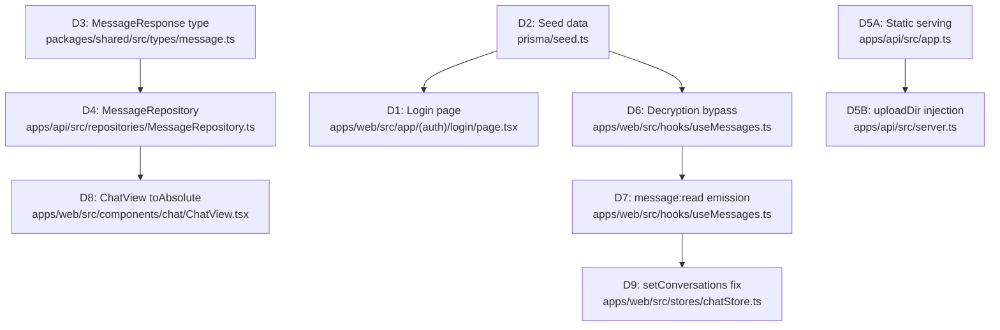

# Technical Specification

# 0. Agent Action Plan

## 0.1 Intent Clarification


### 0.1.1 Core Feature Objective

Based on the prompt, the Blitzy platform understands that the new feature requirement is to apply **5 targeted bug fixes** (delivered as **9 discrete directives** across **9 files**) to the Kalle WhatsApp clone so that the Docker demo stack operates without errors. The expected LoC delta is approximately 210 lines of changed code. The fixes are applied to the `main` branch, post-merge, and the overall goal is functional correctness — not new feature development.

The five bugs and their corresponding fix requirements are:

- **Bug 1 — Login authentication failure:** The `/login` page renders a phone-number keypad UI with credential-derivation logic that produces 401 errors against the seed backend. The fix replaces this with a standard email + password form that POSTs to `POST /api/v1/auth/login` and redirects to `/chat` on success. Seed credentials `sabohiddin@demo.kalle.app / Demo@Pass123!` must produce HTTP 200.

- **Bug 2 — Unreadable seed data (messages and media):** The seed script (`prisma/seed.ts`) stores messages as Base64-encoded simulated ciphertext via `generateDeterministicCiphertext()`, which the frontend's Signal Protocol decryption layer cannot decode, resulting in `[Unable to decrypt message]`. Additionally, media records reference `/uploads/encrypted/…` paths that don't resolve to any real asset. The fix stores readable UTF-8 plaintext in the `ciphertext` column for seed messages and uses `https://picsum.photos/seed/…` URLs for image media.

- **Bug 3 — Missing media URL fields in API response:** The `MessageResponse` shared type lacks fields for media URLs (`mediaUrl`, `mediaThumbnailUrl`, `mediaFileName`, `mediaMimeType`, `mediaFileSize`), the `MessageRepository` does not select media URL columns, and its `mapToResponse` does not populate them. The fix adds fields to the shared type, expands the Prisma select, and maps media data into the API response.

- **Bug 4 — Static file serving and cross-origin image loading:** The API does not serve the `/uploads` directory as static files, and no `Cross-Origin-Resource-Policy` header is set — causing 404s and CORS blocks for media assets. The fix registers an Express static middleware at `/uploads` with an inline CORP header override.

- **Bug 5 — Unread badges reappear after navigation:** `setActiveConversation` zeroes the local unread count but `setConversations` (called on page remount) replaces conversation objects with raw server data, restoring the stale server `unreadCount`. Additionally, no `message:read` WebSocket events are emitted when a conversation is opened. The fix patches `setConversations` to preserve locally-tracked zeros and emits `message:read` events on history load and live message receipt.

Implicit requirements detected:

- **Signal decryption bypass:** Seed messages stored as UTF-8 plaintext will enter the Signal Protocol decryption pipeline and stall for 3 seconds before timing out. A format-detection guard (`/^\d+:/` test) must be added to `decryptSingleMessage` to immediately return non-Signal-format strings.
- **Media URL absolutization:** The API returns relative paths like `/uploads/encrypted/…`; the Next.js frontend resolves these against `localhost:3000` instead of the API origin `localhost:3001`. A `toAbsolute()` helper must prefix relative URLs with `process.env.NEXT_PUBLIC_API_URL`.
- **TypeScript compilation integrity:** Shared type changes propagate to all consumers; zero new TypeScript errors must be introduced.

### 0.1.2 Special Instructions and Constraints

- **Modification boundaries:** Fixes target ONLY the 5 identified bugs. No new features, no architecture expansion, no UI redesign beyond replacing the login credential schema.
- **Sequential execution:** The 9 directives have explicit dependency ordering — Directive 4 depends on Directive 3; Directives 6 and 7 share a file (`useMessages.ts`).
- **Verification-gated completion:** Directive 10 mandates that every pass/fail criterion from Directives 1–9 must be verified before declaring completion.
- **Seed credential schema:** All 12 seed users share password `Demo@Pass123!` hashed with fixed bcrypt salt `$2b$12$KalleSeedDeterministic`. The audit log entries must reference `SEED_USERS[N].email` — no calls to a `deriveEmail()` function.
- **Demo hint display:** The login page must display `sabohiddin@demo.kalle.app / Demo@Pass123!` as a visible demo credential hint.

User Example (login form wiring): `form submit → POST /api/v1/auth/login → useAuthStore.setUser → router.push('/chat')`

User Example (media URL absolutization): `const toAbsolute = (url) => url ? (url.startsWith('http') ? url : \`${apiOrigin}${url}\`) : undefined`

User Example (decryption bypass guard): `if (!/^\d+:/.test(message.ciphertext)) { return message.ciphertext; }`

### 0.1.3 Technical Interpretation

These feature requirements translate to the following technical implementation strategy:

- To **fix login authentication**, we will replace the entire `apps/web/src/app/(auth)/login/page.tsx` component, removing `KEYBOARD_ROWS`, `BackspaceIcon`, `ChevronRightIcon`, `MIN_PHONE_LENGTH`, `MAX_PHONE_LENGTH`, and all credential-derivation logic, and implementing email/password inputs with direct `POST /api/v1/auth/login` submission.
- To **fix seed data**, we will modify `prisma/seed.ts` to replace `generateDeterministicCiphertext()` with a `getSeedMessageText(contentKey)` lookup function returning hardcoded readable strings, use `https://picsum.photos/seed/{mediaId}/400/300` URLs for image media, and ensure all seed users use `email`-only authentication with pre-computed bcrypt hashes.
- To **add media URL fields to API responses**, we will extend `MessageResponse` in `packages/shared/src/types/message.ts`, expand `FULL_MESSAGE_INCLUDE.media.select` and `MessageRecord` in `apps/api/src/repositories/MessageRepository.ts`, and populate the new fields in `mapToResponse`.
- To **serve static files**, we will add `uploadDir: string` to `AppDependencies` in `apps/api/src/app.ts`, register `express.static` at `/uploads` with a CORP header middleware, and pass `uploadDir` from `apps/api/src/server.ts`.
- To **fix unread badge persistence**, we will modify `setConversations` in `apps/web/src/stores/chatStore.ts` to merge locally-tracked zeros into incoming server data, add a Signal decryption bypass guard in `apps/web/src/hooks/useMessages.ts`, emit `message:read` WebSocket events on history load and live message receipt, and apply `toAbsolute()` to media URLs in `apps/web/src/components/chat/ChatView.tsx`.


## 0.2 Repository Scope Discovery


### 0.2.1 Comprehensive File Analysis

The Kalle monorepo is a TypeScript-based workspace organized under `apps/api` (Express/Socket.IO backend), `apps/web` (Next.js frontend), `packages/shared` (shared types/validators/constants), and `prisma` (schema, migrations, seed). All 9 target files were located and their current implementation analyzed.

**Existing files requiring modification (9 files):**

| # | File Path | Current State | Directive | Change Purpose |
|---|-----------|---------------|-----------|----------------|
| 1 | `apps/web/src/app/(auth)/login/page.tsx` | Phone-number keypad UI with `KEYBOARD_ROWS`, `BackspaceIcon`, `ChevronRightIcon`, `MIN_PHONE_LENGTH`, `MAX_PHONE_LENGTH`; derives credentials via registration+login fallback flow | D1 | Replace with email+password form; POST to `/api/v1/auth/login`; redirect on success |
| 2 | `prisma/seed.ts` | Uses `generateDeterministicCiphertext()` for Base64 fake ciphertext; media records use `/uploads/encrypted/…` paths; audit logs reference `SEED_USERS[N].email` correctly | D2 | Replace ciphertext generator with `getSeedMessageText()`; use picsum.photos URLs for images; ensure bcrypt hash uses fixed salt |
| 3 | `packages/shared/src/types/message.ts` | `MessageResponse` interface has `mediaId?: string` but no URL/metadata fields | D3 | Add `mediaUrl`, `mediaThumbnailUrl`, `mediaFileName`, `mediaMimeType`, `mediaFileSize` optional fields |
| 4 | `apps/api/src/repositories/MessageRepository.ts` | `FULL_MESSAGE_INCLUDE.media.select` includes only `{ id: true }`; `MessageRecord.media` typed as `Array<{ id: string }>`; `mapToResponse` extracts only `mediaId` | D4 | Expand select to include `encryptedUrl`, `thumbnailUrl`, `filename`, `mimeType`, `size`; update `MessageRecord`; populate all media fields in `mapToResponse` |
| 5 | `apps/api/src/app.ts` | `AppDependencies` interface has `corsOptions`, `v1Router`, `pinoHttpMiddleware`, `metricsService`; no static file serving; 12-step middleware chain | D5(A) | Add `uploadDir: string` to `AppDependencies`; register CORP middleware + `express.static(uploadDir)` at `/uploads` BEFORE v1Router mount |
| 6 | `apps/api/src/server.ts` | `createApp()` called with `{ corsOptions, v1Router, pinoHttpMiddleware, metricsService }`; `storageProvider` uses `env.UPLOAD_DIR \|\| './uploads'` | D5(B) | Pass `uploadDir: env.UPLOAD_DIR \|\| './uploads'` to `createApp()` |
| 7 | `apps/web/src/hooks/useMessages.ts` | `decryptSingleMessage` has tombstone guard and Signal decryption with 3s timeout; `loadHistory` stores fetched messages but emits no `message:read`; `handleNewMessage` increments unread but has no `message:read` emission for active conversation | D6, D7 | Add `/^\d+:/` bypass guard; emit `message:read` in `loadHistory` after store update; emit `message:read` in `handleNewMessage` for active conversation |
| 8 | `apps/web/src/components/chat/ChatView.tsx` | `mediaAttachment` constructed using `msg.mediaThumbnailUrl` and `msg.mediaUrl` directly (relative paths); no URL absolutization | D8 | Define `apiOrigin` and `toAbsolute()` helper; apply to `thumbnailUrl` and `fullUrl` in `mediaAttachment` construction |
| 9 | `apps/web/src/stores/chatStore.ts` | `setConversations` sorts, copies existing `unreadCounts`, and only sets counts for conversations NOT already in the map; does not merge local zeros back into `conv.unreadCount` | D9 | Replace `setConversations` body to merge locally-tracked counts into conversation objects |

**Integration point discovery:**

- **API endpoints connected to fixes:**
  - `POST /api/v1/auth/login` — login form target (existing endpoint, no modification needed)
  - `GET /api/v1/conversations/:id/messages` — returns `MessageResponse[]`; output shape affected by D3/D4
  - `GET /uploads/…` — new static file route (D5)
  - WebSocket `message:read` event — emitted by client (D7), processed by server (existing handler)

- **Database models/migrations affected:**
  - No schema migration needed — all changes are at the seed data and application code level
  - `prisma/seed.ts` — message `ciphertext` column values change from Base64 to UTF-8 plaintext
  - `prisma/seed.ts` — media `encryptedUrl` and `thumbnailUrl` columns change to picsum.photos URLs for images

- **Shared type propagation:**
  - `packages/shared/src/types/message.ts` → consumed by `apps/api/src/repositories/MessageRepository.ts`, `apps/web/src/hooks/useMessages.ts`, `apps/web/src/stores/chatStore.ts`, `apps/web/src/components/chat/ChatView.tsx`

### 0.2.2 Web Search Research Conducted

No external web search research is required for this bug-fix set. All changes are self-contained within the existing codebase patterns:
- Express `express.static()` middleware is already available via the `express` dependency (`^4.19.0`)
- `bcryptjs` (`^2.4.3`) is already available in the API workspace
- `picsum.photos` is a well-known placeholder image service requiring no API key
- Socket.IO `emitEvent` is already wired in `apps/web/src/lib/socket.ts`

### 0.2.3 New File Requirements

No new source files, test files, or configuration files need to be created. All 9 directives modify existing files only. The total scope is ~210 lines of code delta across 9 existing files.


## 0.3 Dependency Inventory


### 0.3.1 Private and Public Packages

All packages required by this bug-fix set are already present in the workspace dependency manifests. No new dependencies need to be added.

| Registry | Package | Version | Workspace | Purpose in Fix |
|----------|---------|---------|-----------|----------------|
| npm (workspace) | `@kalle/shared` | `*` (workspace link) | `apps/api`, `apps/web` | Shared `MessageResponse` type extended with media URL fields (D3) |
| npm | `express` | `^4.19.0` | `apps/api` | `express.static()` for `/uploads` serving (D5) |
| npm | `bcryptjs` | `^2.4.3` | `apps/api` | Pre-computed bcrypt hash in seed with fixed salt (D2) |
| npm | `@prisma/client` | `^5.14.0` | `apps/api` | Prisma queries in seed and MessageRepository (D2, D4) |
| npm | `next` | `^14.2.0` | `apps/web` | Next.js App Router for login page, `process.env.NEXT_PUBLIC_API_URL` (D1, D8) |
| npm | `react` | `^18.3.0` | `apps/web` | React hooks (`useState`, `useEffect`, `useCallback`) for login page (D1) |
| npm | `zustand` | `^4.5.0` | `apps/web` | Chat store `setConversations` fix (D9), auth store integration (D1) |
| npm | `socket.io-client` | `^4.7.0` | `apps/web` | `emitEvent('message:read', …)` emission (D7) |
| npm | `typescript` | `^5.4.0` | Root, all workspaces | Type compilation verification (D3) |
| npm | `prisma` | `^5.14.0` | Root | Seed execution via `npx prisma db seed` (D2) |
| npm | `cors` | `^2.8.5` | `apps/api` | Existing CORS middleware, unchanged |
| npm | `helmet` | `^7.1.0` | `apps/api` | Existing security headers, unchanged |
| npm (runtime) | Node.js | `>=20.0.0` | Root `engines` | Runtime engine constraint |
| npm (runtime) | npm | `>=10.0.0` | Root `engines` | Package manager constraint |

### 0.3.2 Dependency Updates

No dependency version changes, additions, or removals are required. All necessary packages are already installed at compatible versions.

**Import Updates:**

No import path changes are needed across the codebase. The only new imports required are:

- `apps/api/src/app.ts` — already imports `express` (for `express.static`)
- `apps/web/src/hooks/useMessages.ts` — already imports `emitEvent`, `isConnected` from `../lib/socket`
- `apps/web/src/hooks/useMessages.ts` — already imports `useAuthStore` from `../stores/authStore`

**External Reference Updates:**

No configuration files, documentation, build files, or CI/CD pipelines need import or reference changes. The `.env.example` already defines `NEXT_PUBLIC_API_URL=http://localhost:3001` and `UPLOAD_DIR=/app/uploads`, which are consumed by the fixes without modification.


## 0.4 Integration Analysis


### 0.4.1 Existing Code Touchpoints

**Direct modifications required:**

- **`apps/api/src/app.ts` (lines 61–99, 130–291):** Add `uploadDir: string` to the `AppDependencies` interface (line ~61). Insert a new middleware block between Step 9 (Metrics, line 237) and Step 10 (API v1 routes, line 251) that registers an inline CORP header middleware and `express.static(deps.uploadDir)` at the `/uploads` prefix. The middleware chain comment table at lines 109–124 must be updated to reflect the new step numbering.

- **`apps/api/src/server.ts` (lines 407–412):** Add `uploadDir: env.UPLOAD_DIR || './uploads'` to the `createApp()` invocation object at line 407. The `storageProvider` already reads `env.UPLOAD_DIR || './uploads'` at line 197, confirming the environment variable path.

- **`packages/shared/src/types/message.ts` (lines 212–275):** Add five optional fields to the `MessageResponse` interface after `mediaId?: string` (line 247): `mediaUrl?: string`, `mediaThumbnailUrl?: string`, `mediaFileName?: string`, `mediaMimeType?: string`, `mediaFileSize?: number`.

- **`apps/api/src/repositories/MessageRepository.ts` (lines 57–96, 107–127, 584–637):** Expand `MessageRecord.media` array element type to include `encryptedUrl`, `thumbnailUrl`, `filename`, `mimeType`, `size` (line ~93). Expand `FULL_MESSAGE_INCLUDE.media.select` to include all six fields (line ~123). In `mapToResponse`, extract `primaryMedia = record.media?.[0]` and map `encryptedUrl → mediaUrl`, `thumbnailUrl → mediaThumbnailUrl`, `filename → mediaFileName`, `mimeType → mediaMimeType`, `size → mediaFileSize` (line ~595).

- **`apps/web/src/hooks/useMessages.ts` (lines 251–294, 765–772, 929–973):** In `decryptSingleMessage`, after the tombstone guard (line 256), add the format-detection bypass: `if (!/^\d+:/.test(message.ciphertext)) { return message.ciphertext; }`. In `loadHistory`, after `setMessages`/`addMessages` (lines 768–772), collect `fetchedMessages` where `senderId !== currentUser.id` and emit `message:read` via `emitEvent`. In `handleNewMessage`, in the branch where `incomingMessage.conversationId === activeId` (line 951–953), emit `message:read` for the incoming message.

- **`apps/web/src/components/chat/ChatView.tsx` (lines 784–801):** Define `const apiOrigin = process.env.NEXT_PUBLIC_API_URL ?? 'http://localhost:3001'` and a `toAbsolute()` helper. Apply `toAbsolute()` to `msg.mediaThumbnailUrl` (line 799) and `msg.mediaUrl` (line 800) in the `mediaAttachment` object construction.

- **`apps/web/src/stores/chatStore.ts` (lines 267–279):** Replace the `setConversations` action body. The new implementation sorts incoming conversations, copies the existing `unreadCounts` map, and for each conversation: if NOT already in `unreadCounts`, initialize from `conv.unreadCount`; if already present, overlay the local count onto the conversation object when it differs.

- **`prisma/seed.ts` (lines 133–138, 382–426, 490–537, 644–724):** Replace `generateDeterministicCiphertext()` with `getSeedMessageText(contentKey)`. Update `seedMessages()` to call the new function. Update `seedMedia()` to detect `image/` MIME types and use picsum.photos URLs instead of `/uploads/encrypted/…` paths. Ensure `seedAuditLogs()` references `SEED_USERS[N].email`.

- **`apps/web/src/app/(auth)/login/page.tsx` (full replacement):** Remove all phone-number keypad UI constants, components, and logic. Implement email+password form with `POST /api/v1/auth/login`, 401 error handling, authenticated-redirect `useEffect`, and demo credential hint.

### 0.4.2 Dependency Injections

- **`apps/api/src/server.ts` → `createApp()`:** The `uploadDir` string is injected as a new property alongside existing `corsOptions`, `v1Router`, `pinoHttpMiddleware`, and `metricsService`. No new service, repository, or provider instantiation is needed.

### 0.4.3 Database/Schema Updates

- **No new migrations required.** All database schema columns (`ciphertext`, `encryptedUrl`, `thumbnailUrl`, `filename`, `mimeType`, `size`) already exist in the Prisma schema.
- **Seed data content changes only:** The `ciphertext` column values change from Base64-encoded strings to readable UTF-8 plaintext. The `encryptedUrl` and `thumbnailUrl` columns for image-type media change from local file paths to `https://picsum.photos/seed/…` URLs.

### 0.4.4 Cross-File Dependency Chain

The 9 directives form the following dependency graph:




## 0.5 Technical Implementation


### 0.5.1 File-by-File Execution Plan

Every file listed below MUST be modified. They are grouped by dependency order to ensure downstream consumers have the types and data they need.

**Group 1 — Shared Type Foundation (Directive 3)**

- **MODIFY: `packages/shared/src/types/message.ts`** — Add five optional fields to the `MessageResponse` interface immediately after the existing `mediaId?: string` field:
  - `mediaUrl?: string` — full-resolution media URL (maps from `encryptedUrl`)
  - `mediaThumbnailUrl?: string` — thumbnail URL (maps from `thumbnailUrl`)
  - `mediaFileName?: string` — original filename
  - `mediaMimeType?: string` — MIME type string
  - `mediaFileSize?: number` — file size in bytes

**Group 2 — Backend API Layer (Directives 4, 5A, 5B)**

- **MODIFY: `apps/api/src/repositories/MessageRepository.ts`** — Expand `FULL_MESSAGE_INCLUDE.media.select` from `{ id: true }` to include `id`, `encryptedUrl`, `thumbnailUrl`, `filename`, `mimeType`, `size` (retain `take: 1`). Update the `MessageRecord` interface's `media` array element to include all six fields. In `mapToResponse`, extract `primaryMedia = record.media?.[0]` and populate `mediaUrl`, `mediaThumbnailUrl`, `mediaFileName`, `mediaMimeType`, `mediaFileSize` on the return object.

- **MODIFY: `apps/api/src/app.ts`** — Add `uploadDir: string` to the `AppDependencies` interface. Insert a new middleware step between Metrics (current Step 9) and API Routes (current Step 10):
  ```ts
  app.use('/uploads', (_req, res, next) => {
    res.setHeader('Cross-Origin-Resource-Policy', 'cross-origin');
    next();
  }, express.static(deps.uploadDir));
  ```

- **MODIFY: `apps/api/src/server.ts`** — Add `uploadDir: env.UPLOAD_DIR || './uploads'` to the object passed to `createApp()` at the composition root.

**Group 3 — Seed Data (Directive 2)**

- **MODIFY: `prisma/seed.ts`** — Three changes:
  - **(A) Auth:** Confirm `SEED_USERS` uses `email` field (already correct). Ensure `seedUsers()` calls `hashPassword('Demo@Pass123!')` with the fixed salt `$2b$12$KalleSeedDeterministic` and writes the hash to all 12 users (already correct). Confirm `seedAuditLogs()` references `SEED_USERS[N].email` (already correct).
  - **(B) Messages:** Replace `generateDeterministicCiphertext(content, nonce)` with a new `getSeedMessageText(contentKey): string | null` function that returns a hardcoded human-readable string per `contentKey`, or `null` for tombstones. Update `seedMessages()` to call `getSeedMessageText(def.contentKey)` instead of `generateDeterministicCiphertext(def.contentKey, i)`.
  - **(C) Images:** In `seedMedia()`, detect `md.mimeType.startsWith('image/')`. For image types: set `encryptedUrl = https://picsum.photos/seed/{mediaId}/400/300` and `thumbnailUrl = https://picsum.photos/seed/thumb-{mediaId}/200/150`. For non-image types (`audio/ogg`, `application/pdf`): retain the existing local path pattern.

**Group 4 — Frontend Login (Directive 1)**

- **MODIFY: `apps/web/src/app/(auth)/login/page.tsx`** — Full replacement of the component. Remove: `KEYBOARD_ROWS`, `BackspaceIcon`, `ChevronRightIcon`, `MIN_PHONE_LENGTH`, `MAX_PHONE_LENGTH`, phone-number state, keypad rendering, credential-derivation logic, register-then-login fallback. Implement:
  - `<input type="email">` and `<input type="password">` controlled fields
  - On submit: `POST /api/v1/auth/login` with `{ email, password }`
  - On 401: render "Invalid email or password" error
  - On success: `useAuthStore.getState().login(data.tokens, data.user)` then `router.push('/chat')`
  - `useEffect` that redirects to `/chat` if `authStore.isAuthenticated` is already true on mount
  - Demo credential hint: `sabohiddin@demo.kalle.app / Demo@Pass123!`

**Group 5 — Frontend Message Pipeline (Directives 6, 7)**

- **MODIFY: `apps/web/src/hooks/useMessages.ts`** — Two distinct changes in the same file:
  - **(D6) Decryption bypass:** In `decryptSingleMessage`, after the tombstone/null guard at line 256, add: `if (!/^\d+:/.test(message.ciphertext)) { return message.ciphertext; }`. This returns non-Signal-format strings immediately without entering the decryption pipeline.
  - **(D7A) History load read receipt:** In `loadHistory`, after `setMessages`/`addMessages` (line ~772), if `isConnected()`, collect all `fetchedMessages` where `senderId !== useAuthStore.getState().user?.id`, extract their IDs, and emit `emitEvent('message:read', { messageIds, conversationId })`. Skip if `messageIds` is empty.
  - **(D7B) Live message read receipt:** In `handleNewMessage`, in the branch where `incomingMessage.conversationId === activeId` (line ~952), emit `emitEvent('message:read', { messageIds: [incomingMessage.id], conversationId: incomingMessage.conversationId })` guarded by `isConnected()`.

**Group 6 — Frontend Media Display (Directive 8)**

- **MODIFY: `apps/web/src/components/chat/ChatView.tsx`** — Define at the top of the component or in the helpers section:
  ```ts
  const apiOrigin = process.env.NEXT_PUBLIC_API_URL ?? 'http://localhost:3001';
  const toAbsolute = (url?: string | null) =>
    url ? (url.startsWith('http') ? url : `${apiOrigin}${url}`) : undefined;
  ```
  Apply `toAbsolute()` to `msg.mediaThumbnailUrl` and `msg.mediaUrl` in the `mediaAttachment` construction block (lines 784–801).

**Group 7 — Frontend Unread State (Directive 9)**

- **MODIFY: `apps/web/src/stores/chatStore.ts`** — Replace the `setConversations` action body (lines 267–279). The new implementation:
  - Sorts incoming conversations via `sortConversationsByRecent(conversations)`
  - Copies the existing `unreadCounts` Map to `newUnreadCounts`
  - Maps over sorted conversations: if `conv.id` is NOT in `unreadCounts`, set `newUnreadCounts.set(conv.id, conv.unreadCount)` and return `conv` unchanged; if it IS in `unreadCounts`, return `{ ...conv, unreadCount: localCount }` only when `localCount !== conv.unreadCount`, else return `conv` unchanged
  - Sets `{ conversations: merged, unreadCounts: newUnreadCounts }`
  - `setActiveConversation` MUST NOT be modified

### 0.5.2 Implementation Approach per File

- Establish the shared type foundation first (D3) so all downstream TypeScript consumers resolve cleanly.
- Wire the backend API layer (D4, D5) so the API responds with complete media data and serves static files.
- Fix seed data (D2) so the database contains correct credentials, readable messages, and valid image URLs.
- Replace the login page (D1) to consume the corrected seed credentials.
- Patch the frontend message pipeline (D6, D7) to bypass Signal decryption for plaintext and emit read receipts.
- Apply URL absolutization (D8) so media renders from the correct API origin.
- Fix unread state management (D9) to persist locally-tracked zeros across page remounts.

### 0.5.3 User Interface Design

The only UI change is the login page replacement (Directive 1):

- **Goal:** Replace the phone-number keypad UI with a standard email+password login form.
- **Key elements:** Two text inputs (email, password), a submit button, an error message area, a demo credential hint, and an authenticated-redirect guard.
- **No visual design system changes:** The login page uses standard HTML form elements with existing Tailwind CSS utility classes. No component library is involved.
- **Accessibility:** The form must retain ARIA live error region for screen readers and proper `label` associations for inputs.


## 0.6 Scope Boundaries


### 0.6.1 Exhaustively In Scope

**All modified source files:**
- `apps/web/src/app/(auth)/login/page.tsx` — full replacement (D1)
- `prisma/seed.ts` — auth, messages, and media sections (D2)
- `packages/shared/src/types/message.ts` — `MessageResponse` interface extension (D3)
- `apps/api/src/repositories/MessageRepository.ts` — select, type, and mapper expansion (D4)
- `apps/api/src/app.ts` — `AppDependencies` interface + static serving middleware (D5A)
- `apps/api/src/server.ts` — `uploadDir` injection into `createApp()` (D5B)
- `apps/web/src/hooks/useMessages.ts` — decryption bypass + `message:read` emission (D6, D7)
- `apps/web/src/components/chat/ChatView.tsx` — `toAbsolute()` media URL fix (D8)
- `apps/web/src/stores/chatStore.ts` — `setConversations` merge fix (D9)

**Integration points explicitly in scope:**
- `apps/api/src/app.ts` — middleware chain ordering (CORP + static before v1Router)
- `apps/api/src/server.ts` — composition root `createApp()` argument (uploadDir)
- `apps/web/src/hooks/useMessages.ts` — `decryptSingleMessage` function (all call sites)
- `apps/web/src/hooks/useMessages.ts` — `loadHistory` post-fetch block
- `apps/web/src/hooks/useMessages.ts` — `handleNewMessage` active-conversation branch
- `apps/web/src/stores/chatStore.ts` — `setConversations` action body only
- `apps/web/src/components/chat/ChatView.tsx` — `mediaAttachment` construction block

**Verification criteria (Directive 10):**
- D1: `POST /api/v1/auth/login` with seed credentials → HTTP 200
- D2a: `npx prisma db seed` exits 0
- D2b: `SELECT ciphertext` returns readable UTF-8
- D2c: `SELECT "encryptedUrl"` for image media returns picsum URLs
- D3: TypeScript compiles with zero new errors
- D4: Message list API returns `mediaUrl` non-null for image messages
- D5: `curl -I http://localhost:3001/uploads/` returns `cross-origin-resource-policy: cross-origin`
- D6: Seed messages render as readable text within 500 ms
- D7: Post open+close, `GET /api/v1/conversations` returns `unreadCount: 0`
- D8: Image messages render visible photos via HTTP 200
- D9: Unread badge stays 0 after navigation; no browser console exceptions

### 0.6.2 Explicitly Out of Scope

- **New features:** No new API endpoints, database tables, or UI screens
- **Architecture expansion:** No changes to the service layer, middleware chain (beyond static serving), or provider pattern
- **UI redesign:** No changes to the chat UI, settings, contacts, or status screens — only the login page credential form and media URL paths
- **Encryption system:** No changes to the Signal Protocol implementation, key exchange, or Sender Key distribution — only a format-detection bypass for non-Signal plaintext
- **Performance optimization:** No query optimization, caching changes, or bundle size work
- **Refactoring:** No refactoring of existing code unrelated to the 5 identified bugs
- **Test files:** No test file modifications unless explicitly required by verification criteria
- **CI/CD:** No pipeline, Dockerfile, or docker-compose changes
- **`setActiveConversation`:** Explicitly excluded from modification per Directive 9 constraints
- **Non-image media paths:** Voice notes (`audio/ogg`) and documents (`application/pdf`) retain their existing `/uploads/encrypted/…` path pattern in seed data


## 0.7 Rules for Feature Addition


### 0.7.1 Sequential Execution Requirement

The 9 directives MUST be executed in order (D1 through D9) and each directive's pass/fail criterion must be verified before proceeding to the next. The dependency chain is:
- D3 must complete before D4 (shared type consumed by repository)
- D6 and D7 share a file (`useMessages.ts`) and must be applied together
- D5A and D5B are paired (interface + composition root)

### 0.7.2 Middleware Ordering Constraint

The Express middleware chain in `apps/api/src/app.ts` has a documented 12-step order that is architecturally critical. The new static-file serving block MUST be inserted BEFORE the v1Router mount (current Step 10) and AFTER the Metrics middleware (current Step 9). The step numbering in the middleware comment table must be updated to reflect the insertion.

### 0.7.3 Store Mutation Isolation

Directive 9 explicitly states that `setActiveConversation` MUST NOT be modified. Only the `setConversations` action body is in scope. The existing `resetUnread` and `incrementUnread` actions remain untouched.

### 0.7.4 Decryption Bypass Safety

The Signal Protocol bypass guard (`/^\d+:/` regex test) must be applied ONLY to the `decryptSingleMessage` function. It must not affect the encryption path (`encryptMessage`, `encryptGroupMessage`) or the session management layer. The guard returns the raw `message.ciphertext` string unchanged when the format does not match Signal Protocol wire format.

### 0.7.5 Seed Data Determinism

All seed data changes must preserve the existing determinism guarantees (Rule R10). The `getSeedMessageText()` function must return the same string for the same `contentKey` on every invocation. The bcrypt hash must use the existing `FIXED_SALT = '$2b$12$KalleSeedDeterministic'`. The `hashPassword()` function at line 153 already satisfies this requirement.

### 0.7.6 Cross-Origin Resource Policy

The `/uploads` static file route must set `Cross-Origin-Resource-Policy: cross-origin` on EVERY response, including 404s for missing files. This is achieved by placing the inline header middleware BEFORE `express.static()` in the same `app.use('/uploads', …)` call chain.

### 0.7.7 Fire-and-Forget Read Receipts

The `message:read` WebSocket events emitted in Directives 7A and 7B are fire-and-forget. They must NOT block the UI, must NOT throw on failure, and must be skipped entirely if the socket is not connected (`isConnected()` guard).


## 0.8 References


### 0.8.1 Repository Files and Folders Searched

The following files and folders were retrieved and analyzed to derive the conclusions documented in this Agent Action Plan:

**Root-level configuration:**
- `package.json` — monorepo manifest, workspace structure, engine constraints, Prisma seed configuration
- `.env.example` — environment variable template (PostgreSQL, Redis, JWT, CORS, API/WEB ports, upload directory, logging, OpenTelemetry, seeding)
- `tsconfig.base.json` — shared TypeScript baseline (referenced for compilation context)
- `docker-compose.yml` — Docker service definitions (referenced for port/service topology)

**API workspace (`apps/api/`):**
- `apps/api/package.json` — API dependencies (express `^4.19.0`, bcryptjs `^2.4.3`, @prisma/client `^5.14.0`, socket.io `^4.7.0`)
- `apps/api/src/app.ts` — Express application factory, `AppDependencies` interface, 12-step middleware chain
- `apps/api/src/server.ts` — Composition root, dependency wiring, `createApp()` invocation, graceful shutdown
- `apps/api/src/repositories/MessageRepository.ts` — `MessageRecord` type, `FULL_MESSAGE_INCLUDE`, `mapToResponse`, `findByConversation`, `updateStatus`, `batchUpdateStatus`

**Web workspace (`apps/web/`):**
- `apps/web/package.json` — Web dependencies (next `^14.2.0`, react `^18.3.0`, zustand `^4.5.0`, socket.io-client `^4.7.0`)
- `apps/web/src/app/(auth)/login/page.tsx` — Login page component (phone keypad UI, credential derivation, register+login fallback)
- `apps/web/src/hooks/useMessages.ts` — `decryptSingleMessage`, `loadHistory`, `handleNewMessage`, `syncMessages`, WebSocket event listeners
- `apps/web/src/components/chat/ChatView.tsx` — `ChatMessage` interface, `mediaAttachment` construction, `MessageBubble` rendering, scroll/pagination logic
- `apps/web/src/stores/chatStore.ts` — `ChatState` interface, `setConversations`, `setActiveConversation`, `resetUnread`, `incrementUnread`, `addMessage`
- `apps/web/src/stores/authStore.ts` — (summary) Authentication state container, `login()`, `logout()`, `setUser()`, token accessor registration
- `apps/web/src/lib/socket.ts` — (summary) Socket.IO singleton, `emitEvent`, `onEvent`, `offEvent`, `isConnected`, `generateCorrelationId`

**Shared package (`packages/shared/`):**
- `packages/shared/package.json` — Shared package manifest (zod `^3.23.0`, typescript `^5.4.0`)
- `packages/shared/src/types/message.ts` — `MessageResponse`, `SendMessageDTO`, `EditMessageDTO`, `ReplyToMessage`, `LinkPreviewData`, `MessageType`, `MessageStatusEnum`, `GetMessagesQuery`
- `packages/shared/src/index.ts` — (summary) Barrel re-exports for all shared types, constants, and validators

**Prisma workspace (`prisma/`):**
- `prisma/seed.ts` — Full seed script: `SEED_USERS`, `CONVERSATION_DEFS`, `MESSAGE_DEFS`, `generateDeterministicCiphertext`, `seedUsers`, `seedConversations`, `seedMessages`, `seedMessageStatuses`, `seedMedia`, `seedStories`, `seedAuditLogs`, `seedSessions`, `seedPreKeyBundles`, `cleanDatabase`, `main`

**Folder structure explored:**
- Root (`/`) — 12 files, 8 folders
- `apps/` — `api/`, `web/`
- `apps/api/src/` — `app.ts`, `server.ts`, plus `config/`, `controllers/`, `domain/`, `errors/`, `middleware/`, `providers/`, `repositories/`, `routes/`, `services/`, `websocket/`
- `apps/web/src/` — `app/`, `components/`, `hooks/`, `lib/`, `stores/`, `assets/`
- `apps/web/src/app/(auth)/login/` — `page.tsx`
- `apps/web/src/components/chat/` — 18 component files
- `apps/web/src/hooks/` — 7 hook files
- `packages/shared/src/` — `index.ts`, `constants/`, `types/`, `validators/`
- `prisma/` — `seed.ts`, `migrations/`

### 0.8.2 Attachments

No attachments were provided for this project. No Figma URLs, design files, or external documents were referenced.


