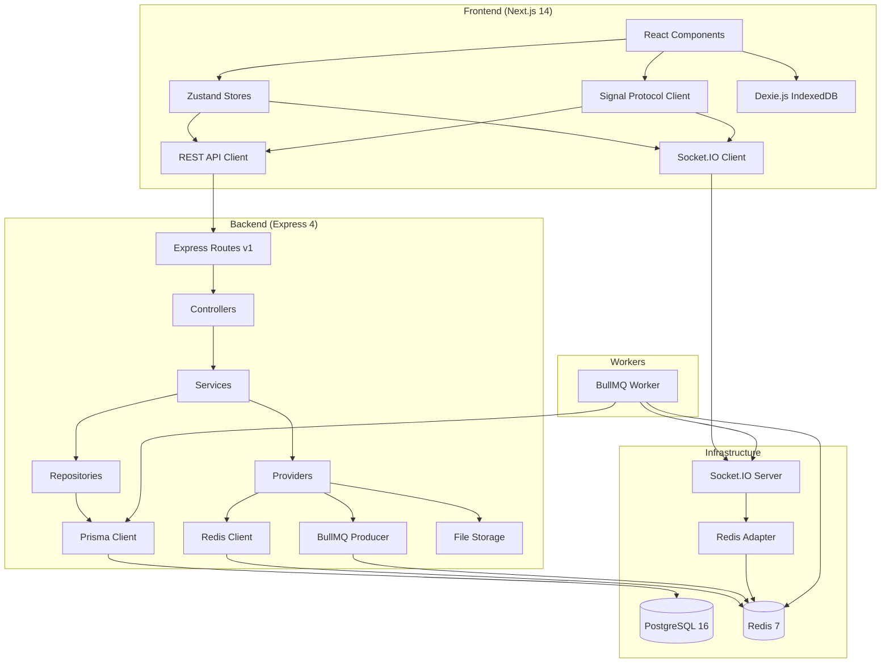
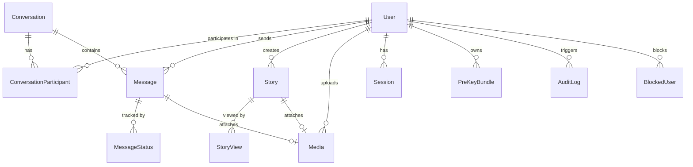

# Architecture Documentation

## Executive Summary

Kalle is a **production-grade, horizontally scalable WhatsApp clone web application** built as a Figma-to-code pipeline demonstration artifact. The system delivers real-time encrypted messaging for both one-to-one and group conversations, media sharing with client-side encryption, stories with 24-hour expiration, and a full observability stack — all running locally via Docker Compose with zero external service dependencies.

**Key architectural characteristics:**

- **Monorepo structure** with shared TypeScript types between frontend and backend via npm workspaces and Turborepo
- **End-to-end encrypted messaging** using the Signal Protocol (X3DH key agreement, Double Ratchet for 1:1, Sender Keys for groups) — the server is zero-knowledge and never has access to plaintext
- **Real-time communication** via Socket.IO 4.x with a Redis adapter enabling horizontal scaling across multiple server instances
- **Asynchronous job processing** via BullMQ 5.x for group message fan-out, link preview extraction, Sender Key distribution, and scheduled cleanup tasks
- **Full observability stack** with Pino structured JSON logging, OpenTelemetry SDK with Prometheus-compatible metrics export, and component-level health checks
- **Docker-first development** with single-command bootstrap (`docker-compose up`) orchestrating PostgreSQL 16, Redis 7, Express API, Next.js frontend, BullMQ worker, backup service, and OpenTelemetry collector — with hot reload and automatic migrations
- **Object-oriented, interface-driven backend** following SOLID principles with dependency injection wired at a composition root
- **Responsive mobile-first UI** translated from 21 Figma screens (375×812px iPhone X form factor) using Tailwind CSS 3.4.x with custom design tokens

---

## System Architecture

### High-Level Architecture Diagram



### Key Architectural Decisions

1. **Monorepo for type sharing** — A single repository houses frontend, backend, worker, and shared types. TypeScript interfaces and DTOs defined once in `@kalle/shared` are consumed by all packages, eliminating contract drift.
2. **Interface-driven backend with dependency injection** — Every service, repository, and provider is coded against its interface. Concrete implementations are wired at a single composition root (`server.ts`), enabling easy testing via mock injection and loose coupling between layers.
3. **Client-side encryption with zero server knowledge** — All message encryption and decryption occurs in the browser using the Signal Protocol. The server stores, transmits, and indexes only ciphertext. No decryption logic exists anywhere in backend code.
4. **Redis adapter for Socket.IO horizontal scaling** — The Socket.IO server uses `@socket.io/redis-adapter` so that events published on one server instance are received by clients connected to any instance, enabling stateless horizontal scaling.
5. **BullMQ for async fan-out and background jobs** — Operations that must not block the API response path (group message delivery to 3+ recipients, link preview extraction, Sender Key distribution, story cleanup) are enqueued as BullMQ jobs and processed by a dedicated worker process.

---

## Monorepo Structure

```
kalle/
├── docker-compose.yml              # Full stack orchestration (7 services)
├── docker-compose.override.yml     # Development overrides (volume mounts, hot reload)
├── Dockerfile.api                   # Multi-stage Node.js 20-alpine build for backend
├── Dockerfile.web                   # Multi-stage Node.js 20-alpine build for frontend
├── Dockerfile.worker                # Multi-stage Node.js 20-alpine build for worker
├── Dockerfile.backup                # Alpine-based pg_dump cron container
├── .env.example                     # Environment variable template with local defaults
├── .gitignore                       # Node.js + Docker + IDE ignore patterns
├── .dockerignore                    # Build context exclusions
├── .eslintrc.json                   # Root ESLint with TypeScript rules
├── .prettierrc                      # Formatting config (single quotes, trailing commas)
├── package.json                     # Root workspace configuration (npm workspaces)
├── turbo.json                       # Turborepo pipeline: shared → api/web/worker
├── tsconfig.base.json               # Shared strict TypeScript compiler options
├── LICENSE                          # MIT License
├── README.md                        # Project documentation and setup instructions
│
├── packages/
│   └── shared/                      # @kalle/shared — Shared TypeScript types/DTOs
│       ├── package.json
│       ├── tsconfig.json
│       └── src/
│           ├── index.ts             # Barrel export
│           ├── types/               # Domain types, API contracts, WS event payloads
│           │   ├── user.ts
│           │   ├── conversation.ts
│           │   ├── message.ts
│           │   ├── media.ts
│           │   ├── story.ts
│           │   ├── auth.ts
│           │   ├── encryption.ts
│           │   ├── audit.ts
│           │   ├── error.ts
│           │   ├── websocket-events.ts
│           │   └── api-contracts.ts
│           ├── constants/           # Rate limits, size limits, TTL values, MIME allowlist
│           │   └── index.ts
│           └── validators/          # Reusable Zod schemas (email, phone, pagination)
│               └── index.ts
│
├── apps/
│   ├── web/                         # @kalle/web — Next.js 14 frontend (App Router)
│   │   ├── package.json
│   │   ├── tsconfig.json
│   │   ├── next.config.js
│   │   ├── tailwind.config.ts       # Custom Figma design tokens
│   │   ├── postcss.config.js
│   │   └── src/
│   │       ├── app/                 # Next.js App Router pages and layouts
│   │       │   ├── layout.tsx       # Root layout with providers
│   │       │   ├── page.tsx         # Root redirect (auth → /chat or /auth/login)
│   │       │   ├── (auth)/          # Unauthenticated route group
│   │       │   │   └── login/
│   │       │   │       └── page.tsx
│   │       │   └── (main)/          # Authenticated route group
│   │       │       ├── layout.tsx   # Main layout with TabBar
│   │       │       ├── chat/
│   │       │       ├── status/
│   │       │       ├── calls/
│   │       │       ├── camera/
│   │       │       ├── settings/
│   │       │       └── contact/
│   │       ├── components/          # React UI components
│   │       │   ├── chat/            # ChatList, MessageBubble, MessageInput, etc.
│   │       │   ├── status/          # StatusFeed, StatusItem, StatusComposer, StatusViewer
│   │       │   ├── calls/           # CallsList, CallItem
│   │       │   ├── contacts/        # ContactInfo, EditContact
│   │       │   ├── settings/        # SettingsMenu, ProfileEditor, AccountSettings, etc.
│   │       │   └── common/          # TabBar, NavigationBar, Avatar, ActionSheet, etc.
│   │       ├── stores/              # Zustand state management
│   │       │   ├── authStore.ts
│   │       │   ├── chatStore.ts
│   │       │   ├── presenceStore.ts
│   │       │   ├── storyStore.ts
│   │       │   └── uiStore.ts
│   │       ├── lib/                 # Core libraries
│   │       │   ├── socket.ts        # Socket.IO client singleton
│   │       │   ├── encryption.ts    # Signal Protocol wrapper
│   │       │   ├── db.ts            # Dexie.js IndexedDB schema
│   │       │   ├── search.ts        # Client-side full-text search engine
│   │       │   ├── api.ts           # REST API client with auth interceptors
│   │       │   ├── media.ts         # Thumbnail generation, encryption, upload
│   │       │   └── voicenote.ts     # Web Audio API recording + waveform
│   │       ├── hooks/               # Custom React hooks
│   │       │   ├── useSocket.ts
│   │       │   ├── useEncryption.ts
│   │       │   ├── useMessages.ts
│   │       │   ├── usePresence.ts
│   │       │   ├── useMediaUpload.ts
│   │       │   ├── useSearch.ts
│   │       │   └── useResponsive.ts
│   │       └── assets/              # Figma-derived static assets
│   │           ├── icons/           # SVG icons (50 assets)
│   │           └── images/          # PNG images (avatars, wallpaper, illustrations)
│   │
│   └── api/                         # @kalle/api — Express 4 backend + Socket.IO
│       ├── package.json
│       ├── tsconfig.json
│       ├── nodemon.json             # Hot reload configuration
│       └── src/
│           ├── server.ts            # Composition root — DI wiring, bootstrap
│           ├── app.ts               # Express app factory with middleware chain
│           ├── config/              # Environment and infrastructure config
│           │   ├── env.ts           # Zod-validated environment variables
│           │   ├── database.ts      # Prisma client singleton with pooling
│           │   ├── redis.ts         # Redis client with reconnection
│           │   └── cors.ts          # CORS from CORS_ORIGIN env var
│           ├── domain/              # Domain layer (OOD)
│           │   ├── models/          # Domain models with encapsulated behavior
│           │   │   ├── User.ts
│           │   │   ├── Conversation.ts
│           │   │   ├── Message.ts
│           │   │   ├── Story.ts
│           │   │   ├── Media.ts
│           │   │   └── PreKeyBundle.ts
│           │   └── interfaces/      # Repository and provider contracts
│           │       ├── IUserRepository.ts
│           │       ├── IConversationRepository.ts
│           │       ├── IMessageRepository.ts
│           │       ├── IMediaRepository.ts
│           │       ├── IStoryRepository.ts
│           │       ├── IKeyRepository.ts
│           │       ├── IAuditRepository.ts
│           │       ├── IStorageProvider.ts
│           │       ├── IRealtimeProvider.ts
│           │       ├── IQueueProvider.ts
│           │       └── ICacheProvider.ts
│           ├── repositories/        # Prisma-backed persistence implementations
│           │   ├── UserRepository.ts
│           │   ├── ConversationRepository.ts
│           │   ├── MessageRepository.ts
│           │   ├── MediaRepository.ts
│           │   ├── StoryRepository.ts
│           │   ├── KeyRepository.ts
│           │   ├── AuditRepository.ts
│           │   └── SessionRepository.ts
│           ├── services/            # Business logic layer
│           │   ├── AuthService.ts
│           │   ├── UserService.ts
│           │   ├── ConversationService.ts
│           │   ├── MessageService.ts
│           │   ├── MediaService.ts
│           │   ├── StoryService.ts
│           │   ├── EncryptionKeyService.ts
│           │   ├── AuditService.ts
│           │   ├── HealthService.ts
│           │   └── MetricsService.ts
│           ├── providers/           # Infrastructure abstraction implementations
│           │   ├── StorageProvider.ts
│           │   ├── RealtimeProvider.ts
│           │   ├── QueueProvider.ts
│           │   ├── CacheProvider.ts
│           │   └── LoggerProvider.ts
│           ├── controllers/         # Thin HTTP delegation layer
│           │   ├── AuthController.ts
│           │   ├── UserController.ts
│           │   ├── ConversationController.ts
│           │   ├── MessageController.ts
│           │   ├── MediaController.ts
│           │   ├── StoryController.ts
│           │   ├── KeyController.ts
│           │   └── HealthController.ts
│           ├── middleware/          # Cross-cutting concerns
│           │   ├── auth.ts
│           │   ├── validation.ts
│           │   ├── error-handler.ts
│           │   ├── correlation-id.ts
│           │   ├── rate-limiter.ts
│           │   ├── metrics.ts
│           │   └── logger.ts
│           ├── websocket/          # Real-time communication layer
│           │   ├── index.ts        # Socket.IO server with Redis adapter
│           │   ├── handlers/
│           │   │   ├── message-handler.ts
│           │   │   ├── typing-handler.ts
│           │   │   ├── presence-handler.ts
│           │   │   └── sync-handler.ts
│           │   └── middleware/
│           │       ├── ws-auth.ts
│           │       └── ws-rate-limiter.ts
│           ├── routes/v1/          # Versioned REST API routes
│           │   ├── index.ts        # v1 router aggregation
│           │   ├── auth.routes.ts
│           │   ├── user.routes.ts
│           │   ├── conversation.routes.ts
│           │   ├── message.routes.ts
│           │   ├── media.routes.ts
│           │   ├── story.routes.ts
│           │   ├── key.routes.ts
│           │   └── health.routes.ts
│           └── errors/             # Typed domain error hierarchy
│               ├── DomainError.ts
│               ├── AuthenticationError.ts
│               ├── AuthorizationError.ts
│               ├── NotFoundError.ts
│               ├── ValidationError.ts
│               ├── ConflictError.ts
│               ├── PayloadTooLargeError.ts
│               ├── UnsupportedMediaTypeError.ts
│               └── RateLimitError.ts
│
├── workers/
│   └── queue/                       # @kalle/worker — BullMQ worker process
│       ├── package.json
│       ├── tsconfig.json
│       └── src/
│           ├── index.ts             # Worker entry point and job registration
│           └── jobs/
│               ├── message-fanout.ts
│               ├── sender-key-distribution.ts
│               ├── link-preview.ts
│               ├── story-cleanup.ts
│               ├── audit-log-cleanup.ts
│               └── prekey-replenish-notification.ts
│
├── prisma/                          # Database schema and migrations
│   ├── schema.prisma                # Complete data model
│   ├── seed.ts                      # Deterministic seed with valid key material
│   └── migrations/                  # Prisma-generated migration SQL files
│
├── scripts/                         # Utility shell scripts
│   ├── wait-for-it.sh               # TCP port wait for Docker dependencies
│   ├── backup.sh                    # pg_dump with gzip and 7-day retention
│   └── entrypoint.api.sh            # Wait → migrate → start server
│
├── docs/                            # Project documentation
│   ├── architecture.md              # This file — system design and ADRs
│   ├── api-reference.md             # REST API endpoint documentation
│   ├── websocket-events.md          # WebSocket event contracts
│   └── encryption.md                # E2E encryption implementation guide
│
├── e2e/                             # End-to-end tests
│   ├── playwright.config.ts
│   └── tests/
│       ├── critical-path.spec.ts
│       ├── group-path.spec.ts
│       ├── media-path.spec.ts
│       ├── story-path.spec.ts
│       ├── conversation-mgmt.spec.ts
│       ├── search.spec.ts
│       ├── offline-sync.spec.ts
│       ├── mobile-nav.spec.ts
│       ├── session-revocation.spec.ts
│       ├── accessibility.spec.ts
│       └── observability.spec.ts
│
└── backups/                         # Database backup volume mount (gitignored)
```

### Workspace Configuration

The monorepo is managed by **npm workspaces** declared in the root `package.json`:

```json
{
  "workspaces": [
    "packages/shared",
    "apps/api",
    "apps/web",
    "workers/queue"
  ]
}
```

**Turborepo** (`turbo.json`) orchestrates the build pipeline with an explicit dependency graph:

```
@kalle/shared  ←── @kalle/api
               ←── @kalle/web
               ←── @kalle/worker
```

The `shared` package must build before any consuming package. Turborepo caches build outputs and only rebuilds packages whose source files have changed.

**Shared TypeScript configuration** (`tsconfig.base.json`) defines strict compiler options extended by all packages:

- `strict: true` — enables all strict type-checking options
- `esModuleInterop: true` — allows default imports from CommonJS modules
- `skipLibCheck: true` — skip type checking of declaration files for faster builds
- `forceConsistentCasingInFileNames: true` — enforce consistent casing in imports
- Path alias: `@kalle/shared` resolves to `packages/shared/src`

---

## Backend Architecture

### Layered Architecture (OOD)

The backend follows a strict **Object-Oriented Design** with clearly separated layers. Each layer has a single responsibility, communicates only with adjacent layers, and depends on abstractions rather than concretions. This enforces **Rules R16** (zero business logic in controllers) and **R17** (interface-driven dependencies).

```
┌──────────────────────────────────────────────────────────┐
│                    Middleware Layer                        │
│  auth │ validation │ error-handler │ correlation-id │ ... │
├──────────────────────────────────────────────────────────┤
│                   Controller Layer                        │
│  Request parsing → Zod validation → Service call →       │
│  Response formatting. Zero business logic. (Rule R16)     │
├──────────────────────────────────────────────────────────┤
│                    Service Layer                          │
│  Business logic. Imports ONLY from domain interfaces.     │
│  Never imports concrete repos or providers. (Rule R17)    │
├─────────────────────┬────────────────────────────────────┤
│  Repository Layer   │         Provider Layer              │
│  Prisma-backed      │  StorageProvider (filesystem)       │
│  persistence.       │  RealtimeProvider (Socket.IO)       │
│  Zero business      │  QueueProvider (BullMQ)             │
│  logic.             │  CacheProvider (Redis)              │
│                     │  LoggerProvider (Pino)              │
├─────────────────────┴────────────────────────────────────┤
│                    Domain Layer                           │
│  Models with behavior │ Interfaces (repos + providers)    │
│  DTOs │ Domain errors │ Value objects                     │
└──────────────────────────────────────────────────────────┘
```

#### Domain Layer (`domain/models/`, `domain/interfaces/`)

Domain models encapsulate behavior — they are not anemic data bags. Each model contains validation rules, state transition logic, and domain invariants:

| Model | Encapsulated Behavior |
|-------|----------------------|
| **User** | Password validation, profile update rules, block/unblock state management |
| **Conversation** | Participant membership rules, 1:1 vs group type enforcement, archive/mute toggle |
| **Message** | Edit eligibility check (sender-only, 15-minute window), soft-delete tombstone logic, ciphertext swap on edit |
| **Story** | 24-hour expiration calculation, view tracking eligibility |
| **Media** | MIME type validation against allowlist, 25MB size limit enforcement |
| **PreKeyBundle** | Key material structure validation, bundle completeness check |

Repository interfaces define persistence contracts per aggregate root:

- `IUserRepository` — User CRUD, search (cursor-paginated), block list queries
- `IConversationRepository` — Conversation CRUD, participant management, archive/mute state
- `IMessageRepository` — Message persistence, cursor-paginated history, status tracking
- `IMediaRepository` — Media metadata persistence, cleanup queries
- `IStoryRepository` — Story CRUD, feed queries, expiration queries
- `IKeyRepository` — PreKey bundle upload, fetch, count queries
- `IAuditRepository` — Append-only audit log writes

Provider interfaces abstract infrastructure concerns:

- `IStorageProvider` — File upload, download, deletion
- `IRealtimeProvider` — Event emission to users and rooms
- `IQueueProvider` — Job enqueuing with typed payloads
- `ICacheProvider` — Key-value cache with TTL support

#### Repository Layer (`repositories/`)

Each repository implements a domain interface using **Prisma Client** as the underlying persistence mechanism. Repositories handle data access exclusively — they contain zero business logic, zero validation, and zero domain rules. All queries are typed via the Prisma-generated client.

#### Provider Layer (`providers/`)

Providers implement infrastructure interfaces, abstracting external dependencies behind clean contracts:

| Provider | Implementation | Interface |
|----------|---------------|-----------|
| **StorageProvider** | Local filesystem storage for encrypted media blobs | `IStorageProvider` |
| **RealtimeProvider** | Socket.IO server with Redis adapter for cross-instance event emission | `IRealtimeProvider` |
| **QueueProvider** | BullMQ producer for enqueuing typed job payloads | `IQueueProvider` |
| **CacheProvider** | Redis-backed caching for presence state, participant lists, unread counts, and token blacklist | `ICacheProvider` |
| **LoggerProvider** | Pino JSON logger factory with automatic correlation ID injection from request context | N/A (factory) |

#### Service Layer (`services/`)

Services own all business logic and orchestrate operations across repositories and providers. Each service is coded against its dependency interfaces — it never imports a concrete repository or provider class (**Rule R17**):

| Service | Responsibility |
|---------|---------------|
| **AuthService** | Registration, login, JWT access/refresh token issuance, token refresh with rotation, single-session revoke, all-sessions revoke-all via Redis blacklist |
| **UserService** | Profile CRUD, user search (cursor-paginated), block/unblock with audit trail |
| **ConversationService** | Conversation CRUD, membership management, archive/unarchive, mute/unmute, group creation with admin assignment |
| **MessageService** | Message send (enqueue fan-out for groups), edit (15-minute window, ciphertext swap), delete (tombstone with ciphertext null), cursor-paginated history |
| **MediaService** | Upload with server-side MIME verification against allowlist, 25MB enforcement, metadata persistence |
| **StoryService** | Story creation, feed retrieval, view tracking, deletion |
| **EncryptionKeyService** | PreKey bundle upload, fetch for session establishment, low-key-count detection |
| **AuditService** | Append-only writes to audit_log with metadata sanitization (no sensitive content) |
| **HealthService** | Component-level health checks for database, Redis, BullMQ, and file storage |
| **MetricsService** | OpenTelemetry metric collection, Prometheus-compatible export |

#### Controller Layer (`controllers/`)

Controllers are thin delegation layers that follow a strict pattern (**Rule R16**):

1. Parse request parameters (path, query, body)
2. Validate input via Zod schemas (**Rule R31**)
3. Delegate to the appropriate service method
4. Format and return the response

Controllers contain zero business logic. They import from services and Zod validation schemas — never from repositories, Prisma, or provider classes.

#### Middleware Layer (`middleware/`)

Cross-cutting concerns are implemented as Express middleware, applied in a specific order in the middleware chain:

| Middleware | Responsibility | Related Rule |
|-----------|---------------|-------------|
| `correlation-id.ts` | Assigns UUID v4 to every request, sets `X-Correlation-ID` response header, injects into Pino logger context | R29 |
| `logger.ts` | Pino HTTP request logging with correlation ID | R28 |
| `metrics.ts` | OpenTelemetry HTTP request/response instrumentation | R37 |
| `rate-limiter.ts` | Per-IP HTTP rate limiting | — |
| `auth.ts` | JWT verification, Redis blacklist check, user attachment to request | R9, R33 |
| `validation.ts` | Zod schema validation factory returning 400 on failure with field-level errors | R31 |
| `error-handler.ts` | Global catch — maps domain errors to HTTP status codes, returns standardized error shape | R22 |

### Dependency Injection

All dependency injection wiring occurs in a single **composition root**: `apps/api/src/server.ts`. No service class imports a concrete repository or provider implementation (**Rule R17**).

The wiring pattern follows a clear sequence:

```
1. Validate environment variables (Zod) — fail fast (Rule R26)
2. Initialize infrastructure clients (Prisma, Redis, BullMQ)
3. Instantiate providers (Storage, Realtime, Queue, Cache, Logger)
4. Instantiate repositories (User, Conversation, Message, Media, Story, Key, Audit, Session)
5. Instantiate services (injecting repository + provider interfaces)
6. Instantiate controllers (injecting services)
7. Build Express app with middleware chain
8. Configure Socket.IO with handlers
9. Start HTTP server
```

**Benefits:**

- **Testability** — Unit tests inject mock implementations of any dependency interface
- **Loose coupling** — Swapping Redis for Memcached requires changing only `CacheProvider`, not any service
- **Single responsibility** — Each layer has one job, one reason to change
- **Explicit dependency graph** — All wiring is visible in one file

### Error Handling Chain

The application uses a typed domain error hierarchy rooted at `DomainError`:

```
DomainError (base)
├── AuthenticationError    → 401 Unauthorized
├── AuthorizationError     → 403 Forbidden
├── NotFoundError          → 404 Not Found
├── ValidationError        → 400 Bad Request
├── ConflictError          → 409 Conflict
├── PayloadTooLargeError   → 413 Payload Too Large
├── UnsupportedMediaTypeError → 415 Unsupported Media Type
└── RateLimitError         → 429 Too Many Requests
```

Controllers and services throw these typed errors. The global `error-handler.ts` middleware catches all errors and maps them to the standardized response shape (**Rule R22**):

```json
{
  "error": {
    "code": "AUTHENTICATION_ERROR",
    "message": "Invalid or expired access token",
    "details": null
  }
}
```

---

## Frontend Architecture

**Tech Stack:** Next.js 14 (App Router), React 18, Zustand 4, Tailwind CSS 3.4, Socket.IO Client 4, libsignal-protocol-javascript, Dexie.js

### App Router Structure

The Next.js application uses the App Router with route groups to separate authenticated and unauthenticated layouts:

| Route Group | Layout | Routes |
|------------|--------|--------|
| `(auth)` | Minimal layout (no tab bar) | `/login` — Registration and login |
| `(main)` | Authenticated layout with TabBar | All main application routes |

**Dynamic routes within `(main)`:**

- `/chat` — Conversation list view
- `/chat/[id]` — Individual conversation view
- `/status` — Status/Stories feed
- `/calls` — Call history
- `/camera` — Camera view
- `/settings` — Settings menu
- `/settings/profile` — Edit profile
- `/settings/account` — Account settings
- `/settings/chats` — Chat settings
- `/settings/notifications` — Notification settings
- `/settings/storage` — Data and storage usage
- `/settings/starred` — Starred messages (UI shell)
- `/contact/[id]` — Contact information
- `/contact/[id]/edit` — Edit contact

### State Management (Zustand)

Client-side state is managed by five Zustand stores, each owning a specific domain:

| Store | State Owned | Key Actions |
|-------|------------|-------------|
| `authStore` | JWT access/refresh tokens, current user profile, authentication status | `login()`, `register()`, `logout()`, `refreshToken()` |
| `chatStore` | Conversation list, messages per conversation, active conversation ID, unread counts | `sendMessage()`, `editMessage()`, `deleteMessage()`, `loadHistory()`, `archiveConversation()`, `muteConversation()` |
| `presenceStore` | Online/offline user map, typing indicator map, last-seen timestamps | `setUserOnline()`, `setUserOffline()`, `setTyping()`, `clearTyping()` |
| `storyStore` | Stories feed, current user's active status, story view tracking | `createStory()`, `loadFeed()`, `markViewed()`, `deleteStory()` |
| `uiStore` | Active tab, open modals, mobile navigation stack, search state | `setActiveTab()`, `openModal()`, `closeModal()`, `pushRoute()`, `popRoute()` |

Stores are designed to be consumed by components via selective subscriptions, preventing unnecessary re-renders.

### Real-Time Communication

The Socket.IO client is initialized as a singleton in `apps/web/src/lib/socket.ts` with automatic reconnection and offline sync:

1. **Connection** — On successful authentication, the client connects to the Socket.IO server with the JWT access token in the handshake
2. **Event binding** — Custom hooks (`useSocket`, `usePresence`, `useMessages`) bind to incoming events and update Zustand stores
3. **Reconnection** — On disconnect, the client automatically reconnects with exponential backoff. Upon reconnection, it triggers `message:sync` with the last known message ID per conversation to receive all missed messages (**Rule R13**)
4. **Graceful degradation** — If the WebSocket connection fails, the client falls back to polling and displays a connection status indicator

### Client-Side Encryption

End-to-end encryption is implemented entirely in the browser using `libsignal-protocol-javascript` (**Rule R12**):

- **Wrapper module:** `apps/web/src/lib/encryption.ts` — Manages Signal Protocol sessions for 1:1 messaging and Sender Key sessions for group messaging
- **React hook:** `apps/web/src/hooks/useEncryption.ts` — Provides encryption/decryption methods to chat components
- **Key exchange:** PreKey bundles are uploaded via REST API and fetched during session establishment
- **Group encryption:** Uses Sender Key distribution with automatic key rotation on membership changes (**Rule R14**). Removed members cannot decrypt post-removal messages; added members cannot decrypt pre-join messages.
- **Stories are NOT encrypted** — Story content is transmitted and stored in plaintext as per design specification

For complete encryption protocol details, see [encryption.md](./encryption.md).

### Client-Side Search

Message search operates exclusively against the client-side IndexedDB database (**Rule R21**):

- **Database:** Dexie.js wraps IndexedDB in `apps/web/src/lib/db.ts` — stores decrypted message text, conversation ID, sender ID, and timestamp
- **Search engine:** `apps/web/src/lib/search.ts` — performs full-text search with case-insensitive substring matching against the local message index
- **Zero network calls** — No search tokens, queries, or results are ever sent to the server. Search is completely client-side.
- **Index management** — Messages are added to the IndexedDB index upon successful decryption. The index is local to each device.

### Responsive Design Strategy

The UI is designed mobile-first from 21 Figma screens at 375×812px (**Rule R3**) and scales responsively across three breakpoints:

| Breakpoint | Width | Layout Strategy |
|-----------|-------|----------------|
| **Mobile** | ≤767px | Single-column stack navigation. Conversation list and chat view are **never visible simultaneously** (**Rule R15**). Opening a conversation fully replaces the list view with push/pop navigation. |
| **Tablet** | 768–1279px | Collapsible sidebar. Conversation list is shown in a sidebar that can be toggled, with the chat view taking the remaining space. |
| **Desktop** | ≥1280px | Side-by-side panels. Conversation list is permanently visible alongside the active chat view. |

The responsive behavior is managed by:
- `apps/web/src/hooks/useResponsive.ts` — Detects the current breakpoint via `matchMedia`
- `apps/web/src/stores/uiStore.ts` — Manages mobile navigation stack state
- Tailwind CSS responsive utility classes (`sm:`, `md:`, `lg:`, `xl:`)

---

## Design System

### Framework

**Tailwind CSS 3.4.x** is the sole styling system. No pre-built component library (Material UI, Shadcn/ui, Ant Design) is used. All UI components are custom React components styled with Tailwind utility classes to achieve pixel-perfect Figma fidelity (**Rule R1**).

### Typography

The application uses an SF Pro Text system font stack that gracefully degrades across platforms:

```css
font-family: -apple-system, BlinkMacSystemFont, 'SF Pro Text', 'Segoe UI', system-ui, sans-serif;
```

Four primary text styles are used throughout the application:

| Style Name | Weight | Size | Line Height | Usage |
|-----------|--------|------|------------|-------|
| `text-nav-title` | 600 (semibold) | 17px | 1.29em | Navigation bar titles |
| `text-nav-action` | 400 (regular) | 17px | 1.29em | Navigation bar actions (Edit, Done, Cancel) |
| `text-chat-name` | 600 (semibold) | 16px | 1.31em | Chat list contact names |
| `text-chat-preview` | 400 (regular) | 14px | 1.19em | Message previews, timestamps, secondary text |
| `text-body` | 400 (regular) | 15px | 1.33em | Body text, instructions, descriptions |
| `text-section-header` | 400 (regular) | 13px | 1.23em | Section headers (uppercased) |

### Custom Tailwind Tokens

The Tailwind configuration (`apps/web/tailwind.config.ts`) extends the default theme with all Figma design tokens:

**Colors (15 custom tokens):**

| Token Name | Hex Value | Tailwind Class | Usage |
|-----------|-----------|---------------|-------|
| `bg-primary` | `#FFFFFF` | `bg-white` (built-in) | Primary backgrounds, message bubbles (received) |
| `bg-surface` | `#EFEFF4` | `bg-surface` | Page backgrounds, section separators |
| `bg-nav` | `#F6F6F6` | `bg-nav` | Navigation bar, tab bar backgrounds |
| `bg-statusbar` | `#F7F7F7` | `bg-statusbar` | Status bar background |
| `text-primary` | `#000000` | `text-black` (built-in) | Primary text |
| `text-secondary` | `#8E8E93` | `text-secondary` | Secondary text, timestamps, previews |
| `text-link` | `#007AFF` | `text-link` | Links, active tab icons, action text |
| `text-destructive` | `#FF3B30` | `text-destructive` | Delete actions, missed calls, error states |
| `text-disabled` | `#D1D1D6` | `text-disabled` | Disabled button text |
| `icon-dark` | `#060606` | `text-icon-dark` | Dark icon fills |
| `separator` | `rgba(60,60,67,0.29)` | `border-separator` | List separators, card borders |
| `nav-shadow` | `rgba(166,166,170,1)` | — (used in shadow definitions) | Navigation bar bottom shadow |
| `msg-sent` | `#DCF8C6` | `bg-msg-sent` | Sent message bubble background |
| `toggle-green` | `#4CD964` | `bg-toggle-green` | iOS toggle switch (on state) |
| `whatsapp-green` | `#25D366` | `bg-whatsapp-green` | WhatsApp brand green |
| `icon-yellow` | `#FFCC00` | `text-icon-yellow` | Star icon |
| `icon-purple` | `#AF52DE` | `text-icon-purple` | Edit/pencil icon |

**Shadows (4 custom tokens):**

| Token Name | Value | Usage |
|-----------|-------|-------|
| `shadow-nav` | `0px 0.33px 0px rgba(166,166,170,1)` | Navigation bar bottom shadow |
| `shadow-tab` | `0px -0.33px 0px rgba(166,166,170,1)` | Tab bar top shadow |
| `shadow-card` | `0px 0.33px 0px rgba(60,60,67,0.29)` | Card/form top and bottom shadows |
| `shadow-card-top` | `0px -0.33px 0px rgba(60,60,67,0.29)` | Card top shadow |

### Accessibility (WCAG 2.1 AA)

All UI components comply with WCAG 2.1 AA standards (**Rule R34**):

- **Color contrast** — All text meets ≥4.5:1 contrast ratio against its background for normal text and ≥3:1 for large text
- **Keyboard navigation** — All interactive elements are reachable and operable via keyboard with visible focus indicators
- **ARIA landmarks** — Every page uses `<main>`, `<nav>`, `<header>`, and `<aside>` landmarks for screen reader navigation
- **ARIA live regions** — Real-time updates (new messages, typing indicators, presence changes) use `aria-live="polite"` to announce changes to assistive technology without interrupting current focus
- **Modal focus trapping** — Action sheets and modals trap focus within their boundaries when open, returning focus to the trigger element on close

---

## Database Architecture

### Overview

- **Database:** PostgreSQL 16, hosted in a Docker container
- **ORM:** Prisma 5.x with generated TypeScript client
- **Schema definition:** `prisma/schema.prisma`
- **Connection pooling:** Configured via Prisma's built-in connection pool (`connection_limit` parameter in DATABASE_URL)

### Data Models

The database schema defines 12 core models with explicit relationships and mandatory indexes:

| Model | Key Relations | Mandatory Indexes |
|-------|--------------|------------------|
| **User** | Has many Conversations (via ConversationParticipant), Messages, Stories, Media, Sessions | `email` (unique) |
| **Conversation** | Has many Participants, Messages | — |
| **ConversationParticipant** | Belongs to User, Conversation | `userId + conversationId` (composite unique) |
| **Message** | Belongs to Conversation, Sender; has many MessageStatus | `conversationId + serverTimestamp`, `conversationId + senderId` |
| **MessageStatus** | Belongs to Message, User | `messageId + userId` (composite unique) |
| **Media** | Belongs to User; optionally linked to Message or Story | — |
| **Story** | Belongs to User (author); has many StoryViews | `authorId + expiresAt` |
| **StoryView** | Belongs to Story, User (viewer) | — |
| **PreKeyBundle** | Belongs to User | — |
| **AuditLog** | References actor (User) | — |
| **Session / RefreshToken** | Belongs to User | — |
| **BlockedUser** | References blocker (User) and blocked (User) | — |

### Entity Relationship Diagram



### Migration Strategy

All database schema changes are managed exclusively through Prisma Migrate (**Rule R24**):

1. **Development:** `npx prisma migrate dev --name <description>` generates SQL migration files and applies them locally
2. **Production (Docker):** The API container entrypoint script (`scripts/entrypoint.api.sh`) runs `npx prisma migrate deploy` on startup, applying any pending migrations
3. **Version control:** All migration files in `prisma/migrations/` are committed to the repository
4. **Prohibited:** `prisma db push` is never used — all changes go through the migration workflow to maintain a complete, auditable migration history

### Audit Log Immutability

The `audit_log` table is designed as an append-only, immutable record (**Rule R32**):

- **Database permissions:** The application database role is granted `INSERT` and `SELECT` only on the `audit_log` table. `UPDATE` and `DELETE` permissions are explicitly revoked.
- **Metadata sanitization:** The metadata JSON field must never contain message content, encryption keys, JWT tokens, passwords, or file contents.
- **Tracked actions:**

| Action | Trigger |
|--------|---------|
| `user.register` | New user registration |
| `user.login` | Successful login |
| `user.login_failed` | Failed login attempt |
| `session.revoke` | Single session revocation |
| `session.revoke_all` | All sessions revocation |
| `user.block` | User blocked another user |
| `user.unblock` | User unblocked another user |
| `group.member_add` | Member added to group conversation |
| `group.member_remove` | Member removed from group conversation |
| `group.admin_change` | Group admin role changed |
| `message.delete` | Message soft-deleted (tombstoned) |
| `keys.bundle_upload` | PreKey bundle uploaded |

- **Retention:** Audit logs older than 90 days are purged by the `audit-log-cleanup` BullMQ job (**Rule R35**).

### Backup Strategy

Database backups are automated via a dedicated Docker container (**Rule R36**):

- **Schedule:** Daily `pg_dump` execution via cron
- **Format:** Compressed gzip archives (`backup_YYYY-MM-DD.sql.gz`)
- **Storage:** Mounted volume at `./backups/` on the host filesystem
- **Retention:** 7-day rolling window — backups older than 7 days are automatically deleted
- **WAL archiving:** PostgreSQL WAL (Write-Ahead Log) archiving is configured for point-in-time recovery capabilities
- **Script:** `scripts/backup.sh` handles dump execution, compression, and retention cleanup

---

## Real-Time Architecture

### Overview

Real-time communication is powered by **Socket.IO 4.x** with a **Redis adapter** (`@socket.io/redis-adapter`) enabling horizontal scaling across multiple API server instances. Events published on one server instance are automatically propagated to clients connected to any other instance.

- **Server setup:** `apps/api/src/websocket/index.ts`
- **Provider abstraction:** `apps/api/src/providers/RealtimeProvider.ts` (implements `IRealtimeProvider`)

### Connection Lifecycle

1. **Handshake** — Client sends JWT access token during Socket.IO handshake
2. **Authentication** — `ws-auth.ts` middleware verifies the token and attaches user context
3. **Room joining** — Authenticated client automatically joins rooms for all their conversations
4. **Event handling** — Registered handlers process incoming events and emit responses
5. **Disconnect** — On disconnect, presence handler broadcasts `user:offline` to relevant rooms
6. **Reconnect** — On reconnect, client triggers `message:sync` for offline reconciliation

### Event Handlers

| Handler | Events | Behavior |
|---------|--------|----------|
| **Message handler** | `message:send`, `message:edit`, `message:delete`, `message:delivered`, `message:read` | Processes message lifecycle events. Send triggers fan-out for groups (3+ recipients via BullMQ). Edit enforces 15-minute sender-only window. Delete creates tombstone. |
| **Typing handler** | `typing:start`, `typing:stop` | Server-side debounced at 3-second intervals with 5-second expiry. Broadcasts typing state to conversation participants. |
| **Presence handler** | `user:presence` | Emitted on connect/disconnect. Updates Redis presence cache. Broadcasts online/offline status to contacts. |
| **Sync handler** | `message:sync` | Client sends last known message ID per conversation. Server returns all missed messages in chronological order (**Rule R13**). All missed messages arrive within 3 seconds. |

For complete event payload contracts, see [websocket-events.md](./websocket-events.md).

### WebSocket Rate Limiting

Per-connection rate limiting is enforced by `ws-rate-limiter.ts` middleware (**Rule R25**):

| Event | Max Rate | Action on Exceed |
|-------|---------|-----------------|
| `message:send` | 30 per minute | Disconnect with rate-limit error code |
| `typing:start` | 10 per minute | Disconnect with rate-limit error code |
| All other events | 60 per minute | Disconnect with rate-limit error code |

---

## Async Job Processing

### Overview

Background job processing is handled by **BullMQ 5.x** with Redis as the backing store. Jobs are enqueued by the API server (via `QueueProvider`) and processed by a dedicated worker process (`workers/queue/src/index.ts`).

- **Producer:** `apps/api/src/providers/QueueProvider.ts` — enqueues typed job payloads
- **Consumer:** `workers/queue/src/index.ts` — registers job processors and manages concurrency
- **Backing store:** Shared Redis 7 instance

### Job Inventory

All asynchronous operations that must not block the API response path are processed as BullMQ jobs (**Rule R18**):

| Job Name | Purpose | Trigger | Schedule |
|----------|---------|---------|----------|
| `message-fanout` | Deliver group messages to all conversation participants | On `message:send` to conversations with 3+ participants | Event-driven |
| `sender-key-distribution` | Distribute new Sender Keys to group members on membership changes; rotate keys when members are removed | On `group.member_add` or `group.member_remove` | Event-driven |
| `link-preview` | Extract Open Graph metadata from URLs detected in messages, emit `link:preview` event | On message containing URL | Event-driven |
| `story-cleanup` | Purge expired stories (>24 hours) and delete associated media files from storage | Hourly cron (**Rule R11**) | `0 * * * *` |
| `audit-log-cleanup` | Purge audit log entries older than 90 days (**Rule R35**) | Weekly cron | `0 0 * * 0` |
| `prekey-replenish-notification` | Notify client via WebSocket when their prekey supply drops below threshold | On prekey bundle fetch | Event-driven |

### Retry Policy

All jobs follow a consistent retry policy:

- **Max attempts:** 3
- **Backoff strategy:** Exponential (base 2 seconds: 2s → 4s → 8s)
- **Dead-letter queue:** After 3 failed attempts, the job is moved to a dead-letter queue for manual inspection
- **Concurrency:** Configurable per job type, default 5 concurrent workers per queue

---

## Observability

### Structured Logging

All backend logging uses **Pino 8.x** with JSON output (**Rule R28**):

- **Zero `console.log`** — No `console.log`, `console.warn`, or `console.error` calls exist anywhere in backend source code
- **Correlation ID** — Every log entry includes the request's UUID v4 correlation ID (**Rule R29**), enabling end-to-end request tracing across services
- **Logger factory:** `apps/api/src/providers/LoggerProvider.ts` creates child loggers with contextual fields (correlation ID, user ID, conversation ID)
- **Request logging:** `apps/api/src/middleware/logger.ts` logs HTTP method, URL, status code, response time, and correlation ID for every request

**Log Hygiene (**Rule R23**)**

Application logs must never contain:
- JWT access or refresh tokens
- Passwords (plaintext or hashed)
- Plaintext message content
- Encryption keys or key material
- PreKey bundle data

All sensitive fields are redacted before logging via Pino's `redact` configuration.

### Metrics

Application metrics are collected via **OpenTelemetry SDK 1.x** and exported in Prometheus-compatible format (**Rule R37**):

- **Endpoint:** `GET /api/v1/metrics` — exposes all metrics in Prometheus text format
- **Service:** `apps/api/src/services/MetricsService.ts`
- **Collector:** OpenTelemetry Collector container (`otel-collector-config.yml`) scrapes and forwards metrics

**Exposed metrics:**

| Metric | Type | Description |
|--------|------|-------------|
| `http_requests_total` | Counter | Total HTTP requests by method, route, and status code |
| `http_request_duration_seconds` | Histogram | HTTP request latency in seconds (p50, p95, p99) |
| `websocket_connections_active` | Gauge | Currently active WebSocket connections |
| `bullmq_queue_depth` | Gauge | Number of waiting jobs per queue |
| `db_query_duration_seconds` | Histogram | Database query latency in seconds (p50, p95, p99) |

### Health Checks

Component-level health monitoring is exposed at `GET /api/v1/health`:

- **Service:** `apps/api/src/services/HealthService.ts`
- **Checks:** Database connectivity (Prisma `$queryRaw`), Redis connectivity (`PING`), BullMQ worker status, file storage accessibility

**Response format:**

```json
{
  "status": "healthy",
  "timestamp": "2026-03-30T12:00:00.000Z",
  "components": {
    "database": { "status": "healthy", "latencyMs": 12 },
    "redis": { "status": "healthy", "latencyMs": 3 },
    "queue": { "status": "healthy", "activeWorkers": 5 },
    "storage": { "status": "healthy", "writable": true }
  }
}
```

Docker health checks are configured for all services (see Docker Infrastructure section).

---

## Docker Infrastructure

### Overview

The entire application stack runs locally via Docker Compose with zero external service dependencies (**Rule R38**). A single command bootstraps the complete development environment (**Rule R39**):

```bash
cp .env.example .env
docker-compose up
```

**Prerequisites:** Docker Desktop only — no cloud accounts, SaaS dependencies, or external API keys required.

### Service Architecture

| Service | Image / Build | Port(s) | Depends On | Health Check |
|---------|-------------|---------|-----------|-------------|
| **postgres** | `postgres:16-alpine` | 5432 | — | `pg_isready -U postgres` |
| **redis** | `redis:7-alpine` | 6379 | — | `redis-cli ping` |
| **api** | `Dockerfile.api` | 3001 | postgres, redis | `GET /api/v1/health` |
| **web** | `Dockerfile.web` | 3000 | api | HTTP 200 on root |
| **worker** | `Dockerfile.worker` | — | postgres, redis | BullMQ worker active |
| **backup** | `Dockerfile.backup` | — | postgres | Cron health file |
| **otel-collector** | `otel/opentelemetry-collector` | 4317, 8889 | — | gRPC health |

### Bootstrap Sequence

1. PostgreSQL and Redis start first (no dependencies)
2. Docker health checks verify database and cache readiness
3. API container waits for healthy postgres and redis (`scripts/wait-for-it.sh`)
4. API entrypoint (`scripts/entrypoint.api.sh`) runs `prisma migrate deploy` to apply all pending migrations
5. On first boot, seed data is populated via `prisma db seed`
6. API server starts and begins accepting connections
7. Web container connects to the API server
8. Worker container connects to Redis and begins processing queued jobs
9. Backup container starts its daily cron schedule
10. OpenTelemetry Collector starts scraping metrics

### Hot Reload

Development hot reload is enabled via Docker volume mounts (**Rule R40**):

| Service | Hot Reload Mechanism | Volume Mount |
|---------|---------------------|-------------|
| **web** | Next.js dev server with Fast Refresh | `./apps/web/src` → `/app/apps/web/src` |
| **api** | nodemon with tsx watching `src/` directory | `./apps/api/src` → `/app/apps/api/src` |
| **worker** | nodemon with tsx watching `src/` directory | `./workers/queue/src` → `/app/workers/queue/src` |

Source code changes on the host are reflected inside containers without manual restart.

### Multi-Stage Builds

All application Dockerfiles use multi-stage builds for optimized production images:

1. **Stage 1 (deps):** Install production dependencies only
2. **Stage 2 (build):** Copy source, compile TypeScript
3. **Stage 3 (runtime):** Copy compiled output and production `node_modules` into a clean Node.js 20-alpine image

This produces minimal final images with no development dependencies, build tools, or source TypeScript files.

---

## Security Architecture

### Authentication

The application uses **JWT-based authentication** with access/refresh token rotation (**Rules R9, R33**):

1. **Registration** — User registers with email and password. Password is hashed with bcrypt (12 rounds). A JWT access token (15-minute expiry) and refresh token (7-day expiry) are issued.
2. **Login** — Email/password verification issues a new token pair. Each token contains a unique JTI (JWT ID) claim.
3. **Token refresh** — Client presents the refresh token to obtain a new access/refresh pair. The old refresh token is invalidated (rotation).
4. **Protected routes** — All endpoints except `POST /api/v1/auth/register`, `POST /api/v1/auth/login`, and `GET /api/v1/health` require a valid JWT access token (**Rule R9**).
5. **Token blacklist** — Revoked access tokens are added to a Redis blacklist keyed by JTI with TTL equal to the token's remaining expiry time. The auth middleware checks this blacklist on every request (**Rule R33**).
6. **Single-session revoke** — Invalidates a specific session's access and refresh tokens.
7. **All-sessions revoke** — Invalidates all active sessions for the user by blacklisting all their active JTIs.

### End-to-End Encryption

Message encryption uses the **Signal Protocol** (**Rules R12, R14**):

- **1:1 messaging:** X3DH (Extended Triple Diffie-Hellman) key agreement establishes a shared secret, followed by the Double Ratchet algorithm for forward secrecy and break-in recovery
- **Group messaging:** Sender Key distribution — each group member maintains a Sender Key session. When a member is removed, all remaining members' Sender Keys are rotated via BullMQ job. Removed members cannot decrypt post-removal messages; added members cannot decrypt pre-join messages.
- **Server is zero-knowledge:** The server stores, transmits, and relays only ciphertext. No decryption logic exists in backend code. PreKey bundles are exchanged via REST endpoints.
- **Stories are NOT encrypted** — By design, story content is stored and transmitted in plaintext.

For the complete encryption protocol specification, see [encryption.md](./encryption.md).

### Audit Trail

Security-sensitive actions are recorded in an immutable audit log (**Rule R32**):

- **Append-only:** The application database role has `INSERT` and `SELECT` permissions only — `UPDATE` and `DELETE` are revoked
- **Sanitized metadata:** The metadata field never contains message content, encryption keys, tokens, passwords, or file contents (**Rule R23**)
- **Retention:** 90-day retention with automated cleanup via BullMQ job (**Rule R35**)
- **Tracked actions:** 12 security-sensitive action types (see Database Architecture section)

### Environment Validation

The application validates all required environment variables on boot via a Zod schema (**Rule R26**):

- **Configuration file:** `apps/api/src/config/env.ts`
- **Behavior:** If any required variable is missing or invalid, the application fails immediately with a descriptive error listing every missing variable
- **Guarantee:** The server never starts serving requests with incomplete configuration

Required environment variables include:

| Variable | Purpose |
|----------|---------|
| `DATABASE_URL` | PostgreSQL connection string |
| `REDIS_URL` | Redis connection string |
| `JWT_SECRET` | Secret key for JWT signing |
| `JWT_REFRESH_SECRET` | Secret key for refresh token signing |
| `PORT` | HTTP server port |
| `NODE_ENV` | Environment (development/production/test) |
| `CORS_ORIGIN` | Allowed CORS origin (e.g., `http://localhost:3000`) |
| `STORAGE_PATH` | Local filesystem path for media storage |

---

## Testing Strategy

### Test Pyramid

The project follows a comprehensive test pyramid with four layers:

```
         ╱ E2E Tests (Playwright) ╲
        ╱   Integration Tests      ╲
       ╱     Unit Tests              ╲
      ╱       Static Analysis          ╲
     ╱  TypeScript + ESLint + Prettier   ╲
    ╱─────────────────────────────────────╲
```

### Backend Unit Tests

- **Location:** `apps/api/tests/unit/`
- **Runner:** Jest 29.x with ts-jest transformer
- **Coverage target:** ≥80% on all service classes
- **Scope:**
  - `services/*.test.ts` — Business logic for all 10 service classes with mocked dependencies
  - `domain/*.test.ts` — Domain model behavior (validation, state transitions, invariants)

### Backend Integration Tests

- **Location:** `apps/api/tests/integration/`
- **Runner:** Jest 29.x with supertest for HTTP assertions
- **Scope:**

| Test Suite | Validates |
|-----------|-----------|
| `auth.test.ts` | Registration → login → token refresh → revocation flow |
| `messaging.test.ts` | Encrypted message send → receive → edit → delete lifecycle |
| `group.test.ts` | Group creation → Sender Key distribution → send → member removal |
| `media.test.ts` | Media upload with MIME type validation and size enforcement |
| `story.test.ts` | Story creation → feed → view tracking → expiration |
| `sync.test.ts` | Offline disconnect → messages → reconnect → sync reconciliation |
| `audit.test.ts` | Audit log immutability (verify no UPDATE/DELETE possible) |

### Frontend Unit Tests

- **Location:** `apps/web/tests/unit/`
- **Runner:** Vitest 1.6.x with @testing-library/react
- **Scope:**
  - `stores/*.test.ts` — Zustand store logic (actions, state transitions, selectors)
  - `lib/*.test.ts` — Encryption wrapper, search engine, media processing utilities

### End-to-End Tests

- **Location:** `e2e/tests/`
- **Runner:** Playwright 1.44.x
- **Configuration:** `e2e/playwright.config.ts`
- **Test suites:**

| Suite | Critical Path |
|-------|--------------|
| `critical-path.spec.ts` | Register → encrypt → send → receive → edit → delete → logout |
| `group-path.spec.ts` | Group creation → Sender Keys → send → member removal |
| `media-path.spec.ts` | Encrypt → upload → thumbnail → receive → decrypt |
| `story-path.spec.ts` | Post → feed → view → expiry → cleanup |
| `conversation-mgmt.spec.ts` | Archive/unarchive, mute, block |
| `search.spec.ts` | Client-side search with zero network calls verification |
| `offline-sync.spec.ts` | Disconnect → messages → reconnect → sync |
| `mobile-nav.spec.ts` | Mobile stack navigation (list and chat never simultaneous) |
| `session-revocation.spec.ts` | Revoke/revoke-all token blacklist verification |
| `accessibility.spec.ts` | axe-core audit on all primary views (WCAG 2.1 AA) |
| `observability.spec.ts` | Metrics endpoint and structured logging verification |

### Static Analysis

- **TypeScript:** `tsc --noEmit --strict` — zero type errors
- **ESLint:** Configured with TypeScript rules — zero warnings (**Rule R7**)
- **Prettier:** Consistent formatting enforced across all source files

---

## Architecture Decision Records

### ADR-001: Monorepo with npm Workspaces and Turborepo

**Context:** The application requires a frontend (Next.js), backend (Express), worker process (BullMQ), and shared type definitions. TypeScript interfaces and DTOs must be defined once and consumed by all packages to prevent contract drift between frontend and backend.

**Decision:** Organize the project as a monorepo using npm workspaces for dependency management and Turborepo for build orchestration. The shared types package (`@kalle/shared`) is a workspace dependency consumed by all other packages.

**Consequences:**
- Atomic commits across frontend and backend when changing shared types
- Single dependency tree with deduplication
- Turborepo caches build outputs and only rebuilds changed packages
- All packages share a single `tsconfig.base.json` for consistent compiler settings
- CI/CD pipeline builds all packages in dependency order automatically

---

### ADR-002: Signal Protocol for End-to-End Encryption

**Context:** The application requires production-grade message encryption with forward secrecy. The server must never have access to plaintext message content. Group messaging requires a separate encryption mechanism that supports member addition and removal with proper key isolation.

**Decision:** Use `libsignal-protocol-javascript` for implementing the Signal Protocol — X3DH (Extended Triple Diffie-Hellman) for key agreement, Double Ratchet for 1:1 message encryption with forward secrecy, and Sender Keys for efficient group message encryption.

**Consequences:**
- Server is zero-knowledge — stores only ciphertext, no decryption logic exists in backend code
- Client manages all key material (identity keys, signed prekeys, one-time prekeys, session state)
- PreKey bundle exchange occurs via REST API endpoints
- Complex key lifecycle management: prekey replenishment, Sender Key rotation on group membership changes
- Client-side IndexedDB required for persistent key storage across sessions
- Server-side message search is impossible — search must be entirely client-side

---

### ADR-003: Socket.IO with Redis Adapter for Real-Time Communication

**Context:** The application requires real-time message delivery, typing indicators, and presence tracking. The architecture must support horizontal scaling with multiple API server instances, where clients connected to different instances can communicate seamlessly.

**Decision:** Use Socket.IO 4.x as the real-time transport layer with `@socket.io/redis-adapter` for cross-instance event propagation. Redis Pub/Sub ensures that events published on one server instance are received by clients connected to any other instance.

**Consequences:**
- Stateless horizontal scaling — any server instance can handle any client
- Automatic long-polling fallback when WebSocket connections fail
- Built-in reconnection with configurable backoff
- Redis becomes a critical dependency for real-time functionality
- All real-time event contracts are typed via `@kalle/shared/types/websocket-events`

---

### ADR-004: BullMQ for Asynchronous Job Processing

**Context:** Several operations must not block the API response path: group message delivery to multiple participants, link preview extraction, Sender Key distribution on group membership changes, and scheduled cleanup tasks (expired stories, old audit logs). These operations require reliable execution with retry semantics.

**Decision:** Use BullMQ 5.x with a dedicated worker process (`workers/queue/`) for all asynchronous operations. Jobs are enqueued by the API server and processed independently with configurable concurrency, retry policies, and dead-letter queues.

**Consequences:**
- API responses are fast — group message send returns before all deliveries complete
- Reliable retries with exponential backoff (3 attempts, then dead-letter)
- Dead-letter queue enables manual inspection of persistently failing jobs
- Cron-scheduled jobs (story cleanup, audit purge) run independently of API server lifecycle
- Redis is a critical dependency for job queue functionality
- Separate process enables independent scaling of job processing capacity

---

### ADR-005: Client-Side Only Search via IndexedDB

**Context:** End-to-end encryption means the server has no access to plaintext message content and cannot build search indexes. Users still need the ability to search their message history.

**Decision:** Implement full-text search entirely on the client side using Dexie.js as an IndexedDB wrapper. Decrypted messages are indexed locally, and all search queries execute against the local database with zero network calls.

**Consequences:**
- Zero search-related API calls — complete client-side operation
- Search is limited to messages that have been decrypted on the current device
- No cross-device search history (each device has its own index)
- IndexedDB storage limits apply (browser-dependent, typically 50% of available disk)
- Search performance depends on client device capabilities
- Privacy preserved — no search tokens or queries are transmitted to the server

---

### ADR-006: Prisma ORM with PostgreSQL

**Context:** The application requires a relational database with complex relationships (conversations ↔ participants ↔ messages ↔ statuses), full-text indexing for server-side queries (user search), and managed schema migrations that are version-controlled.

**Decision:** Use Prisma 5.x as the ORM with PostgreSQL 16 as the database engine. Prisma generates a TypeScript client from the schema definition, providing type-safe database queries. All schema changes are managed through Prisma Migrate with committed migration files.

**Consequences:**
- Type-safe queries with auto-completion and compile-time error checking
- Schema-as-code in `prisma/schema.prisma` with automatic client generation
- Managed migration workflow with `prisma migrate dev` (never `prisma db push`)
- Connection pooling via Prisma's built-in pool configuration
- Migration files are committed to version control for auditable schema history
- Docker entrypoint automatically runs `prisma migrate deploy` on startup

---

### ADR-007: Docker-First Development Environment

**Context:** The application must run locally with zero external service dependencies — no cloud accounts, SaaS dependencies, or API keys. The development environment must be reproducible and bootstrappable with a single command.

**Decision:** Orchestrate the entire stack via `docker-compose.yml` with 7 services: PostgreSQL, Redis, Express API, Next.js frontend, BullMQ worker, backup service, and OpenTelemetry collector. Volume mounts enable hot reload without container restart.

**Consequences:**
- Single-command bootstrap: `cp .env.example .env && docker-compose up`
- Reproducible across developer machines — no "works on my machine" issues
- Automatic migration execution on API container startup
- Deterministic seed data on first boot
- Hot reload via volume mounts for frontend, backend, and worker
- Resource overhead of running 7 containers simultaneously (mitigated by Alpine-based images)
- Docker Desktop is the only prerequisite

---

### ADR-008: Zustand for Client-Side State Management

**Context:** The frontend requires state management for authentication, conversations, messages, presence, stories, and UI state. The solution must support selective re-renders (performance), middleware (for IndexedDB persistence), and a simple API that doesn't impose boilerplate.

**Decision:** Use Zustand 4.x for all client-side state management, with five domain-specific stores and middleware for persistence where needed.

**Consequences:**
- Minimal bundle size (~1KB gzipped) compared to Redux or MobX
- Simple API — no reducers, actions, or dispatch boilerplate
- Selective subscriptions prevent unnecessary re-renders (components subscribe to specific state slices)
- Middleware ecosystem supports IndexedDB persistence, devtools integration, and immer for immutable updates
- No Provider wrapper needed — stores are importable from anywhere
- Clear domain separation via five focused stores

---

### ADR-009: Tailwind CSS with Custom Design Tokens

**Context:** The application must achieve pixel-perfect fidelity with 21 Figma screens. No pre-built component library matches the iOS-style design language. All design tokens (colors, shadows, typography) must come from the Figma source.

**Decision:** Use Tailwind CSS 3.4.x as the sole styling system with a custom theme configuration extending the default theme with 15 custom colors, 4 custom shadows, and SF Pro Text font family from the Figma Token Manifest.

**Consequences:**
- Full design control — every style value traces to a Figma design token
- Utility-first approach eliminates CSS specificity conflicts
- Custom `tailwind.config.ts` serves as the single source of truth for design tokens
- No component library dependency — all components are custom-built
- Responsive breakpoints (375px, 768px, 1280px) implemented via Tailwind's responsive prefixes
- Learning curve for developers unfamiliar with utility-first CSS

---

### ADR-010: Interface-Driven Backend Architecture with Dependency Injection

**Context:** The backend requires testability (easy mocking in unit tests), loose coupling (swappable infrastructure implementations), and adherence to SOLID principles (single responsibility, dependency inversion).

**Decision:** Code all services against interfaces (repository interfaces, provider interfaces). Wire all concrete implementations at a single composition root (`apps/api/src/server.ts`). No service class imports a concrete repository or provider.

**Consequences:**
- Unit tests inject mock implementations of any dependency — no real database or Redis needed
- Swapping implementations (e.g., Redis → Memcached for cache) requires changing only the provider, not any service
- Clear dependency contracts visible in interface definitions
- All wiring is explicit and inspectable in one file (`server.ts`)
- Slightly more upfront code (interface + implementation per dependency)
- Consistent patterns across all backend layers

---

## Cross-Reference Index

| Document | Path | Content |
|----------|------|---------|
| **API Reference** | [docs/api-reference.md](./api-reference.md) | Complete REST API endpoint documentation with request/response schemas |
| **WebSocket Events** | [docs/websocket-events.md](./websocket-events.md) | All WebSocket event contracts with payload types |
| **Encryption Guide** | [docs/encryption.md](./encryption.md) | Signal Protocol implementation details, key lifecycle, Sender Key distribution |
| **README** | [README.md](../README.md) | Project overview, quick start guide, and contribution guidelines |

---

## Rules Reference

This architecture document implements and references the following project rules:

| Rule | Title | Primary Section |
|------|-------|----------------|
| R1 | Figma Fidelity | Design System |
| R3 | Responsive from Single Frame | Frontend Architecture — Responsive Design |
| R4 | Real-time Message Integrity | Real-Time Architecture |
| R5 | No Mock Data in Demo Path | Testing Strategy |
| R6 | Backend Integration Wiring | System Architecture |
| R7 | Zero Warnings Build | Testing Strategy — Static Analysis |
| R8 | Media Upload Validation | Backend Architecture — Service Layer |
| R9 | Authentication on All Protected Routes | Security Architecture — Authentication |
| R10 | Seed Data Determinism with Encryption | Database Architecture |
| R11 | Story Expiration and Cleanup | Async Job Processing |
| R12 | E2E Encryption Integrity | Security Architecture — E2E Encryption |
| R13 | Offline Reconciliation | Real-Time Architecture — Event Handlers |
| R14 | Group Encryption via Sender Keys | Security Architecture — E2E Encryption |
| R15 | Mobile Navigation Pattern | Frontend Architecture — Responsive Design |
| R16 | OOD Layering (Zero Logic in Controllers) | Backend Architecture — Controller Layer |
| R17 | Interface-Driven Dependencies | Backend Architecture — Dependency Injection |
| R18 | Fan-Out via Queue | Async Job Processing |
| R19 | Message Edit Integrity | Real-Time Architecture — Event Handlers |
| R20 | Message Delete as Tombstone | Real-Time Architecture — Event Handlers |
| R21 | Client-Side Search Only | Frontend Architecture — Client-Side Search |
| R22 | Standardized Error Responses | Backend Architecture — Error Handling Chain |
| R23 | Log Hygiene | Observability — Structured Logging |
| R24 | Database Migrations | Database Architecture — Migration Strategy |
| R25 | WebSocket Rate Limiting | Real-Time Architecture — Rate Limiting |
| R26 | Environment Validation | Security Architecture — Environment Validation |
| R27 | Client-Side Thumbnail Generation | Frontend Architecture — Client-Side Encryption |
| R28 | Structured Logging Only | Observability — Structured Logging |
| R29 | Correlation ID Propagation | Observability — Structured Logging |
| R30 | API Versioning (`/api/v1/`) | Monorepo Structure — Routes |
| R31 | Input Validation via Zod | Backend Architecture — Controller Layer |
| R32 | Immutable Audit Log | Database Architecture — Audit Log Immutability |
| R33 | Session Revocation | Security Architecture — Authentication |
| R34 | WCAG 2.1 AA Compliance | Design System — Accessibility |
| R35 | Data Retention Enforcement | Database Architecture — Audit Log Immutability, Async Job Processing |
| R36 | Database Backup | Database Architecture — Backup Strategy |
| R37 | Metrics Endpoint | Observability — Metrics |
| R38 | Zero External Dependencies | Docker Infrastructure |
| R39 | Single-Command Bootstrap | Docker Infrastructure |
| R40 | Hot Reload in Docker | Docker Infrastructure — Hot Reload |
