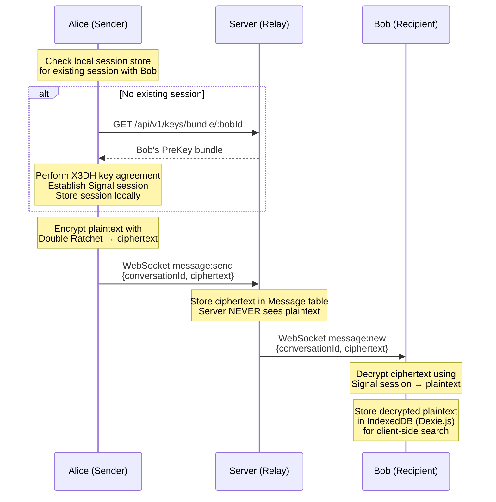
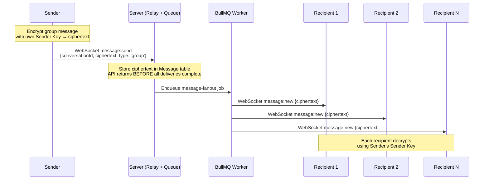
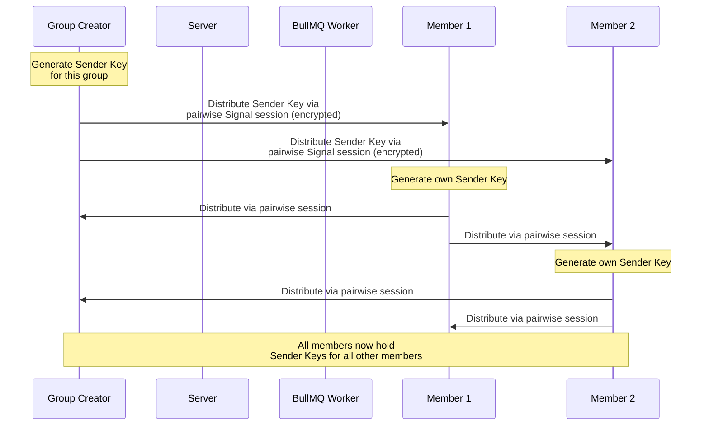
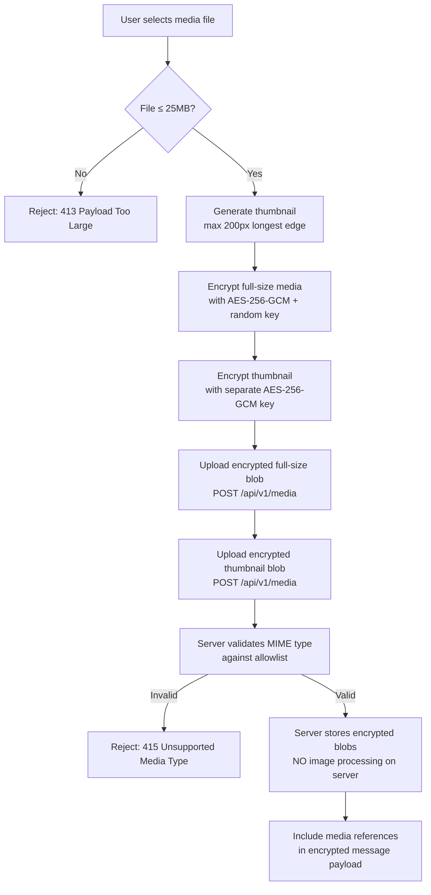
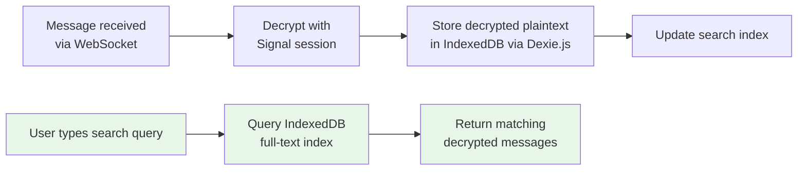

# End-to-End Encryption Implementation Guide

> **Kalle WhatsApp Clone — Signal Protocol E2E Encryption**

## Introduction

Kalle implements end-to-end encryption (E2E) for all 1:1 and group messages using the [Signal Protocol](https://signal.org/docs/). The core security guarantee is:

> **Messages are encrypted and decrypted exclusively on the client. The server stores only ciphertext. Server code contains zero decryption logic.** *(Rule R12)*

All message payloads — text, media metadata, and document references — are encrypted before leaving the sender's device and decrypted only on the recipient's device. The server acts as a relay and persistence layer for opaque ciphertext blobs.

**Key constraints:**

- **Stories are NOT encrypted.** Status/story content is transmitted and stored in plaintext on the server *(Rule R12)*.
- **Client library:** [`@privacyresearch/libsignal-protocol-typescript`](https://www.npmjs.com/package/@privacyresearch/libsignal-protocol-typescript) (^0.0.16) — a TypeScript implementation of the Signal Protocol providing X3DH key agreement, Double Ratchet, and Sender Key primitives.
- **Search is client-side only:** Decrypted messages are indexed locally in IndexedDB. No plaintext or search tokens ever reach the server *(Rule R21)*.

---

## Signal Protocol Overview

The Signal Protocol provides three core cryptographic mechanisms used in this application: X3DH key agreement for session establishment, the Double Ratchet algorithm for ongoing message encryption, and Sender Keys for efficient group messaging.

### X3DH Key Agreement

Extended Triple Diffie-Hellman (X3DH) is the initial key agreement protocol that establishes a shared secret between two parties who have never communicated before. It uses three types of key material:

| Key Type | Lifespan | Purpose |
|----------|----------|---------|
| **Identity Key** | Long-term (per device registration) | Permanent public/private Curve25519 keypair that uniquely identifies a user's device. Published once during registration. |
| **Signed PreKey** | Medium-term (rotated periodically) | A Curve25519 keypair signed by the Identity Key. Rotated on a configurable schedule (e.g., weekly). Allows offline session establishment. |
| **One-Time PreKeys** | Single-use (consumed on fetch) | A pool of Curve25519 keypairs uploaded in batches. Each key is used exactly once during session setup, then discarded. Provides replay protection. |

**Session establishment flow:**

1. **Alice** wants to send a message to **Bob** for the first time.
2. Alice fetches Bob's **PreKey bundle** from the server (`GET /api/v1/keys/bundle/:userId`).
3. The bundle contains Bob's Identity Key, current Signed PreKey (with signature), and one One-Time PreKey.
4. Alice generates an **ephemeral keypair** and performs three (or four) Diffie-Hellman computations:
   - `DH1 = DH(Alice_IdentityKey, Bob_SignedPreKey)`
   - `DH2 = DH(Alice_EphemeralKey, Bob_IdentityKey)`
   - `DH3 = DH(Alice_EphemeralKey, Bob_SignedPreKey)`
   - `DH4 = DH(Alice_EphemeralKey, Bob_OneTimePreKey)` *(if available)*
5. The shared secret `SK = KDF(DH1 || DH2 || DH3 || DH4)` seeds the Double Ratchet.
6. Alice sends her initial message along with her Identity Key and Ephemeral Key so Bob can compute the same shared secret.
7. The consumed One-Time PreKey is removed from the server — it cannot be reused.

### Double Ratchet Algorithm

Once a session is established via X3DH, all subsequent messages use the Double Ratchet algorithm. This provides two interleaved ratchet mechanisms:

**Symmetric-Key Ratchet (Sending/Receiving Chains):**

- Each message derives its encryption key from the previous chain key using a KDF.
- After encryption, the chain key advances forward — previous keys are deleted.
- This provides **forward secrecy within a chain**: compromising a single message key does not reveal past message keys.

**Diffie-Hellman Ratchet (Key Agreement Evolution):**

- Periodically (on each reply), parties exchange new ephemeral DH public keys.
- Each DH exchange generates a new root key, which in turn seeds new sending/receiving chain keys.
- This provides **break-in recovery**: even if an attacker compromises the current session state, security is restored as soon as a new DH ratchet step occurs.

**Security properties achieved:**

| Property | Mechanism |
|----------|-----------|
| **Forward secrecy** | Compromising a long-term Identity Key does not expose past messages — each message uses a unique derived key that is deleted after use. |
| **Break-in recovery** | Compromising session state (chain keys) is mitigated by the next DH ratchet step, which generates entirely new key material. |
| **Out-of-order tolerance** | Message keys can be stored temporarily to decrypt out-of-order messages without breaking the ratchet. |

### Sender Keys (Group Messaging)

For group conversations, the application uses the **Sender Key** distribution mechanism *(Rule R14)*. This avoids the O(N) cost of encrypting each group message individually for every member.

**How Sender Keys work:**

1. **Each group member generates their own Sender Key** — a symmetric key plus a signing keypair.
2. The Sender Key is **distributed to all other group members** through existing pairwise Signal Protocol sessions (1:1 encrypted channels).
3. When sending a group message, the **sender encrypts once** using their own Sender Key. All recipients who possess that Sender Key can decrypt.
4. The server fans out the single ciphertext to all group participants via BullMQ *(Rule R18)*.

**Key rotation rules *(Rule R14)*:**

| Event | Action | Security Guarantee |
|-------|--------|-------------------|
| **Member removed** | All remaining members generate new Sender Keys and redistribute via BullMQ `sender-key-distribution` job. Old keys invalidated. | Removed member **cannot decrypt** any messages sent after removal. |
| **Member added** | New member receives current Sender Keys from all existing members via pairwise sessions. | New member **cannot decrypt** messages sent before joining — they never possessed the old Sender Keys. |

---

## Key Material Management

### PreKey Bundle Structure

The PreKey bundle is defined in `packages/shared/src/types/encryption.ts` and contains all the public key material needed for another user to establish a Signal session:

```typescript
interface IdentityKey {
  /** Base64-encoded Curve25519 public key */
  publicKey: string;
  /** Optional key fingerprint for verification */
  fingerprint?: string;
}

interface SignedPreKey {
  /** Unique key identifier */
  keyId: number;
  /** Base64-encoded Curve25519 public key */
  publicKey: string;
  /** Base64-encoded signature over publicKey using the Identity Key */
  signature: string;
  /** ISO 8601 UTC timestamp of key generation */
  timestamp: string;
}

interface PublicPreKey {
  /** Unique key identifier */
  keyId: number;
  /** Base64-encoded Curve25519 public key */
  publicKey: string;
}

interface PreKeyBundleDTO {
  /** Unique registration identifier for this device */
  registrationId: number;

  /** Long-term Identity Key (public component only) */
  identityKey: IdentityKey;

  /** Current Signed PreKey */
  signedPreKey: SignedPreKey;

  /** Pool of single-use One-Time PreKeys */
  preKeys: PublicPreKey[];
}
```

> **Note:** All key material is serialized as Base64-encoded strings (not `ArrayBuffer`). The actual TypeScript types are defined in `packages/shared/src/types/encryption.ts`.

> **Server-side storage:** The server persists this bundle using `String` and `Json` column types in the `PreKeyBundle` database model (`prisma/schema.prisma`). The server never interprets, validates signatures on, or decrypts any component of the bundle.

### PreKey Bundle Upload

**Endpoint:** `POST /api/v1/keys/bundle`

| Attribute | Value |
|-----------|-------|
| **Authentication** | Required — valid JWT in `Authorization: Bearer <token>` header |
| **Request body** | PreKey bundle (registration ID, identity key, signed prekey, array of one-time prekeys) |
| **Server behavior** | Store bundle as-is — no inspection, no decryption, no signature verification |
| **Handler chain** | `apps/api/src/controllers/KeyController.ts` → `apps/api/src/services/EncryptionKeyService.ts` → `apps/api/src/repositories/KeyRepository.ts` |
| **Audit** | Action logged to immutable audit log as `keys.bundle_upload` *(Rule R32)* — metadata contains user ID and key count only, **never** key material |
| **Success response** | `201 Created` |

> For full endpoint documentation, see [API Reference](./api-reference.md).

### PreKey Bundle Fetch

**Endpoint:** `GET /api/v1/keys/bundle/:userId`

| Attribute | Value |
|-----------|-------|
| **Authentication** | Required — valid JWT |
| **Path parameter** | `userId` — the target user whose bundle is being requested |
| **Server behavior** | Return the user's current bundle. **Consume** (remove) one One-Time PreKey from the pool — it must never be reused. |
| **Handler chain** | `apps/api/src/controllers/KeyController.ts` → `apps/api/src/services/EncryptionKeyService.ts` → `apps/api/src/repositories/KeyRepository.ts` |
| **Success response** | `200 OK` with the PreKey bundle payload |
| **Error cases** | `404 Not Found` if user has no uploaded bundle; `401 Unauthorized` if JWT is invalid/expired |

After consuming a One-Time PreKey, the server checks the remaining pool size. If the count falls below a configured threshold, the `prekey-replenish-notification` BullMQ job is enqueued.

### PreKey Replenishment

When a user's One-Time PreKey supply is running low, the system proactively notifies the client to upload more keys.

| Component | File |
|-----------|------|
| **BullMQ job** | `workers/queue/src/jobs/prekey-replenish-notification.ts` |
| **Trigger** | PreKey pool drops below the configured threshold after a fetch operation |
| **Action** | Emits a `key:replenish` WebSocket event to the user's connected client(s) |
| **Client response** | Client generates a new batch of One-Time PreKeys and uploads via `POST /api/v1/keys/bundle` |

> For WebSocket event contracts, see [WebSocket Events](./websocket-events.md).

---

## 1:1 Message Encryption Flow

The following diagram illustrates the complete flow for sending an encrypted 1:1 message:



**Step-by-step breakdown:**

1. **Session check:** The sender's client (via `apps/web/src/lib/encryption.ts`) checks its local Signal session store for an existing session with the recipient.
2. **Session establishment (if needed):** If no session exists, the client fetches the recipient's PreKey bundle from the server (`GET /api/v1/keys/bundle/:userId`) and performs X3DH key agreement to establish a new session.
3. **Encryption:** The sender encrypts the plaintext message content using the Double Ratchet algorithm, producing a ciphertext blob.
4. **Transmission:** The ciphertext is sent to the server via the `message:send` WebSocket event.
5. **Server relay:** The server persists the ciphertext in the `Message` table and delivers it to the recipient via the `message:new` WebSocket event. The server processes the message as an opaque blob — no decryption logic exists anywhere in the server codebase.
6. **Decryption:** The recipient's client decrypts the ciphertext using their local Signal session state.
7. **Local indexing:** The decrypted plaintext is stored in the client's IndexedDB database (via Dexie.js in `apps/web/src/lib/db.ts`) to support client-side search *(Rule R21)*.

**Key implementation files:**

| File | Role |
|------|------|
| `apps/web/src/lib/encryption.ts` | Signal Protocol client wrapper — session management, encrypt/decrypt |
| `apps/web/src/hooks/useEncryption.ts` | React hook managing encryption session lifecycle and key exchange |

---

## Group Message Encryption Flow

Group messaging uses Sender Keys for efficient one-to-many encryption *(Rule R14)*. The server uses BullMQ for message fan-out *(Rule R18)*.



### Group Setup — Sender Key Distribution

When a group is created or a member joins, Sender Keys must be distributed:



### Member Removal — Key Rotation

When a member is removed from a group, all Sender Keys must be rotated to enforce forward secrecy *(Rule R14)*:

1. The group admin removes a member via the Conversation API.
2. The server enqueues a `sender-key-distribution` BullMQ job (`workers/queue/src/jobs/sender-key-distribution.ts`).
3. Each remaining member generates a **new Sender Key**.
4. New Sender Keys are distributed to all remaining members via pairwise Signal sessions.
5. Old Sender Keys are invalidated — the removed member's client possesses only the old keys and **cannot decrypt any messages sent after removal**.

### Member Addition

When a new member joins:

1. Existing members distribute their current Sender Keys to the new member via pairwise Signal sessions.
2. The new member generates their own Sender Key and distributes it to all existing members.
3. The new member **cannot decrypt messages sent before joining** — they never possessed the previous Sender Keys used for those messages.

---

## Encrypted Message Lifecycle

### Message Edit *(Rule R19)*

Message editing re-encrypts content and replaces ciphertext on the server:

1. **Sender** edits a message within the **15-minute edit window** (server-enforced).
2. The sender's client re-encrypts the edited plaintext using the current Signal session/Sender Key state, producing new ciphertext.
3. The new ciphertext is sent to the server, which **replaces** the old ciphertext. The original ciphertext is **not retained**.
4. All conversation participants receive a `message:edited` WebSocket event containing the new ciphertext.
5. Each recipient decrypts the new ciphertext and updates their local IndexedDB entry.

**Constraints:**

- Only the original sender can edit.
- The 15-minute window is calculated from the original `serverTimestamp`.
- After the window expires, edit requests are rejected with a `403 Forbidden` response.

### Message Delete *(Rule R20)*

Message deletion uses a soft-delete tombstone pattern:

1. **Sender** requests deletion of their message.
2. The server performs a **soft delete**: the ciphertext field is set to `null`, but the `Message` row is retained as a tombstone.
3. All conversation participants receive a `message:deleted` WebSocket event.
4. Each recipient's UI renders: **"This message was deleted"** in place of the original content.
5. The local IndexedDB entry is also marked as deleted.

**Constraints:**

- Only the original sender can delete.
- The tombstone row preserves message metadata (ID, conversation ID, sender ID, timestamps) for ordering integrity.

### Media Encryption *(Rules R8, R27)*

Media files (images, videos, documents, voice notes) follow a client-side encryption workflow:



**Critical requirements:**

- **Client-side thumbnail generation *(Rule R27)*:** Thumbnails (max 200px longest edge) are generated in the browser **before** encryption. The server performs zero image processing.
- **Separate encryption:** Full-size media and thumbnail are encrypted independently with distinct keys. Both keys are included in the encrypted message payload.
- **MIME validation *(Rule R8)*:** The server validates the declared MIME type against an allowlist. Files with disallowed MIME types are rejected with `415 Unsupported Media Type`.
- **Size enforcement *(Rule R8)*:** 25MB limit enforced both client-side (pre-upload check) and server-side (`413 Payload Too Large`).
- **Implementation:** Client-side processing in `apps/web/src/lib/media.ts`.

---

## Client-Side Search with Encryption

Message search is performed entirely client-side to preserve the zero-knowledge server model *(Rule R21)*:



**Architecture:**

| Component | File | Responsibility |
|-----------|------|----------------|
| **IndexedDB schema** | `apps/web/src/lib/db.ts` | Dexie.js database definition with tables for decrypted messages, indexed on `id`, `conversationId`, and `timestamp` |
| **Search engine** | `apps/web/src/lib/search.ts` | Full-text search queries against the local IndexedDB index — tokenization, prefix matching, and result ranking |
| **Search hook** | `apps/web/src/hooks/useSearch.ts` | React hook exposing search state and results to UI components |

**Security guarantees:**

- **Zero network calls during search** — all queries execute against local IndexedDB.
- **No plaintext sent to server** — search tokens, query strings, and results exist only in the client's browser memory and IndexedDB.
- **No server-side search index** — the server has no mechanism to search message content because it only stores ciphertext.

---

## Security Guarantees

The encryption implementation provides the following security properties:

### 1. Forward Secrecy

Compromising a user's long-term Identity Key does **not** expose past messages. Each message is encrypted with a unique key derived from the Double Ratchet chain, and old chain keys are deleted after use. An attacker with the Identity Key cannot reconstruct past derived keys.

### 2. Break-in Recovery

If an attacker compromises the current session state (e.g., chain keys and DH ratchet keys), security is **automatically restored** upon the next Diffie-Hellman ratchet step. This occurs whenever the conversation participants exchange replies, generating entirely new key material.

### 3. Zero Server-Side Plaintext *(Rule R12)*

The server **never** has access to:

- Message plaintext content
- Encryption keys (session keys, chain keys, message keys)
- Decrypted media files or thumbnails
- PreKey private components (only public keys are uploaded)

The server stores and relays only opaque ciphertext blobs.

### 4. Group Forward Secrecy *(Rule R14)*

When a member is removed from a group conversation, all remaining members rotate their Sender Keys. The removed member holds only the old, invalidated Sender Keys and **cannot decrypt any messages sent after removal**.

### 5. Group Backward Secrecy *(Rule R14)*

When a new member is added to a group, they receive only the current Sender Keys. They never possessed the previous Sender Keys and **cannot decrypt messages sent before they joined**.

### 6. Immutable Audit Trail *(Rule R32)*

All security-sensitive encryption operations are logged to the `audit_log` table via `AuditService`:

- `keys.bundle_upload` — when a user uploads or refreshes their PreKey bundle
- `group.member_add` / `group.member_remove` — triggers Sender Key rotation

**Critical constraint:** Audit log metadata **must never** contain encryption keys, key material, prekey data, or message content. Only user IDs, action types, timestamps, and key counts are logged.

The `audit_log` table enforces immutability at the database level — the application database role has **no UPDATE or DELETE permissions** on this table.

### 7. Log Hygiene *(Rule R23)*

Application logs (Pino JSON output) are sanitized to ensure the following **never** appear in any log entry:

- JWT tokens (access or refresh)
- User passwords (plaintext or hashed)
- Plaintext message content
- Encryption keys (Identity Keys, Signed PreKeys, One-Time PreKeys, Sender Keys, chain keys, message keys)
- PreKey material of any kind

All logging is performed via the structured Pino logger (`apps/api/src/providers/LoggerProvider.ts`) with explicit field redaction. Every log entry includes a correlation ID for request tracing *(Rule R29)*.

---

## Implementation Files

The following table maps every encryption-related source file to its role in the system:

### Client-Side (Frontend)

| File | Purpose |
|------|---------|
| `packages/shared/src/types/encryption.ts` | Encryption key bundle TypeScript types and DTOs shared between frontend and backend |
| `apps/web/src/lib/encryption.ts` | Signal Protocol client wrapper — session management, X3DH establishment, Double Ratchet encrypt/decrypt, Sender Key generation and usage |
| `apps/web/src/hooks/useEncryption.ts` | React hook for encryption session lifecycle — initializes sessions, handles key exchange, provides encrypt/decrypt functions to components |
| `apps/web/src/lib/db.ts` | Dexie.js IndexedDB schema for persisting decrypted messages locally for search |
| `apps/web/src/lib/search.ts` | Client-side full-text search engine querying the IndexedDB index |
| `apps/web/src/lib/media.ts` | Client-side media processing — thumbnail generation (max 200px), AES encryption of media blobs, upload orchestration |

### Server-Side (Backend)

| File | Purpose |
|------|---------|
| `apps/api/src/domain/models/PreKeyBundle.ts` | PreKey bundle domain model with validation logic |
| `apps/api/src/domain/interfaces/IKeyRepository.ts` | Key repository interface — abstracts PreKey bundle persistence |
| `apps/api/src/repositories/KeyRepository.ts` | Prisma-backed key persistence — stores and retrieves opaque key bundles |
| `apps/api/src/services/EncryptionKeyService.ts` | PreKey bundle upload/fetch business logic — bundle storage, one-time key consumption, replenishment threshold checks |
| `apps/api/src/controllers/KeyController.ts` | Encryption key REST endpoint handlers — request validation, service delegation, response formatting |
| `apps/api/src/routes/v1/key.routes.ts` | Key route definitions — `POST /api/v1/keys/bundle` and `GET /api/v1/keys/bundle/:userId` |

### Background Workers

| File | Purpose |
|------|---------|
| `workers/queue/src/jobs/sender-key-distribution.ts` | BullMQ job — redistributes Sender Keys to all group members after membership changes |
| `workers/queue/src/jobs/prekey-replenish-notification.ts` | BullMQ job — notifies client via WebSocket when One-Time PreKey supply is low |

### Database

| File | Purpose |
|------|---------|
| `prisma/schema.prisma` | `PreKeyBundle` model definition with fields for registration ID, identity key, signed prekey, and one-time prekey pool |

---

## Seed Data

Per **Rule R10**, the seed script must generate valid encryption key material to enable a fully functional demo out of the box.

### Requirements

| Requirement | Implementation |
|-------------|----------------|
| **Idempotent execution** | Running `prisma/seed.ts` twice produces identical database state — upsert semantics on all records |
| **Valid key material** | Seed generates simulated Curve25519 keypairs for Identity Keys, Signed PreKeys, and One-Time PreKeys using deterministic generation (not the Signal Protocol library) |
| **Simulated ciphertext** | Seeded messages use simulated ciphertext (`SEED_CIPHERTEXT:{content}:{nonce}` base64-encoded) — these are **not** real Signal Protocol ciphertext and will **not** decrypt in the UI via Signal sessions. They serve as structural placeholders for demo data. |
| **Deterministic output** | Seed uses a fixed PRNG seed to generate reproducible key material across runs |

### Seed Data Contents

The seed script (`prisma/seed.ts`) populates:

1. **Users** (10+) — each with a registration ID and Identity Key.
2. **PreKey bundles** — each user has a complete bundle with 1 Signed PreKey and 10 One-Time PreKeys.
3. **Conversations** (5+) — mix of 1:1 and group conversations.
4. **Messages** — simulated ciphertext (base64-encoded `SEED_CIPHERTEXT:{content}:{nonce}` format) for structural demo data. Real Signal Protocol sessions are **not** pre-established in the seed.
5. **Auth sessions** — JWT-based auth sessions for seed users (these are authentication sessions, not Signal Protocol sessions).

### Running the Seed

```bash
# Via Docker (recommended)
docker-compose exec api npx prisma db seed

# Locally (requires DATABASE_URL in .env)
npx prisma db seed
```

---

## Related Documentation

| Document | Description |
|----------|-------------|
| [API Reference](./api-reference.md) | Full REST API endpoint documentation including key exchange endpoints |
| [WebSocket Events](./websocket-events.md) | WebSocket event contracts including `message:send`, `message:new`, `message:edited`, `message:deleted`, `key:replenish` |
| [Architecture](./architecture.md) | System architecture, dependency injection, and layering decisions |

---

## Rules Reference

This document addresses the following project rules:

| Rule | Summary | Section |
|------|---------|---------|
| **R8** | Media upload validation — 25MB limit, MIME allowlist | [Media Encryption](#media-encryption-rules-r8-r27) |
| **R10** | Seed data determinism with valid encryption key material | [Seed Data](#seed-data) |
| **R12** | E2E encryption — server stores only ciphertext, stories not encrypted | [Introduction](#introduction) |
| **R14** | Group encryption via Sender Keys with rotation on membership changes | [Sender Keys](#sender-keys-group-messaging), [Group Flow](#group-message-encryption-flow) |
| **R18** | Fan-out via BullMQ for group delivery and Sender Key distribution | [Group Flow](#group-message-encryption-flow) |
| **R19** | Message edit — re-encrypt, replace ciphertext, 15-minute window | [Message Edit](#message-edit-rule-r19) |
| **R20** | Message delete — soft-delete tombstone, null ciphertext | [Message Delete](#message-delete-rule-r20) |
| **R21** | Client-side search only — zero server-side search | [Client-Side Search](#client-side-search-with-encryption) |
| **R23** | Log hygiene — no keys, tokens, passwords, or plaintext in logs | [Log Hygiene](#7-log-hygiene-rule-r23) |
| **R27** | Client-side thumbnail generation before encryption | [Media Encryption](#media-encryption-rules-r8-r27) |
| **R32** | Immutable audit trail for key operations | [Immutable Audit Trail](#6-immutable-audit-trail-rule-r32) |
